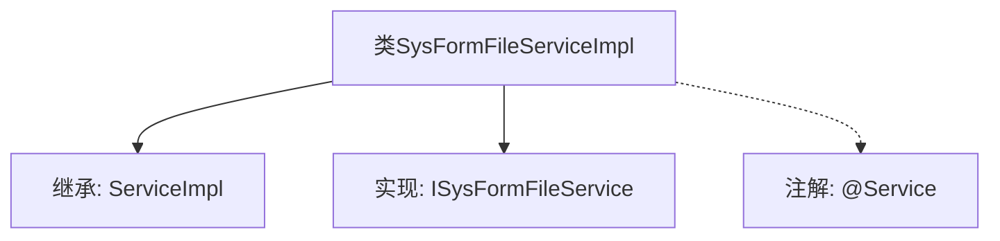

# 基础信息

|      |      |
|------|------|
| 名称 | SysFormFileServiceImpl |
| 编码语言 | .java |
| 代码路径 | JeecgBoot/jeecg-boot/jeecg-module-system/jeecg-system-biz/src/main/java/org/jeecg/modules/system/service/impl/SysFormFileServiceImpl.java |
| 包名 | org.jeecg.modules.system.service.impl |
| 依赖项 | ['com.baomidou.mybatisplus.extension.service.impl.ServiceImpl', 'org.jeecg.modules.system.entity.SysFormFile', 'org.jeecg.modules.system.mapper.SysFormFileMapper', 'org.jeecg.modules.system.service.ISysFormFileService', 'org.springframework.stereotype.Service'] |
| 概述说明 | SysFormFileServiceImpl继承ServiceImpl并实现ISysFormFileService接口。 |

# 说明

SysFormFileServiceImpl类是一个具体的服务实现类，它继承了ServiceImpl类并实现了ISysFormFileService接口。通过继承ServiceImpl类，SysFormFileServiceImpl类获得了ServiceImpl类中定义的基础功能和方法。同时，通过实现ISysFormFileService接口，SysFormFileServiceImpl类必须提供接口中定义的所有方法的具体实现，以确保其能够履行接口所规定的职责。这种设计模式使得SysFormFileServiceImpl类既能复用ServiceImpl类的功能，又能满足ISysFormFileService接口的特定需求。

# 类列表 Class Summary

| 名称   | 类型  | 说明 |
|-------|------|-------------|
| SysFormFileServiceImpl | class | SysFormFileServiceImpl类继承ServiceImpl并实现ISysFormFileService接口。 |


## 类 SysFormFileServiceImpl

|      |      |
|------|------|
| 访问范围 | @Service;public |
| 类型 | class |
| 名称 | SysFormFileServiceImpl |
| 说明 | SysFormFileServiceImpl类继承ServiceImpl并实现ISysFormFileService接口。 |


### UML类图

```mermaid
classDiagram
    class SysFormFileServiceImpl {
        +SysFormFileServiceImpl()
    }
    class ServiceImpl~T, R~ {
        +ServiceImpl()
    }
    class SysFormFileMapper {
    }
    class SysFormFile {
    }
    <<Interface>> ISysFormFileService {
    }

    SysFormFileServiceImpl --> ServiceImpl~SysFormFileMapper, SysFormFile~ : 继承
    SysFormFileServiceImpl --> ISysFormFileService : 实现
    ServiceImpl~SysFormFileMapper, SysFormFile~ --> SysFormFileMapper : 依赖
    ServiceImpl~SysFormFileMapper, SysFormFile~ --> SysFormFile : 依赖
```

这段代码定义了一个名为 `SysFormFileServiceImpl` 的服务类，它继承了 `ServiceImpl` 类并实现了 `ISysFormFileService` 接口。`ServiceImpl` 是一个泛型类，接受两个类型参数 `SysFormFileMapper` 和 `SysFormFile`。`SysFormFileServiceImpl` 类通过继承 `ServiceImpl` 类，获得了对 `SysFormFileMapper` 和 `SysFormFile` 的依赖管理能力，并通过实现 `ISysFormFileService` 接口，提供了具体的服务实现。


### 内部方法调用关系图



这段代码定义了一个名为 `SysFormFileServiceImpl` 的类，该类继承自 `ServiceImpl<SysFormFileMapper, SysFormFile>` 并实现了 `ISysFormFileService` 接口。类上使用了 `@Service` 注解，表明这是一个服务层的组件，通常用于业务逻辑的处理。通过继承和实现，该类具备了 `ServiceImpl` 的通用功能以及 `ISysFormFileService` 接口定义的特定方法。

### 字段列表 Field List

| 名称  | 类型  | 说明 |
|-------|-------|------|

### 方法列表 Method List

| 名称  | 类型  | 说明 |
|-------|-------|------|


