# 基础信息

|      |      |
|------|------|
| 名称 | SysGatewayRouteServiceImpl |
| 编码语言 | .java |
| 代码路径 | JeecgBoot/jeecg-boot/jeecg-module-system/jeecg-system-biz/src/main/java/org/jeecg/modules/system/service/impl/SysGatewayRouteServiceImpl.java |
| 包名 | org.jeecg.modules.system.service.impl |
| 依赖项 | ['cn.hutool.core.util.ObjectUtil', 'cn.hutool.core.util.RandomUtil', 'com.alibaba.fastjson.JSON', 'com.alibaba.fastjson.JSONObject', 'com.baomidou.mybatisplus.core.conditions.query.LambdaQueryWrapper', 'com.baomidou.mybatisplus.extension.service.impl.ServiceImpl', 'lombok.extern.slf4j.Slf4j', 'org.jeecg.common.base.BaseMap', 'org.jeecg.common.constant.CacheConstant', 'org.jeecg.common.constant.CommonConstant', 'org.jeecg.common.constant.GlobalConstants', 'org.jeecg.common.util.oConvertUtils', 'org.jeecg.modules.system.entity.SysGatewayRoute', 'org.jeecg.modules.system.mapper.SysGatewayRouteMapper', 'org.jeecg.modules.system.service.ISysGatewayRouteService', 'org.springframework.beans.BeanUtils', 'org.springframework.beans.factory.annotation.Autowired', 'org.springframework.data.redis.core.RedisTemplate', 'org.springframework.stereotype.Service', 'org.springframework.transaction.annotation.Transactional', 'java.text.SimpleDateFormat', 'java.util.Date', 'java.util.List'] |
| 概述说明 | SysGatewayRouteServiceImpl类管理网关路由，支持增删改查、缓存更新及路由复制。 |

# 说明

SysGatewayRouteServiceImpl类是一个用于管理网关路由的服务实现类，提供了丰富的功能支持。该类实现了对网关路由的增删改查操作，确保路由信息的管理灵活高效。此外，它还支持缓存更新功能，能够及时同步路由数据，提升系统性能。同时，该类还具备路由复制功能，便于快速创建或迁移路由配置，增强了系统的可维护性和扩展性。通过这些功能，SysGatewayRouteServiceImpl类为网关路由管理提供了全面且可靠的解决方案。

# 类列表 Class Summary

| 名称   | 类型  | 说明 |
|-------|------|-------------|
| SysGatewayRouteServiceImpl | class | SysGatewayRouteServiceImpl类实现网关路由管理，支持增删改查、缓存更新、路由复制等功能。 |

## 类 SysGatewayRouteServiceImpl

|      |      |
|------|------|
| 访问范围 | @Service;@Slf4j;public |
| 类型 | class |
| 名称 | SysGatewayRouteServiceImpl |
| 说明 | SysGatewayRouteServiceImpl类实现网关路由管理，支持增删改查、缓存更新、路由复制等功能。 |

### UML类图

```mermaid
classDiagram
    class SysGatewayRouteServiceImpl {
        -RedisTemplate~String, Object~ redisTemplate
        -String STRING_STATUS
        -SimpleDateFormat dateFormat
        +void addRoute2Redis(String key)
        +void deleteById(String id)
        +void updateAll(JSONObject json)
        -void resreshRouter(String delRouterId)
        +void clearRedis()
        +void revertLogicDeleted(List~String~ ids)
        +void deleteLogicDeleted(List~String~ ids)
        +SysGatewayRoute copyRoute(String id)
        +List~SysGatewayRoute~ getDeletelist()
    }
    class ServiceImpl~SysGatewayRouteMapper, SysGatewayRoute~ {
        <<Interface>>
    }
    class ISysGatewayRouteService {
        <<Interface>>
        +void addRoute2Redis(String key)
        +void deleteById(String id)
        +void updateAll(JSONObject json)
        +void clearRedis()
        +void revertLogicDeleted(List~String~ ids)
        +void deleteLogicDeleted(List~String~ ids)
        +SysGatewayRoute copyRoute(String id)
        +List~SysGatewayRoute~ getDeletelist()
    }
    class SysGatewayRouteMapper {
        <<Interface>>
    }
    class SysGatewayRoute {
        -String id
        -String routerId
        -String name
        -String predicates
        -String filters
        -String uri
        -int status
        -int delFlag
        -Date createTime
    }
    class RedisTemplate~String, Object~ {
        +void opsForValue().set(String key, Object value)
        +void convertAndSend(String topic, Object message)
    }
    class JSONObject {
        +JSONObject getJSONObject(String key)
        +String getString(String key)
        +Integer getInteger(String key)
    }
    class LambdaQueryWrapper~SysGatewayRoute~ {
        +LambdaQueryWrapper~SysGatewayRoute~ eq(Function~SysGatewayRoute, Object~ func, Object value)
    }
    class BaseMap {
        +void put(String key, Object value)
    }
    class GlobalConstants {
        <<Interface>>
        +String HANDLER_NAME
        +String LODER_ROUDER_HANDLER
        +String REDIS_TOPIC_NAME
    }
    class CacheConstant {
        <<Interface>>
        +String GATEWAY_ROUTES
    }
    class CommonConstant {
        <<Interface>>
        +int DEL_FLAG_0
    }
    class ObjectUtil {
        <<Interface>>
        +boolean isEmpty(Object obj)
    }
    class oConvertUtils {
        <<Interface>>
        +boolean isEmpty(String str)
    }
    class BeanUtils {
        <<Interface>>
        +void copyProperties(Object source, Object target)
    }
    class RandomUtil {
        <<Interface>>
        +String randomNumbers(int length)
    }
    SysGatewayRouteServiceImpl --> ServiceImpl~SysGatewayRouteMapper, SysGatewayRoute~ : 继承
    SysGatewayRouteServiceImpl --> ISysGatewayRouteService : 实现
    SysGatewayRouteServiceImpl --> RedisTemplate~String, Object~ : 依赖
    SysGatewayRouteServiceImpl --> JSONObject : 依赖
    SysGatewayRouteServiceImpl --> LambdaQueryWrapper~SysGatewayRoute~ : 依赖
    SysGatewayRouteServiceImpl --> BaseMap : 依赖
    SysGatewayRouteServiceImpl --> GlobalConstants : 依赖
    SysGatewayRouteServiceImpl --> CacheConstant : 依赖
    SysGatewayRouteServiceImpl --> CommonConstant : 依赖
    SysGatewayRouteServiceImpl --> ObjectUtil : 依赖
    SysGatewayRouteServiceImpl --> oConvertUtils : 依赖
    SysGatewayRouteServiceImpl --> BeanUtils : 依赖
    SysGatewayRouteServiceImpl --> RandomUtil : 依赖
    ServiceImpl~SysGatewayRouteMapper, SysGatewayRoute~ --> SysGatewayRouteMapper : 依赖
    ServiceImpl~SysGatewayRouteMapper, SysGatewayRoute~ --> SysGatewayRoute : 依赖
```

这段代码定义了一个名为 `SysGatewayRouteServiceImpl` 的服务类，该类继承自 `ServiceImpl` 并实现了 `ISysGatewayRouteService` 接口。它主要用于管理网关路由的增删改查操作，并将路由信息存储在 Redis 中。类中包含了多个方法，如 `addRoute2Redis`、`deleteById`、`updateAll` 等，用于处理路由的添加、删除、更新和缓存刷新等操作。代码中还使用了 `RedisTemplate`、`JSONObject`、`LambdaQueryWrapper` 等工具类来辅助实现这些功能。

### 内部方法调用关系图

这段代码是`SysGatewayRouteServiceImpl`类的实现，主要用于管理系统网关路由的增删改查操作。类中包含了多个方法，如`addRoute2Redis`、`deleteById`、`updateAll`等，这些方法通过操作数据库和Redis缓存来管理路由信息。代码中还包含了事务管理、日志记录和异常处理等功能，确保系统的稳定性和数据一致性。

### 字段列表 Field List

| 名称  | 类型  | 说明 |
|-------|-------|------|
| redisTemplate | RedisTemplate<String, Object> | 使用@Autowired注入RedisTemplate对象，类型为String和Object。 |
| STRING_STATUS = "status" | String | 定义私有静态常量STRING_STATUS，值为"status"。 |
| dateFormat = new SimpleDateFormat("MMdd") | SimpleDateFormat | 定义一个私有静态常量日期格式化对象，格式为月日。 |

### 方法列表 Method List

| 名称  | 类型  | 说明 |
|-------|-------|------|
| revertLogicDeleted | void | 重写方法，恢复逻辑删除并刷新路由。 |
| deleteLogicDeleted | void | 删除逻辑删除记录并刷新路由。 |
| getDeletelist | List<SysGatewayRoute> | 重写方法返回待删除网关路由列表。 |
| copyRoute | SysGatewayRoute | 复制网关路由，生成新名称并插入数据库，刷新路由配置。 |
| addRoute2Redis | void | 重写方法，将网关路由列表存入Redis，键为指定参数。 |
| resreshRouter | void | 刷新Redis路由缓存并更新网关配置。 |
| clearRedis | void | 该方法清空Redis中键为GATEWAY_ROUTES的值。 |
| deleteById | void | 删除指定ID的路由，先禁用状态再删除，最后刷新路由。 |
| updateAll | void | 更新网关路由配置，处理ID、状态等字段，保存或更新后刷新路由，异常时记录日志并刷新。 |

