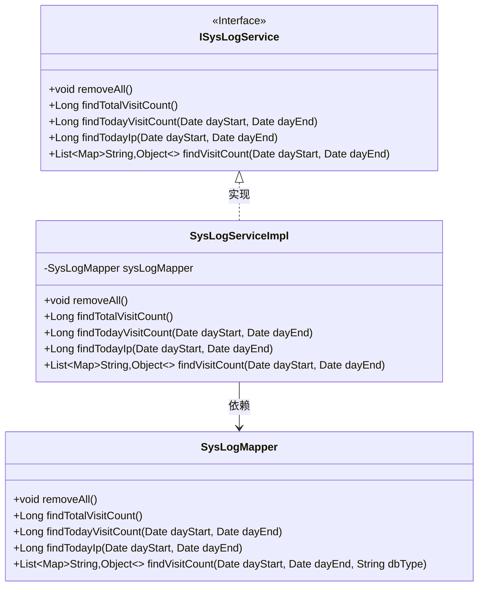
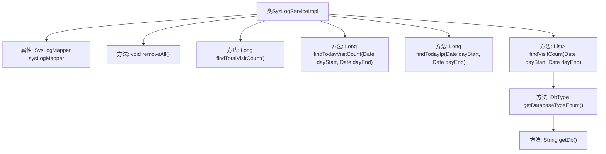

# 基础信息

|      |      |
|------|------|
| 名称 | SysLogServiceImpl |
| 编码语言 | .java |
| 代码路径 | JeecgBoot/jeecg-boot/jeecg-module-system/jeecg-system-biz/src/main/java/org/jeecg/modules/system/service/impl/SysLogServiceImpl.java |
| 包名 | org.jeecg.modules.system.service.impl |
| 依赖项 | ['java.sql.SQLException', 'java.util.Date', 'java.util.List', 'java.util.Map', 'javax.annotation.Resource', 'com.baomidou.mybatisplus.annotation.DbType', 'org.jeecg.common.system.api.ISysBaseAPI', 'org.jeecg.common.util.CommonUtils', 'org.jeecg.modules.system.entity.SysLog', 'org.jeecg.modules.system.mapper.SysLogMapper', 'org.jeecg.modules.system.service.ISysLogService', 'org.springframework.beans.factory.annotation.Autowired', 'org.springframework.stereotype.Service', 'com.baomidou.mybatisplus.extension.service.impl.ServiceImpl'] |
| 概述说明 | SysLogServiceImpl类实现日志服务，提供清空、查询访问量及统计功能。 |

# 说明

SysLogServiceImpl类是一个实现日志服务的类，提供了多种日志管理功能。该类支持清空日志，方便用户删除所有日志记录。同时，它能够查询总访问量，统计系统自运行以来的总访问次数。此外，该类还能获取当日访问量，统计当天系统的访问次数。它还提供了当日IP统计功能，记录当天访问系统的独立IP地址。最后，该类还具备访问统计功能，能够对系统的访问情况进行详细分析，帮助用户了解访问模式和行为。

# 类列表 Class Summary

| 名称   | 类型  | 说明 |
|-------|------|-------------|
| SysLogServiceImpl | class | SysLogServiceImpl类实现日志服务，提供清空日志、查询总访问量、当日访问量、当日IP及访问统计功能。 |

## 类 SysLogServiceImpl

|      |      |
|------|------|
| 访问范围 | @Service;public |
| 类型 | class |
| 名称 | SysLogServiceImpl |
| 说明 | SysLogServiceImpl类实现日志服务，提供清空日志、查询总访问量、当日访问量、当日IP及访问统计功能。 |

### UML类图

**描述**：该代码展示了一个日志服务实现类 `SysLogServiceImpl`，它实现了 `ISysLogService` 接口，并通过依赖 `SysLogMapper` 来执行具体的数据库操作。`SysLogServiceImpl` 提供了清空日志、查询总访问量、查询当天访问量和IP等功能，`SysLogMapper` 则负责与数据库交互，执行具体的SQL操作。

### 内部方法调用关系图

这段代码展示了`SysLogServiceImpl`类的结构及其方法调用关系。该类继承自`ServiceImpl`并实现了`ISysLogService`接口，主要功能是处理系统日志的相关操作。类中包含多个方法，如`removeAll()`用于清空日志记录，`findTotalVisitCount()`用于获取总访问次数，`findTodayVisitCount()`和`findTodayIp()`用于获取当天访问次数和IP地址，`findVisitCount()`则根据时间范围获取访问次数。这些方法通过调用`sysLogMapper`对象来执行具体的数据库操作。

### 字段列表 Field List

| 名称  | 类型  | 说明 |
|-------|-------|------|
| sysLogMapper | SysLogMapper | 类中私有注入SysLogMapper资源。 |

### 方法列表 Method List

| 名称  | 类型  | 说明 |
|-------|-------|------|
| findTodayVisitCount | Long | 重写方法查找当日访问次数。 |
| removeAll | void | 重写removeAll方法，调用sysLogMapper的removeAll方法。 |
| findTodayIp | Long | 重写方法findTodayIp，调用sysLogMapper查询当日IP。 |
| findVisitCount | List<Map<String,Object>> | 重写方法查询指定日期范围内的访问次数，返回结果列表。 |
| findTotalVisitCount | Long | 重写方法findTotalVisitCount，调用sysLogMapper的findTotalVisitCount返回总访问数。 |

