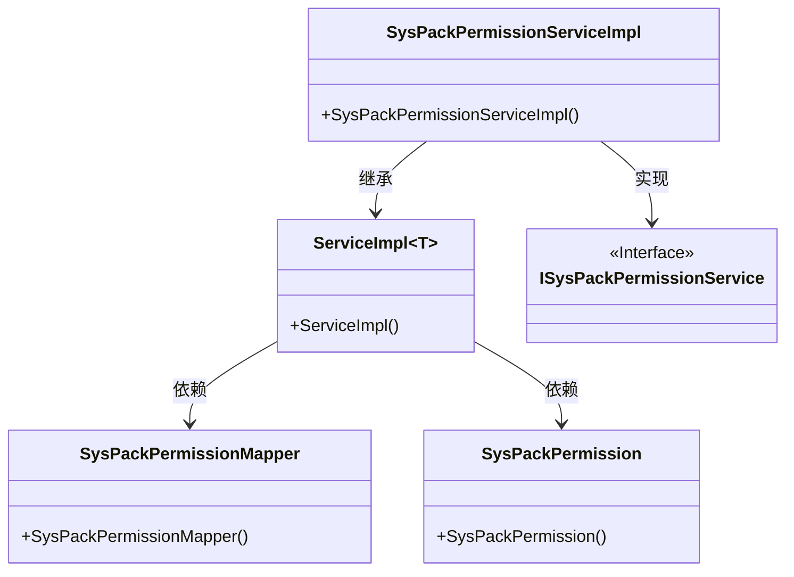
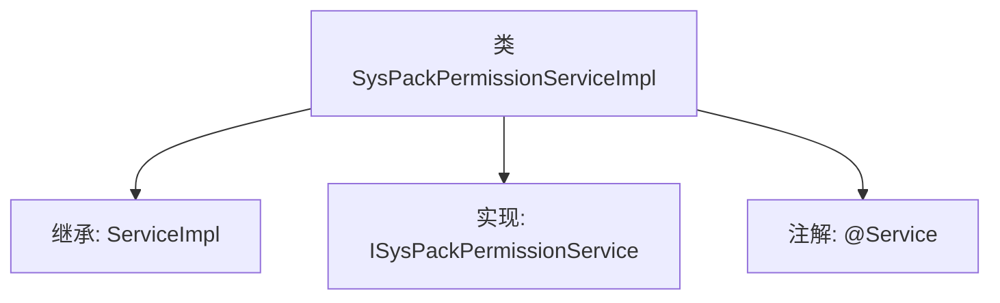

# 基础信息

|      |      |
|------|------|
| 名称 | SysPackPermissionServiceImpl |
| 编码语言 | .java |
| 代码路径 | JeecgBoot/jeecg-boot/jeecg-module-system/jeecg-system-biz/src/main/java/org/jeecg/modules/system/service/impl/SysPackPermissionServiceImpl.java |
| 包名 | org.jeecg.modules.system.service.impl |
| 依赖项 | ['org.jeecg.modules.system.entity.SysPackPermission', 'org.jeecg.modules.system.mapper.SysPackPermissionMapper', 'org.jeecg.modules.system.service.ISysPackPermissionService', 'org.springframework.stereotype.Service', 'com.baomidou.mybatisplus.extension.service.impl.ServiceImpl'] |
| 概述说明 | SysPackPermissionServiceImpl继承ServiceImpl，实现ISysPackPermissionService接口。 |

# 说明

SysPackPermissionServiceImpl类继承自ServiceImpl类，并实现了ISysPackPermissionService接口。这一设计表明该类负责处理系统包权限相关的业务逻辑，继承了ServiceImpl类的通用功能，同时通过实现ISysPackPermissionService接口，确保其具备处理特定权限服务的能力。

# 类列表 Class Summary

| 名称   | 类型  | 说明 |
|-------|------|-------------|
| SysPackPermissionServiceImpl | class | SysPackPermissionServiceImpl类继承ServiceImpl，实现ISysPackPermissionService接口。 |

## 类 SysPackPermissionServiceImpl

|      |      |
|------|------|
| 访问范围 | @Service;public |
| 类型 | class |
| 名称 | SysPackPermissionServiceImpl |
| 说明 | SysPackPermissionServiceImpl类继承ServiceImpl，实现ISysPackPermissionService接口。 |

### UML类图

这段代码展示了`SysPackPermissionServiceImpl`类继承`ServiceImpl`并实现`ISysPackPermissionService`接口的类图。`ServiceImpl`是一个泛型类，依赖于`SysPackPermissionMapper`和`SysPackPermission`类。`SysPackPermissionServiceImpl`通过继承`ServiceImpl`并实现`ISysPackPermissionService`接口，实现了对权限管理的服务逻辑。

### 内部方法调用关系图

该流程图展示了`SysPackPermissionServiceImpl`类的结构，该类继承自`ServiceImpl`并实现了`ISysPackPermissionService`接口，同时被标记为`@Service`注解。该服务类主要用于处理与系统包权限相关的业务逻辑，通过继承和实现的方式，继承了`ServiceImpl`的通用功能，并实现了特定的服务接口。

### 字段列表 Field List

| 名称  | 类型  | 说明 |
|-------|-------|------|

### 方法列表 Method List

| 名称  | 类型  | 说明 |
|-------|-------|------|

