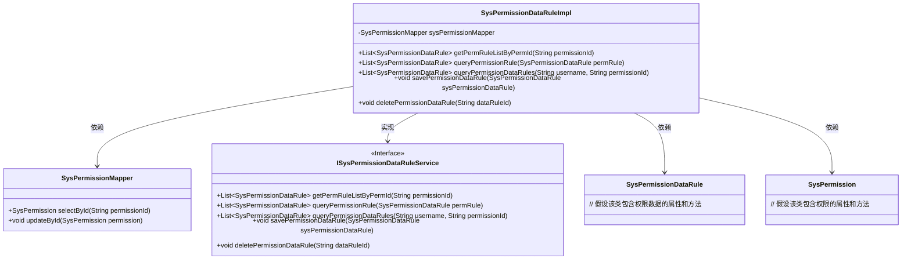
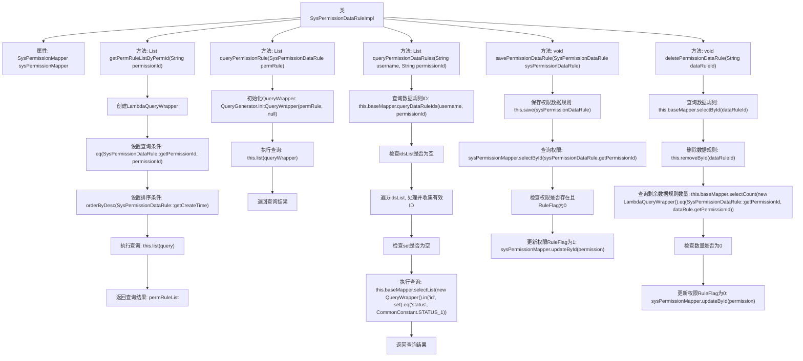

# 基础信息

|      |      |
|------|------|
| 名称 | SysPermissionDataRuleImpl |
| 编码语言 | .java |
| 代码路径 | JeecgBoot/jeecg-boot/jeecg-module-system/jeecg-system-biz/src/main/java/org/jeecg/modules/system/service/impl/SysPermissionDataRuleImpl.java |
| 包名 | org.jeecg.modules.system.service.impl |
| 依赖项 | ['java.util.HashSet', 'java.util.List', 'java.util.Set', 'javax.annotation.Resource', 'org.jeecg.common.constant.CommonConstant', 'org.jeecg.common.system.query.QueryGenerator', 'org.jeecg.common.util.oConvertUtils', 'org.jeecg.modules.system.entity.SysPermission', 'org.jeecg.modules.system.entity.SysPermissionDataRule', 'org.jeecg.modules.system.mapper.SysPermissionDataRuleMapper', 'org.jeecg.modules.system.mapper.SysPermissionMapper', 'org.jeecg.modules.system.service.ISysPermissionDataRuleService', 'org.springframework.stereotype.Service', 'org.springframework.transaction.annotation.Transactional', 'com.baomidou.mybatisplus.core.conditions.query.LambdaQueryWrapper', 'com.baomidou.mybatisplus.core.conditions.query.QueryWrapper', 'com.baomidou.mybatisplus.extension.service.impl.ServiceImpl'] |
| 概述说明 | SysPermissionDataRuleImpl类实现权限查询、保存、删除，支持菜单ID、权限名称和值查询，处理数据权限失效。 |

# 说明

SysPermissionDataRuleImpl类主要负责权限数据的管理，包括查询、保存和删除功能。该类支持根据菜单ID、权限名称和权限值进行数据查询，并能有效处理数据权限失效的问题，确保权限数据的准确性和有效性。

# 类列表 Class Summary

| 名称   | 类型  | 说明 |
|-------|------|-------------|
| SysPermissionDataRuleImpl | class | SysPermissionDataRuleImpl类实现权限数据查询、保存、删除功能，支持按菜单ID、权限名称和值查询，并处理数据权限失效问题。 |

## 类 SysPermissionDataRuleImpl

|      |      |
|------|------|
| 访问范围 | @Service;public |
| 类型 | class |
| 名称 | SysPermissionDataRuleImpl |
| 说明 | SysPermissionDataRuleImpl类实现权限数据查询、保存、删除功能，支持按菜单ID、权限名称和值查询，并处理数据权限失效问题。 |

### UML类图

**描述**：  
`SysPermissionDataRuleImpl` 类实现了 `ISysPermissionDataRuleService` 接口，提供了权限数据规则的查询、保存和删除功能。该类依赖于 `SysPermissionMapper` 来操作权限数据，并处理与 `SysPermissionDataRule` 和 `SysPermission` 相关的业务逻辑。通过 `@Transactional` 注解，确保在保存和删除操作中的事务一致性。该类的核心功能包括根据菜单ID查询权限数据、根据权限名称和值查询权限数据、以及处理权限数据的保存和删除。

### 内部方法调用关系图

**描述：**
该流程图展示了`SysPermissionDataRuleImpl`类的主要方法及其内部逻辑。类中包含多个方法，用于处理权限数据规则的查询、保存和删除操作。每个方法都通过一系列步骤完成其功能，如创建查询条件、执行查询、处理结果等。流程图清晰地展示了这些方法的调用关系和数据流动，帮助理解代码的执行流程和逻辑结构。

### 字段列表 Field List

| 名称  | 类型  | 说明 |
|-------|-------|------|
| sysPermissionMapper | SysPermissionMapper | 定义私有SysPermissionMapper资源对象。 |

### 方法列表 Method List

| 名称  | 类型  | 说明 |
|-------|-------|------|
| deletePermissionDataRule | void | 删除权限数据规则，检查并更新权限标志。 |
| queryPermissionRule | List<SysPermissionDataRule> | 该方法查询权限规则，使用查询包装器并返回结果列表。 |
| getPermRuleListByPermId | List<SysPermissionDataRule> | 根据权限ID查询并返回按创建时间降序排列的权限规则列表。 |
| queryPermissionDataRules | List<SysPermissionDataRule> | 该方法查询用户权限数据规则，处理空值并返回有效规则列表。 |
| savePermissionDataRule | void | 保存权限数据规则并更新权限标志。 |

