# 基础信息

|      |      |
|------|------|
| 名称 | SysPermissionServiceImpl |
| 编码语言 | .java |
| 代码路径 | JeecgBoot/jeecg-boot/jeecg-module-system/jeecg-system-biz/src/main/java/org/jeecg/modules/system/service/impl/SysPermissionServiceImpl.java |
| 包名 | org.jeecg.modules.system.service.impl |
| 依赖项 | ['com.baomidou.mybatisplus.core.conditions.query.LambdaQueryWrapper', 'com.baomidou.mybatisplus.core.conditions.query.QueryWrapper', 'com.baomidou.mybatisplus.extension.service.impl.ServiceImpl', 'org.jeecg.common.constant.CacheConstant', 'org.jeecg.common.constant.CommonConstant', 'org.jeecg.common.exception.JeecgBootException', 'org.jeecg.common.util.oConvertUtils', 'org.jeecg.config.mybatis.MybatisPlusSaasConfig', 'org.jeecg.modules.system.entity.SysPermission', 'org.jeecg.modules.system.entity.SysPermissionDataRule', 'org.jeecg.modules.system.entity.SysRoleIndex', 'org.jeecg.modules.system.mapper.SysDepartPermissionMapper', 'org.jeecg.modules.system.mapper.SysDepartRolePermissionMapper', 'org.jeecg.modules.system.mapper.SysPermissionMapper', 'org.jeecg.modules.system.mapper.SysRolePermissionMapper', 'org.jeecg.modules.system.model.TreeModel', 'org.jeecg.modules.system.service.ISysPermissionDataRuleService', 'org.jeecg.modules.system.service.ISysPermissionService', 'org.jeecg.modules.system.service.ISysRoleIndexService', 'org.springframework.beans.factory.annotation.Autowired', 'org.springframework.cache.annotation.CacheEvict', 'org.springframework.cache.annotation.Cacheable', 'org.springframework.stereotype.Service', 'org.springframework.transaction.annotation.Transactional', 'javax.annotation.Resource', 'java.util'] |
| 概述说明 | SysPermissionServiceImpl实现菜单切换、查询、删除、添加、编辑及权限检查等权限管理功能。 |

# 说明

SysPermissionServiceImpl是一个实现权限管理的服务类，提供了全面的权限管理功能。其主要功能包括菜单切换、查询、删除、添加、编辑以及权限检查等。通过这些功能，系统能够有效地管理和控制用户的权限，确保不同用户只能访问和操作其被授权的资源和功能。该服务类在权限管理系统中扮演着核心角色，保障了系统的安全性和操作的规范性。

# 类列表 Class Summary

| 名称   | 类型  | 说明 |
|-------|------|-------------|
| SysPermissionServiceImpl | class | SysPermissionServiceImpl实现权限管理，包括菜单切换、查询、删除、添加、编辑及权限检查等功能。 |


## 类 SysPermissionServiceImpl

|      |      |
|------|------|
| 访问范围 | @Service;public |
| 类型 | class |
| 名称 | SysPermissionServiceImpl |
| 说明 | SysPermissionServiceImpl实现权限管理，包括菜单切换、查询、删除、添加、编辑及权限检查等功能。 |


### UML类图

```mermaid
classDiagram
    class SysPermissionServiceImpl {
        -SysPermissionMapper sysPermissionMapper
        -ISysPermissionDataRuleService permissionDataRuleService
        -SysRolePermissionMapper sysRolePermissionMapper
        -SysDepartPermissionMapper sysDepartPermissionMapper
        -SysDepartRolePermissionMapper sysDepartRolePermissionMapper
        -ISysRoleIndexService roleIndexService
        +void switchVue3Menu()
        +List~TreeModel~ queryListByParentId(String parentId)
        +void deletePermission(String id) throws JeecgBootException
        +void removeChildrenBy(String parentId)
        +void deletePermissionLogical(String id) throws JeecgBootException
        +void addPermission(SysPermission sysPermission) throws JeecgBootException
        +void editPermission(SysPermission sysPermission) throws JeecgBootException
        +List~SysPermission~ queryByUser(String userId)
        +void deletePermRuleByPermId(String id)
        +List~String~ queryPermissionUrlWithStar()
        +boolean hasPermission(String username, SysPermission sysPermission)
        +boolean hasPermission(String username, String url)
        +List~SysPermission~ queryDepartPermissionList(String departId)
        +boolean checkPermDuplication(String id, String url, Boolean alwaysShow)
    }
    class SysPermission {
        // SysPermission类的属性和方法
    }
    class SysPermissionMapper {
        // SysPermissionMapper类的属性和方法
    }
    class ISysPermissionDataRuleService {
        <<Interface>>
        // ISysPermissionDataRuleService接口的方法
    }
    class SysRolePermissionMapper {
        // SysRolePermissionMapper类的属性和方法
    }
    class SysDepartPermissionMapper {
        // SysDepartPermissionMapper类的属性和方法
    }
    class SysDepartRolePermissionMapper {
        // SysDepartRolePermissionMapper类的属性和方法
    }
    class ISysRoleIndexService {
        <<Interface>>
        // ISysRoleIndexService接口的方法
    }
    class TreeModel {
        // TreeModel类的属性和方法
    }
    class SysPermissionDataRule {
        // SysPermissionDataRule类的属性和方法
    }
    class QueryWrapper~T~ {
        // QueryWrapper类的属性和方法
    }
    class LambdaQueryWrapper~T~ {
        // LambdaQueryWrapper类的属性和方法
    }
    class JeecgBootException {
        // JeecgBootException类的属性和方法
    }
    class CacheConstant {
        // CacheConstant类的属性和方法
    }
    class MybatisPlusSaasConfig {
        // MybatisPlusSaasConfig类的属性和方法
    }
    class CommonConstant {
        // CommonConstant类的属性和方法
    }
    class Date {
        // Date类的属性和方法
    }
    class HashMap~K, V~ {
        // HashMap类的属性和方法
    }
    class ArrayList~T~ {
        // ArrayList类的属性和方法
    }
    class Long {
        // Long类的属性和方法
    }
    class Boolean {
        // Boolean类的属性和方法
    }
    class String {
        // String类的属性和方法
    }
    class Integer {
        // Integer类的属性和方法
    }
    class Object {
        // Object类的属性和方法
    }
    class List~T~ {
        // List接口的方法
    }
    class Map~K, V~ {
        // Map接口的方法
    }
    class QueryWrapper~T~ {
        // QueryWrapper类的属性和方法
    }
    class LambdaQueryWrapper~T~ {
        // LambdaQueryWrapper类的属性和方法
    }
    class SysPermissionServiceImpl --> SysPermissionMapper : 依赖
    SysPermissionServiceImpl --> ISysPermissionDataRuleService : 依赖
    SysPermissionServiceImpl --> SysRolePermissionMapper : 依赖
    SysPermissionServiceImpl --> SysDepartPermissionMapper : 依赖
    SysPermissionServiceImpl --> SysDepartRolePermissionMapper : 依赖
    SysPermissionServiceImpl --> ISysRoleIndexService : 依赖
    SysPermissionServiceImpl --> TreeModel : 依赖
    SysPermissionServiceImpl --> SysPermissionDataRule : 依赖
    SysPermissionServiceImpl --> QueryWrapper : 依赖
    SysPermissionServiceImpl --> LambdaQueryWrapper : 依赖
    SysPermissionServiceImpl --> JeecgBootException : 依赖
    SysPermissionServiceImpl --> CacheConstant : 依赖
    SysPermissionServiceImpl --> MybatisPlusSaasConfig : 依赖
    SysPermissionServiceImpl --> CommonConstant : 依赖
    SysPermissionServiceImpl --> Date : 依赖
    SysPermissionServiceImpl --> HashMap : 依赖
    SysPermissionServiceImpl --> ArrayList : 依赖
    SysPermissionServiceImpl --> Long : 依赖
    SysPermissionServiceImpl --> Boolean : 依赖
    SysPermissionServiceImpl --> String : 依赖
    SysPermissionServiceImpl --> Integer : 依赖
    SysPermissionServiceImpl --> Object : 依赖
    SysPermissionServiceImpl --> List : 依赖
    SysPermissionServiceImpl --> Map : 依赖
```

**描述**：`SysPermissionServiceImpl`类是一个服务实现类，主要负责系统权限的管理。它依赖于多个Mapper和Service接口，如`SysPermissionMapper`、`ISysPermissionDataRuleService`等，用于处理权限的增删改查操作。类中的方法包括切换菜单、查询权限列表、删除权限、添加权限等，涉及复杂的业务逻辑和数据处理。该类通过依赖注入的方式获取所需的资源，并通过事务管理确保数据的一致性。


### 内部方法调用关系图

```mermaid
graph TD
    A["类SysPermissionServiceImpl"]
    B["属性: SysPermissionMapper sysPermissionMapper"]
    C["属性: ISysPermissionDataRuleService permissionDataRuleService"]
    D["属性: SysRolePermissionMapper sysRolePermissionMapper"]
    E["属性: SysDepartPermissionMapper sysDepartPermissionMapper"]
    F["属性: SysDepartRolePermissionMapper sysDepartRolePermissionMapper"]
    G["属性: ISysRoleIndexService roleIndexService"]
    H["方法: void switchVue3Menu()"]
    I["方法: List<TreeModel> queryListByParentId(String parentId)"]
    J["方法: void deletePermission(String id)"]
    K["方法: void removeChildrenBy(String parentId)"]
    L["方法: void deletePermissionLogical(String id)"]
    M["方法: void addPermission(SysPermission sysPermission)"]
    N["方法: void editPermission(SysPermission sysPermission)"]
    O["方法: List<SysPermission> queryByUser(String userId)"]
    P["方法: void deletePermRuleByPermId(String id)"]
    Q["方法: List<String> queryPermissionUrlWithStar()"]
    R["方法: boolean hasPermission(String username, SysPermission sysPermission)"]
    S["方法: boolean hasPermission(String username, String url)"]
    T["方法: List<SysPermission> queryDepartPermissionList(String departId)"]
    U["方法: boolean checkPermDuplication(String id, String url, Boolean alwaysShow)"]

    A --> B
    A --> C
    A --> D
    A --> E
    A --> F
    A --> G
    A --> H
    A --> I
    A --> J
    A --> K
    A --> L
    A --> M
    A --> N
    A --> O
    A --> P
    A --> Q
    A --> R
    A --> S
    A --> T
    A --> U

    H --> H1["sysPermissionMapper.backupVue2Menu()"]
    H --> H2["sysPermissionMapper.changeVue3Menu()"]
    I --> I1["sysPermissionMapper.queryListByParentId(parentId)"]
    J --> J1["this.getById(id)"]
    J --> J2["sysPermissionMapper.setMenuLeaf(pid, 1)"]
    J --> J3["sysPermissionMapper.deleteById(id)"]
    J --> J4["this.removeChildrenBy(sysPermission.getId())"]
    J --> J5["this.deletePermRuleByPermId(id)"]
    J --> J6["sysRolePermissionMapper.deleteByMap(map)"]
    J --> J7["sysDepartPermissionMapper.deleteByMap(map)"]
    J --> J8["sysDepartRolePermissionMapper.deleteByMap(map)"]
    K --> K1["this.list(query)"]
    K --> K2["this.remove(query)"]
    K --> K3["this.deletePermRuleByPermId(id)"]
    K --> K4["sysRolePermissionMapper.deleteByMap(map)"]
    K --> K5["sysDepartPermissionMapper.deleteByMap(map)"]
    K --> K6["sysDepartRolePermissionMapper.deleteByMap(map)"]
    K --> K7["this.count(new LambdaQueryWrapper<SysPermission>().eq(SysPermission::getParentId, id))"]
    K --> K8["this.removeChildrenBy(id)"]
    L --> L1["this.getById(id)"]
    L --> L2["sysPermissionMapper.setMenuLeaf(pid, 1)"]
    L --> L3["sysPermission.setDelFlag(1)"]
    L --> L4["this.updateById(sysPermission)"]
    M --> M1["sysPermissionMapper.setMenuLeaf(pid, 0)"]
    M --> M2["sysPermission.setCreateTime(new Date())"]
    M --> M3["sysPermission.setDelFlag(0)"]
    M --> M4["sysPermission.setLeaf(true)"]
    M --> M5["this.save(sysPermission)"]
    N --> N1["this.getById(sysPermission.getId())"]
    N --> N2["sysPermission.setUpdateTime(new Date())"]
    N --> N3["sysPermissionMapper.setMenuLeaf(pid, 0)"]
    N --> N4["this.updateById(sysPermission)"]
    N --> N5["this.roleIndexService.updateDefaultIndex(sysPermission.getUrl(), sysPermission.getComponent(), sysPermission.isRoute())"]
    O --> O1["sysPermissionMapper.queryByUser(userId)"]
    O --> O2["sysPermissionMapper.queryPermissionByTestRoleId()"]
    P --> P1["this.permissionDataRuleService.count(query)"]
    P --> P2["this.permissionDataRuleService.remove(query)"]
    Q --> Q1["this.baseMapper.queryPermissionUrlWithStar()"]
    R --> R1["baseMapper.queryCountByUsername(username, sysPermission)"]
    S --> S1["baseMapper.queryCountByUsername(username, sysPermission)"]
    T --> T1["sysPermissionMapper.queryDepartPermissionList(departId)"]
    U --> U1["count(qw) == 0"]
```



这段代码是一个Spring Boot服务类，名为`SysPermissionServiceImpl`，它实现了`ISysPermissionService`接口，并继承了`ServiceImpl`类。该类主要用于处理系统权限相关的业务逻辑，包括权限的增删改查、权限树的查询、权限规则的删除等。代码中通过多个`@Resource`和`@Autowired`注解注入依赖的Mapper和Service，并通过`@Transactional`和`@CacheEvict`注解确保事务和缓存的一致性。

### 字段列表 Field List

| 名称  | 类型  | 说明 |
|-------|-------|------|
| roleIndexService | ISysRoleIndexService | 自动注入角色索引服务实例。 |
| permissionDataRuleService | ISysPermissionDataRuleService | 私有权限数据规则服务接口实例化。 |
| sysRolePermissionMapper | SysRolePermissionMapper | 私有属性sysRolePermissionMapper，类型为SysRolePermissionMapper。 |
| sysDepartPermissionMapper | SysDepartPermissionMapper | 私有变量sysDepartPermissionMapper用于访问SysDepartPermissionMapper资源。 |
| sysPermissionMapper | SysPermissionMapper | 私有属性sysPermissionMapper注入SysPermissionMapper实例。 |
| sysDepartRolePermissionMapper | SysDepartRolePermissionMapper | 私有变量sysDepartRolePermissionMapper注入SysDepartRolePermissionMapper实例。 |

### 方法列表 Method List

| 名称  | 类型  | 说明 |
|-------|-------|------|
| queryListByParentId | List<TreeModel> | 根据父ID查询权限树列表。 |
| deletePermRuleByPermId | void | 根据权限ID删除权限规则，先检查是否存在，存在则删除。 |
| deletePermissionLogical | void | 删除权限逻辑，清除缓存，更新父节点状态。 |
| switchVue3Menu | void | 该方法备份Vue2菜单并切换至Vue3菜单。 |
| queryByUser | List<SysPermission> | 查询用户权限，若开启租户控制且无test角色，则默认加入test角色并去重。 |
| hasPermission | boolean | 检查用户是否有访问指定URL的权限。 |
| queryDepartPermissionList | List<SysPermission> | 重写方法查询部门权限列表并返回结果。 |
| editPermission | void | 编辑权限时，清空缓存，判断菜单层级，更新父菜单状态，同步默认菜单配置。 |
| addPermission | void | 添加权限时，清空一级菜单父节点，设置父节点非叶子节点，保存权限信息。 |
| hasPermission | boolean | 检查用户是否拥有指定权限，返回布尔值。 |
| queryPermissionUrlWithStar | List<String> | 方法queryPermissionUrlWithStar使用缓存查询带星号的权限URL列表。 |
| checkPermDuplication | boolean | 检查权限重复性，根据ID、URL和alwaysShow条件查询并返回结果。 |
| removeChildrenBy | void | 根据parentId删除所有子级权限及其相关数据。 |
| deletePermission | void | 删除权限时，检查父节点状态，级联删除子节点及相关关联数据。 |


