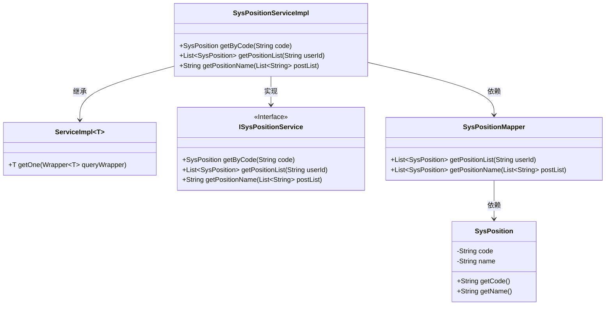
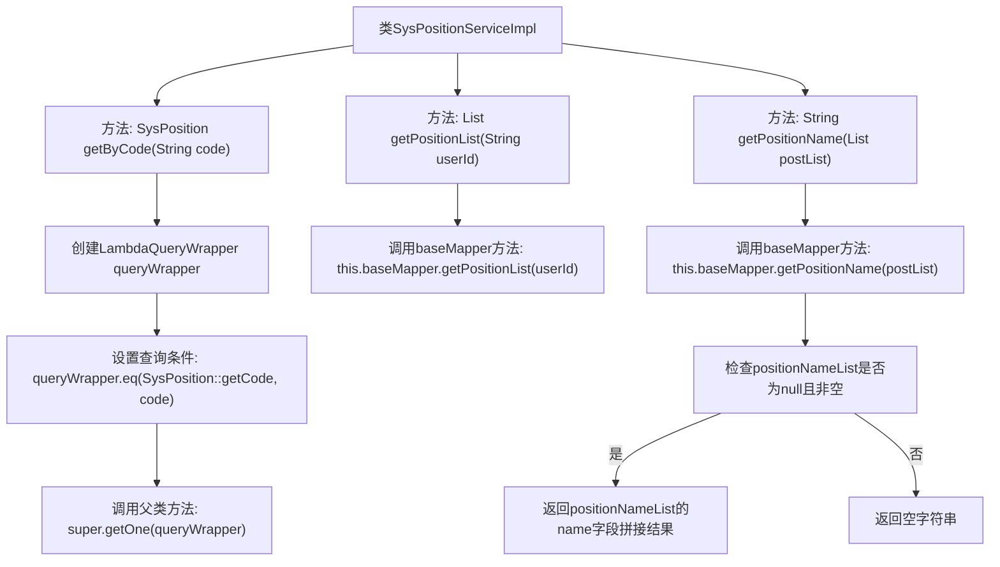

# 基础信息

|      |      |
|------|------|
| 名称 | SysPositionServiceImpl |
| 编码语言 | .java |
| 代码路径 | JeecgBoot/jeecg-boot/jeecg-module-system/jeecg-system-biz/src/main/java/org/jeecg/modules/system/service/impl/SysPositionServiceImpl.java |
| 包名 | org.jeecg.modules.system.service.impl |
| 依赖项 | ['com.baomidou.mybatisplus.core.conditions.query.LambdaQueryWrapper', 'com.baomidou.mybatisplus.extension.service.impl.ServiceImpl', 'org.jeecg.common.constant.SymbolConstant', 'org.jeecg.modules.system.entity.SysPosition', 'org.jeecg.modules.system.mapper.SysPositionMapper', 'org.jeecg.modules.system.service.ISysPositionService', 'org.springframework.stereotype.Service', 'java.util.List', 'java.util.stream.Collectors'] |
| 概述说明 | SysPositionServiceImpl类实现ISysPositionService接口，提供职位编码查询、用户职位列表及职位名称功能。 |

# 说明

SysPositionServiceImpl类实现了ISysPositionService接口，主要功能包括根据职位编码获取职位信息、获取用户职位列表以及获取职位名称。这些功能为用户提供了便捷的职位管理服务，确保能够快速准确地获取相关职位数据。

# 类列表 Class Summary

| 名称   | 类型  | 说明 |
|-------|------|-------------|
| SysPositionServiceImpl | class | SysPositionServiceImpl类实现ISysPositionService接口，提供根据编码获取职位、获取用户职位列表及职位名称功能。 |

## 类 SysPositionServiceImpl

|      |      |
|------|------|
| 访问范围 | @Service;public |
| 类型 | class |
| 名称 | SysPositionServiceImpl |
| 说明 | SysPositionServiceImpl类实现ISysPositionService接口，提供根据编码获取职位、获取用户职位列表及职位名称功能。 |

### UML类图

这段代码定义了一个`SysPositionServiceImpl`类，它继承了`ServiceImpl`并实现了`ISysPositionService`接口。该类提供了三个方法：`getByCode`用于根据代码获取职位信息，`getPositionList`用于获取用户职位列表，`getPositionName`用于获取职位名称列表并拼接成字符串。`SysPositionMapper`类负责与数据库交互，获取职位信息。`SysPosition`类表示职位实体，包含职位代码和名称。

### 内部方法调用关系图

这段代码是一个服务类 `SysPositionServiceImpl`，它实现了 `ISysPositionService` 接口，并继承了 `ServiceImpl` 类。代码中定义了三个方法：`getByCode` 用于根据编码查询职位信息，`getPositionList` 用于获取用户的职位列表，`getPositionName` 用于根据职位列表获取职位名称的拼接字符串。流程图展示了每个方法的内部调用关系和逻辑流程，确保代码的每个步骤都清晰可见。

### 字段列表 Field List

| 名称  | 类型  | 说明 |
|-------|-------|------|

### 方法列表 Method List

| 名称  | 类型  | 说明 |
|-------|-------|------|
| getByCode | SysPosition | 通过代码查询系统职位信息的方法。 |
| getPositionList | List<SysPosition> | 重写方法获取用户职位列表，调用基础映射器实现。 |
| getPositionName | String | 方法根据职位列表查询并返回逗号分隔的职位名称。 |

