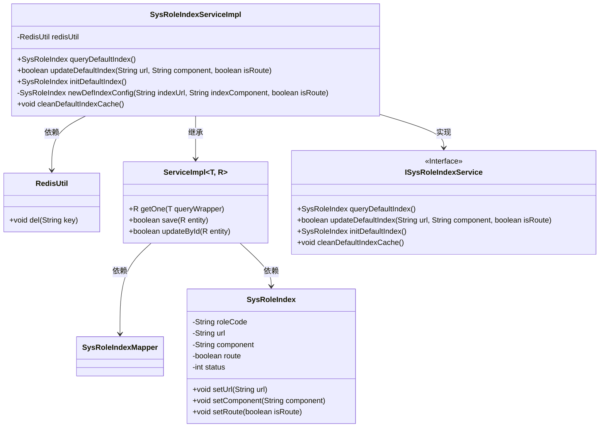
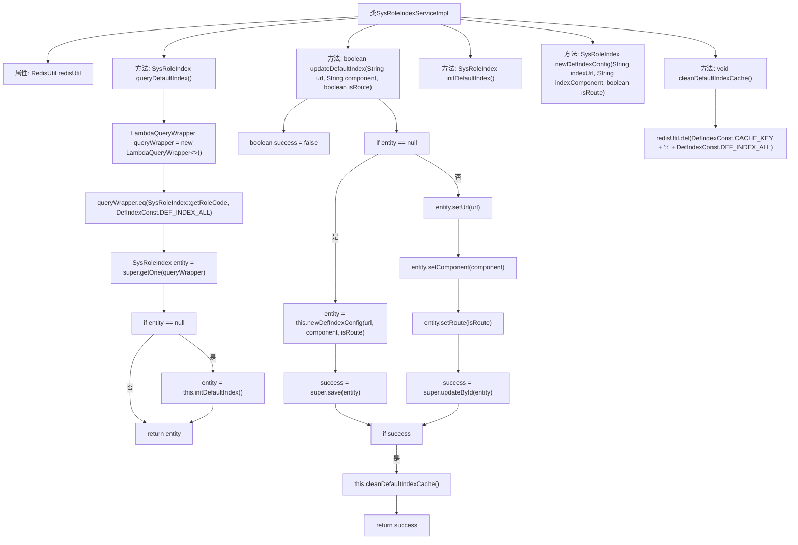

# 基础信息

|      |      |
|------|------|
| 名称 | SysRoleIndexServiceImpl |
| 编码语言 | .java |
| 代码路径 | JeecgBoot/jeecg-boot/jeecg-module-system/jeecg-system-biz/src/main/java/org/jeecg/modules/system/service/impl/SysRoleIndexServiceImpl.java |
| 包名 | org.jeecg.modules.system.service.impl |
| 依赖项 | ['com.baomidou.mybatisplus.core.conditions.query.LambdaQueryWrapper', 'com.baomidou.mybatisplus.extension.service.impl.ServiceImpl', 'org.jeecg.common.constant.CommonConstant', 'org.jeecg.common.util.RedisUtil', 'org.jeecg.modules.system.constant.DefIndexConst', 'org.jeecg.modules.system.entity.SysRoleIndex', 'org.jeecg.modules.system.mapper.SysRoleIndexMapper', 'org.jeecg.modules.system.service.ISysRoleIndexService', 'org.springframework.beans.factory.annotation.Autowired', 'org.springframework.cache.annotation.Cacheable', 'org.springframework.stereotype.Service'] |
| 概述说明 | SysRoleIndexServiceImpl类处理首页查询、更新及缓存清理。 |

# 说明

SysRoleIndexServiceImpl类负责实现系统角色默认首页的查询、更新以及缓存清理功能。该类通过提供查询方法，能够获取默认首页的相关信息；通过更新方法，可以对默认首页的数据进行修改和保存；同时，该类还具备缓存清理功能，确保在数据更新后，缓存能够及时清除，以保证数据的一致性和实时性。这些功能共同协作，确保系统角色默认首页的数据管理高效且准确。

# 类列表 Class Summary

| 名称   | 类型  | 说明 |
|-------|------|-------------|
| SysRoleIndexServiceImpl | class | SysRoleIndexServiceImpl类实现默认首页查询、更新及缓存清理功能。 |

## 类 SysRoleIndexServiceImpl

|      |      |
|------|------|
| 访问范围 | @Service("sysRoleIndexServiceImpl");public |
| 类型 | class |
| 名称 | SysRoleIndexServiceImpl |
| 说明 | SysRoleIndexServiceImpl类实现默认首页查询、更新及缓存清理功能。 |

### UML类图

### 描述
`SysRoleIndexServiceImpl` 是一个服务类，负责处理系统角色首页配置的相关逻辑。它继承了 `ServiceImpl` 类，并实现了 `ISysRoleIndexService` 接口。该类通过 `RedisUtil` 进行缓存管理，提供了查询、更新、初始化默认首页配置以及清理缓存的功能。`SysRoleIndex` 类用于存储角色首页配置的相关信息，包括 URL、组件、路由状态等。

### 内部方法调用关系图

这段代码是一个服务类 `SysRoleIndexServiceImpl`，用于管理系统角色首页的默认配置。它包含了查询、更新、初始化和清理缓存的功能。流程图展示了类中各个方法的调用关系，以及方法内部的逻辑流程，包括条件判断和操作步骤。通过流程图可以清晰地看到每个方法的执行路径和它们之间的依赖关系。

### 字段列表 Field List

| 名称  | 类型  | 说明 |
|-------|-------|------|
| redisUtil | RedisUtil | 自动注入Redis工具类实例。 |

### 方法列表 Method List

| 名称  | 类型  | 说明 |
|-------|-------|------|
| initDefaultIndex | SysRoleIndex | 重写方法，初始化默认索引配置。 |
| updateDefaultIndex | boolean | 更新默认索引：查询配置，不存在则新增，存在则更新，成功则清理缓存。 |
| cleanDefaultIndexCache | void | 重写方法用于删除Redis中默认索引缓存。 |
| queryDefaultIndex | SysRoleIndex | 查询默认角色索引，缓存结果，确保返回非空实体。 |
| newDefIndexConfig | SysRoleIndex | 创建SysRoleIndex对象，设置角色代码、URL、组件、路由和状态。 |

