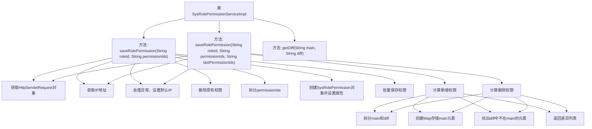

# 基础信息

|      |      |
|------|------|
| 名称 | SysRolePermissionServiceImpl |
| 编码语言 | .java |
| 代码路径 | JeecgBoot/jeecg-boot/jeecg-module-system/jeecg-system-biz/src/main/java/org/jeecg/modules/system/service/impl/SysRolePermissionServiceImpl.java |
| 包名 | org.jeecg.modules.system.service.impl |
| 依赖项 | ['java.util', 'org.jeecg.common.util.IpUtils', 'org.jeecg.common.util.SpringContextUtils', 'org.jeecg.common.util.oConvertUtils', 'org.jeecg.modules.system.entity.SysRolePermission', 'org.jeecg.modules.system.mapper.SysRolePermissionMapper', 'org.jeecg.modules.system.service.ISysRolePermissionService', 'com.baomidou.mybatisplus.core.conditions.query.LambdaQueryWrapper', 'com.baomidou.mybatisplus.core.conditions.query.QueryWrapper', 'com.baomidou.mybatisplus.extension.service.impl.ServiceImpl', 'org.springframework.stereotype.Service', 'javax.servlet.http.HttpServletRequest'] |
| 概述说明 | 实现角色权限保存与更新，支持IP获取、权限差异处理和批量操作。 |

# 说明

该功能实现了角色权限的保存与更新，涵盖了IP地址的获取、权限差异的处理以及批量操作的支持。通过获取用户IP地址，系统能够记录操作来源；权限差异处理确保权限变更的准确性和一致性；批量操作功能提高了权限管理的效率，支持同时对多个角色进行权限调整。该功能全面提升了权限管理的精确性和操作便捷性。

# 类列表 Class Summary

| 名称   | 类型  | 说明 |
|-------|------|-------------|
| SysRolePermissionServiceImpl | class | 实现角色权限保存与更新，包括IP获取、权限差异处理及批量操作。 |


## 类 SysRolePermissionServiceImpl

|      |      |
|------|------|
| 访问范围 | @Service;public |
| 类型 | class |
| 名称 | SysRolePermissionServiceImpl |
| 说明 | 实现角色权限保存与更新，包括IP获取、权限差异处理及批量操作。 |


### UML类图

```mermaid
classDiagram
    class SysRolePermissionServiceImpl {
        +void saveRolePermission(String roleId, String permissionIds)
        +void saveRolePermission(String roleId, String permissionIds, String lastPermissionIds)
        -List~String~ getDiff(String main, String diff)
    }
    class ServiceImpl~SysRolePermissionMapper, SysRolePermission~ {
        // 基类，提供通用服务实现
    }
    class ISysRolePermissionService {
        <<Interface>>
        +void saveRolePermission(String roleId, String permissionIds)
        +void saveRolePermission(String roleId, String permissionIds, String lastPermissionIds)
    }
    class SysRolePermission {
        // 角色权限实体类
    }
    class SysRolePermissionMapper {
        // 角色权限数据访问类
    }
    class SpringContextUtils {
        +HttpServletRequest getHttpServletRequest()
    }
    class IpUtils {
        +String getIpAddr(HttpServletRequest request)
    }
    class oConvertUtils {
        +boolean isEmpty(String str)
        +boolean isNotEmpty(String str)
    }
    class QueryWrapper~SysRolePermission~ {
        // 查询条件封装类
    }
    class LambdaQueryWrapper~SysRolePermission~ {
        // Lambda表达式查询条件封装类
    }
    class HttpServletRequest {
        // HTTP请求对象
    }

    SysRolePermissionServiceImpl --> ServiceImpl~SysRolePermissionMapper, SysRolePermission~ : 继承
    SysRolePermissionServiceImpl --> ISysRolePermissionService : 实现
    SysRolePermissionServiceImpl --> SpringContextUtils : 依赖 : 获取HttpServletRequest
    SysRolePermissionServiceImpl --> IpUtils : 依赖 : 获取IP地址
    SysRolePermissionServiceImpl --> oConvertUtils : 依赖 : 字符串处理
    SysRolePermissionServiceImpl --> QueryWrapper~SysRolePermission~ : 依赖 : 查询条件封装
    SysRolePermissionServiceImpl --> LambdaQueryWrapper~SysRolePermission~ : 依赖 : Lambda查询条件封装
    SysRolePermissionServiceImpl --> SysRolePermission : 依赖 : 角色权限实体
    SysRolePermissionServiceImpl --> SysRolePermissionMapper : 依赖 : 数据访问
```

### 描述
`SysRolePermissionServiceImpl` 是一个服务实现类，继承自 `ServiceImpl` 并实现了 `ISysRolePermissionService` 接口。该类提供了保存角色权限的功能，包括处理IP地址、查询条件封装、字符串处理等。通过 `SpringContextUtils` 获取HTTP请求对象，使用 `IpUtils` 获取IP地址，并通过 `oConvertUtils` 进行字符串处理。类中还定义了 `getDiff` 方法用于比较权限差异，并通过 `QueryWrapper` 和 `LambdaQueryWrapper` 封装查询条件。


### 内部方法调用关系图



这段代码是`SysRolePermissionServiceImpl`类的实现，主要功能是处理角色与权限的关联操作。代码中包含两个重载的`saveRolePermission`方法，分别用于保存角色的权限和更新角色的权限。代码首先通过`HttpServletRequest`获取IP地址，处理异常时设置默认IP。然后根据传入的权限ID列表，删除原有权限，创建新的权限对象并批量保存。`getDiff`方法用于计算两个权限列表的差异，找出新增和删除的权限。

### 字段列表 Field List

| 名称  | 类型  | 说明 |
|-------|-------|------|

### 方法列表 Method List

| 名称  | 类型  | 说明 |
|-------|-------|------|
| saveRolePermission | void | 保存角色权限，获取IP，删除旧权限，批量保存新权限。 |
| getDiff | List<String> | 获取两个字符串的差异，返回不在主字符串中的元素列表。 |
| saveRolePermission | void | 保存角色权限，处理新增和删除权限，记录操作IP和时间。 |


