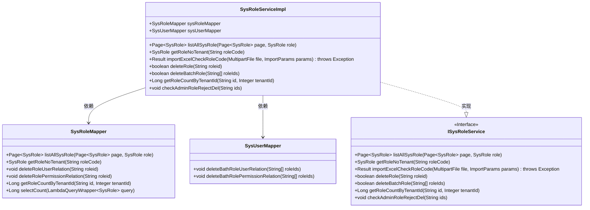

# 基础信息

|      |      |
|------|------|
| 名称 | SysRoleServiceImpl |
| 编码语言 | .java |
| 代码路径 | JeecgBoot/jeecg-boot/jeecg-module-system/jeecg-system-biz/src/main/java/org/jeecg/modules/system/service/impl/SysRoleServiceImpl.java |
| 包名 | org.jeecg.modules.system.service.impl |
| 依赖项 | ['com.baomidou.mybatisplus.core.conditions.query.LambdaQueryWrapper', 'com.baomidou.mybatisplus.extension.plugins.pagination.Page', 'com.baomidou.mybatisplus.extension.service.impl.ServiceImpl', 'org.jeecg.common.api.vo.Result', 'org.jeecg.common.constant.CommonConstant', 'org.jeecg.common.constant.SymbolConstant', 'org.jeecg.common.exception.JeecgBootException', 'org.jeecg.common.util.ImportExcelUtil', 'org.jeecg.modules.system.entity.SysRole', 'org.jeecg.modules.system.mapper.SysRoleMapper', 'org.jeecg.modules.system.mapper.SysUserMapper', 'org.jeecg.modules.system.service.ISysRoleService', 'org.jeecgframework.poi.excel.ExcelImportUtil', 'org.jeecgframework.poi.excel.entity.ImportParams', 'org.springframework.beans.factory.annotation.Autowired', 'org.springframework.stereotype.Service', 'org.springframework.transaction.annotation.Transactional', 'org.springframework.web.multipart.MultipartFile', 'java.util.ArrayList', 'java.util.Arrays', 'java.util.List'] |
| 概述说明 | SysRoleServiceImpl实现角色管理功能，涵盖查询、删除、导入及计数操作。 |

# 说明

SysRoleServiceImpl是一个实现角色管理功能的类，主要功能包括角色列表查询、单个角色删除、批量角色删除、角色数据导入时的校验以及角色数量的统计等操作。这些功能涵盖了角色管理的基本需求，提供了全面的角色管理支持。

# 类列表 Class Summary

| 名称   | 类型  | 说明 |
|-------|------|-------------|
| SysRoleServiceImpl | class | SysRoleServiceImpl实现角色管理功能，包括列表查询、角色删除、批量删除、导入校验及角色计数等操作。 |

## 类 SysRoleServiceImpl

|      |      |
|------|------|
| 访问范围 | @Service;public |
| 类型 | class |
| 名称 | SysRoleServiceImpl |
| 说明 | SysRoleServiceImpl实现角色管理功能，包括列表查询、角色删除、批量删除、导入校验及角色计数等操作。 |

### UML类图

这段代码定义了一个名为 `SysRoleServiceImpl` 的服务类，该类实现了 `ISysRoleService` 接口，并依赖于 `SysRoleMapper` 和 `SysUserMapper` 两个映射器类。`SysRoleServiceImpl` 提供了多种方法来处理系统角色的相关操作，如列出所有角色、获取角色、删除角色、批量删除角色、检查角色代码的重复性等。该类通过 `@Autowired` 注解自动注入 `SysRoleMapper` 和 `SysUserMapper` 实例，并在方法中调用这些映射器来执行数据库操作。

### 内部方法调用关系图

```mermaid
graph TD
    A["类SysRoleServiceImpl"]
    B["属性: SysRoleMapper sysRoleMapper"]
    C["属性: SysUserMapper sysUserMapper"]
    D["方法: Page<SysRole> listAllSysRole(Page<SysRole> page, SysRole role)"]
    E["方法: SysRole getRoleNoTenant(String roleCode)"]
    F["方法: Result importExcelCheckRoleCode(MultipartFile file, ImportParams params)"]
    G["方法: boolean deleteRole(String roleid)"]
    H["方法: boolean deleteBatchRole(String[] roleIds)"]
    I["方法: Long getRoleCountByTenantId(String id, Integer tenantId)"]
    J["方法: void checkAdminRoleRejectDel(String ids)"]

    A --> B
    A --> C
    A --> D
    A --> E
    A --> F
    A --> G
    A --> H
    A --> I
    A --> J

    D --> K["调用: sysRoleMapper.listAllSysRole(page, role)"]
    E --> L["调用: sysRoleMapper.getRoleNoTenant(roleCode)"]
    F --> M["调用: ExcelImportUtil.importExcel(file.getInputStream(), SysRole.class, params)"]
    F --> N["调用: ImportExcelUtil.importDateSave(listSysRoles, ISysRoleService.class, errorStrs, CommonConstant.SQL_INDEX_UNIQ_SYS_ROLE_CODE)"]
    F --> O["调用: ImportExcelUtil.imporReturnRes(errorLines, successLines, list)"]
    G --> P["调用: sysRoleMapper.deleteRoleUserRelation(roleid)"]
    G --> Q["调用: sysRoleMapper.deleteRolePermissionRelation(roleid)"]
    G --> R["调用: this.removeById(roleid)"]
    H --> S["调用: sysUserMapper.deleteBathRoleUserRelation(roleIds)"]
    H --> T["调用: sysUserMapper.deleteBathRolePermissionRelation(roleIds)"]
    H --> U["调用: this.removeByIds(Arrays.asList(roleIds))"]
    I --> V["调用: sysRoleMapper.getRoleCountByTenantId(id, tenantId)"]
    J --> W["调用: sysRoleMapper.selectCount(query)"]
    J --> X["抛出: JeecgBootException('admin角色，不允许删除！')"]
```

这段代码展示了`SysRoleServiceImpl`类的实现，该类继承自`ServiceImpl`并实现了`ISysRoleService`接口。类中包含了多个方法，用于处理系统角色的查询、导入、删除和校验等操作。每个方法都调用了相应的Mapper方法或工具类方法来完成具体业务逻辑。代码通过`@Transactional`注解确保了事务的原子性，并在删除操作时进行了权限校验，防止误删`admin`角色。

### 字段列表 Field List

| 名称  | 类型  | 说明 |
|-------|-------|------|
| sysRoleMapper | SysRoleMapper | 自动注入SysRoleMapper对象。 |
| sysUserMapper | SysUserMapper | 自动注入SysUserMapper实例。 |

### 方法列表 Method List

| 名称  | 类型  | 说明 |
|-------|-------|------|
| deleteBatchRole | boolean | 批量删除角色及其关联关系，确保事务回滚。 |
| listAllSysRole | Page<SysRole> | 重写方法，返回分页查询的角色列表。 |
| deleteRole | boolean | 删除角色及其关联的用户和权限关系，确保事务回滚。 |
| getRoleCountByTenantId | Long | 根据租户ID和ID获取角色数量。 |
| getRoleNoTenant | SysRole | 重写方法获取无租户角色信息。 |
| importExcelCheckRoleCode | Result | 方法检查并导入Excel中的角色代码，去除重复数据并返回结果。 |
| checkAdminRoleRejectDel | void | 检查并拒绝删除包含admin角色的记录。 |

