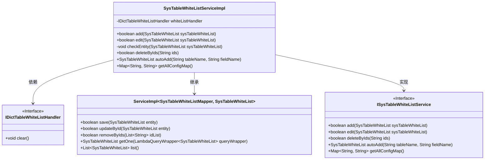
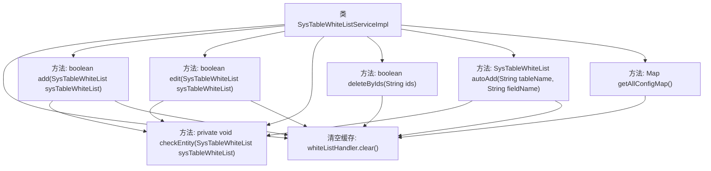

# 基础信息

|      |      |
|------|------|
| 名称 | SysTableWhiteListServiceImpl |
| 编码语言 | .java |
| 代码路径 | JeecgBoot/jeecg-boot/jeecg-module-system/jeecg-system-biz/src/main/java/org/jeecg/modules/system/service/impl/SysTableWhiteListServiceImpl.java |
| 包名 | org.jeecg.modules.system.service.impl |
| 依赖项 | ['com.baomidou.mybatisplus.core.conditions.query.LambdaQueryWrapper', 'com.baomidou.mybatisplus.extension.service.impl.ServiceImpl', 'lombok.extern.slf4j.Slf4j', 'org.jeecg.common.constant.CommonConstant', 'org.jeecg.common.exception.JeecgBootException', 'org.jeecg.common.util.oConvertUtils', 'org.jeecg.config.firewall.SqlInjection.IDictTableWhiteListHandler', 'org.jeecg.modules.system.entity.SysTableWhiteList', 'org.jeecg.modules.system.mapper.SysTableWhiteListMapper', 'org.jeecg.modules.system.service.ISysTableWhiteListService', 'org.springframework.beans.factory.annotation.Autowired', 'org.springframework.context.annotation.Lazy', 'org.springframework.stereotype.Service', 'java.util'] |
| 概述说明 | 实现表白名单管理，支持增删改查和缓存清理功能。 |

# 说明

该系统实现了表白名单的管理功能，支持对名单进行增加、删除、修改和查询操作。此外，系统还提供了缓存清理功能，确保数据的一致性和高效性。通过这些功能，用户可以方便地管理和维护表白名单，同时保持系统的性能优化。

# 类列表 Class Summary

| 名称   | 类型  | 说明 |
|-------|------|-------------|
| SysTableWhiteListServiceImpl | class | 实现系统表白名单管理，支持增删改查及缓存清理功能。 |

## 类 SysTableWhiteListServiceImpl

|      |      |
|------|------|
| 访问范围 | @Slf4j;@Service;public |
| 类型 | class |
| 名称 | SysTableWhiteListServiceImpl |
| 说明 | 实现系统表白名单管理，支持增删改查及缓存清理功能。 |

### UML类图

这段代码定义了一个名为 `SysTableWhiteListServiceImpl` 的服务类，该类继承自 `ServiceImpl` 并实现了 `ISysTableWhiteListService` 接口。该类主要负责处理系统表白名单的增删改查操作，并且在每次操作后都会调用 `whiteListHandler.clear()` 方法来清空缓存。`checkEntity` 方法用于验证传入的实体是否符合规范，确保表名和字段名不为空，并且将它们转换为小写。`autoAdd` 方法用于自动添加或更新白名单项，而 `getAllConfigMap` 方法则返回所有启用的白名单配置。

### 内部方法调用关系图

这段代码定义了一个名为 `SysTableWhiteListServiceImpl` 的服务类，主要用于管理白名单表的相关操作。类中包含多个方法，如 `add`、`edit`、`deleteByIds`、`autoAdd` 和 `getAllConfigMap`，分别用于添加、编辑、删除、自动添加和获取所有配置。每个方法在执行核心操作后，都会调用 `whiteListHandler.clear()` 来清空缓存。`checkEntity` 方法用于验证实体的合法性，确保表名和字段名不为空，并将其转换为小写。代码通过日志记录操作过程，确保系统的可追溯性和可维护性。

### 字段列表 Field List

| 名称  | 类型  | 说明 |
|-------|-------|------|
| whiteListHandler | IDictTableWhiteListHandler | 使用懒加载和自动装配注入白名单处理程序。 |

### 方法列表 Method List

| 名称  | 类型  | 说明 |
|-------|-------|------|
| add | boolean | 方法检查实体后保存，成功则清空缓存并返回真，否则返回假。 |
| edit | boolean | 重写方法，检查实体后更新并清空缓存，返回更新结果。 |
| getAllConfigMap | Map<String, String> | 重写方法获取启用配置，表名和字段名转小写存入Map。 |
| checkEntity | void | 检查实体非空，表名和字段名不能为空，转为小写，状态为空默认启用。 |
| deleteByIds | boolean | 根据ID批量删除数据，成功时清空缓存并返回true，否则返回false。 |
| autoAdd | SysTableWhiteList | 方法`autoAdd`检查表名和字段名，存在则合并字段，不存在则新增白名单项。 |

