# 基础信息

|      |      |
|------|------|
| 名称 | SysTenantPackServiceImpl |
| 编码语言 | .java |
| 代码路径 | JeecgBoot/jeecg-boot/jeecg-module-system/jeecg-system-biz/src/main/java/org/jeecg/modules/system/service/impl/SysTenantPackServiceImpl.java |
| 包名 | org.jeecg.modules.system.service.impl |
| 依赖项 | ['com.baomidou.mybatisplus.core.conditions.query.LambdaQueryWrapper', 'org.apache.shiro.SecurityUtils', 'org.jeecg.common.constant.SymbolConstant', 'org.jeecg.common.constant.TenantConstant', 'org.jeecg.common.system.vo.LoginUser', 'org.jeecg.common.util.SpringContextUtils', 'org.jeecg.common.util.oConvertUtils', 'org.jeecg.modules.aop.TenantLog', 'org.jeecg.modules.system.entity.SysPackPermission', 'org.jeecg.modules.system.entity.SysTenant', 'org.jeecg.modules.system.entity.SysTenantPack', 'org.jeecg.modules.system.entity.SysTenantPackUser', 'org.jeecg.modules.system.mapper.SysPackPermissionMapper', 'org.jeecg.modules.system.mapper.SysRoleMapper', 'org.jeecg.modules.system.mapper.SysTenantPackMapper', 'org.jeecg.modules.system.mapper.SysTenantPackUserMapper', 'org.jeecg.modules.system.service.ISysTenantPackService', 'org.springframework.beans.BeanUtils', 'org.springframework.beans.factory.annotation.Autowired', 'org.springframework.stereotype.Service', 'com.baomidou.mybatisplus.extension.service.impl.ServiceImpl', 'org.springframework.transaction.annotation.Transactional', 'java.util.Arrays', 'java.util.HashMap', 'java.util.List', 'java.util.Map', 'java.util.stream.Collectors'] |
| 概述说明 | SysTenantPackServiceImpl类负责租户套餐管理，涵盖增删改及同步功能。 |

# 说明

SysTenantPackServiceImpl类负责租户套餐管理，提供添加、编辑和删除权限的功能，同时支持套餐包的同步操作，确保租户套餐信息的统一和实时更新。

# 类列表 Class Summary

| 名称   | 类型  | 说明 |
|-------|------|-------------|
| SysTenantPackServiceImpl | class | SysTenantPackServiceImpl类实现租户套餐管理，包含添加、编辑、删除权限及套餐包同步等功能。 |

## 类 SysTenantPackServiceImpl

|      |      |
|------|------|
| 访问范围 | @Service;public |
| 类型 | class |
| 名称 | SysTenantPackServiceImpl |
| 说明 | SysTenantPackServiceImpl类实现租户套餐管理，包含添加、编辑、删除权限及套餐包同步等功能。 |

### UML类图

```mermaid
classDiagram
    class SysTenantPackServiceImpl {
        -SysTenantPackMapper sysTenantPackMapper
        -SysTenantPackUserMapper sysTenantPackUserMapper
        -SysPackPermissionMapper sysPackPermissionMapper
        -SysRoleMapper sysRoleMapper
        +void addPackPermission(SysTenantPack sysTenantPack)
        +List~SysTenantPack~ setPermissions(List~SysTenantPack~ records)
        +void editPackPermission(SysTenantPack sysTenantPack)
        +void deleteTenantPack(String ids)
        +void exitTenant(String tenantId, String userId)
        +void addDefaultTenantPack(Integer tenantId)
        +String saveOne(SysTenantPack sysTenantPack)
        +void savePackUser(SysTenantPackUser sysTenantPackUser)
        +SysTenantPack getSysTenantPack(Integer tenantId, String packCode)
        +void addPermission(String packId, String permissionId)
        +void deletePackPermission(String packId, String permissionId)
        +void addTenantDefaultPack(Integer tenantId)
        +void syncDefaultPack(Integer tenantId)
        -void syncDefaultPack2CurrentTenant(Integer tenantId, SysTenantPack defaultPacks)
        -void deletePackUser(String packId)
    }

    class SysTenantPackMapper {
        +void insert(SysTenantPack sysTenantPack)
        +void updateById(SysTenantPack sysTenantPack)
        +void deleteById(String id)
        +List~SysTenantPack~ selectList(LambdaQueryWrapper~SysTenantPack~ query)
    }

    class SysTenantPackUserMapper {
        +void insert(SysTenantPackUser sysTenantPackUser)
        +void delete(LambdaQueryWrapper~SysTenantPackUser~ query)
    }

    class SysPackPermissionMapper {
        +void insert(SysPackPermission sysPackPermission)
        +void delete(LambdaQueryWrapper~SysPackPermission~ query)
        +List~String~ getPermissionsByPackId(String packId)
    }

    class SysRoleMapper {
        // 未在代码中使用，省略具体方法
    }

    class ISysTenantPackService {
        <<Interface>>
        +void addPackPermission(SysTenantPack sysTenantPack)
        +List~SysTenantPack~ setPermissions(List~SysTenantPack~ records)
        +void editPackPermission(SysTenantPack sysTenantPack)
        +void deleteTenantPack(String ids)
        +void exitTenant(String tenantId, String userId)
        +void addDefaultTenantPack(Integer tenantId)
        +String saveOne(SysTenantPack sysTenantPack)
        +void savePackUser(SysTenantPackUser sysTenantPackUser)
        +SysTenantPack getSysTenantPack(Integer tenantId, String packCode)
    }

    class ServiceImpl~T~ {
        // 省略具体方法
    }

    class LambdaQueryWrapper~T~ {
        // 省略具体方法
    }

    class SysTenantPack {
        -String id
        -String tenantId
        -String packCode
        -String packName
        -String packType
        -String permissionIds
        +SysTenantPack(Integer tenantId, String packName, String packCode)
    }

    class SysTenantPackUser {
        -String tenantId
        -String packId
        -String userId
        -String realname
        -String packName
        -Integer status
        +SysTenantPackUser(String tenantId, String packId, String userId)
    }

    class SysPackPermission {
        -String packId
        -String permissionId
    }

    class LoginUser {
        -String id
        -String realname
    }

    class SecurityUtils {
        +Subject getSubject()
    }

    class Subject {
        +Object getPrincipal()
    }

    class SpringContextUtils {
        +ApplicationContext getApplicationContext()
    }

    class ApplicationContext {
        +T getBean(Class~T~ clazz)
    }

    class BeanUtils {
        +void copyProperties(Object source, Object target)
    }

    class TenantConstant {
        <<Enum>>
        +String SUPER_ADMIN
        +String ACCOUNT_ADMIN
        +String APP_ADMIN
    }

    class SymbolConstant {
        <<Enum>>
        +String COMMA
    }

    class oConvertUtils {
        +boolean isNotEmpty(String str)
        +boolean isEmpty(String str)
        +boolean listIsNotEmpty(List~?~ list)
    }

    SysTenantPackServiceImpl --> ISysTenantPackService : 实现
    SysTenantPackServiceImpl --> ServiceImpl~SysTenantPackMapper, SysTenantPack~ : 继承
    SysTenantPackServiceImpl --> SysTenantPackMapper : 依赖
    SysTenantPackServiceImpl --> SysTenantPackUserMapper : 依赖
    SysTenantPackServiceImpl --> SysPackPermissionMapper : 依赖
    SysTenantPackServiceImpl --> SysRoleMapper : 依赖
    SysTenantPackServiceImpl --> SpringContextUtils : 依赖
    SysTenantPackServiceImpl --> SecurityUtils : 依赖
    SysTenantPackServiceImpl --> BeanUtils : 依赖
    SysTenantPackServiceImpl --> oConvertUtils : 依赖
    SysTenantPackServiceImpl --> TenantConstant : 依赖
    SysTenantPackServiceImpl --> SymbolConstant : 依赖
    ISysTenantPackService --> SysTenantPack : 依赖
    ISysTenantPackService --> SysTenantPackUser : 依赖
    ISysTenantPackService --> SysPackPermission : 依赖
    SysTenantPackMapper --> SysTenantPack : 依赖
    SysTenantPackUserMapper --> SysTenantPackUser : 依赖
    SysPackPermissionMapper --> SysPackPermission : 依赖
    SpringContextUtils --> ApplicationContext : 依赖
    SecurityUtils --> Subject : 依赖
    Subject --> LoginUser : 依赖
```

### 描述
该代码实现了一个租户套餐包管理服务，主要功能包括添加、编辑、删除套餐包及其权限，以及同步默认套餐包到当前租户。`SysTenantPackServiceImpl`类实现了`ISysTenantPackService`接口，并依赖于多个Mapper类进行数据库操作。代码通过`SpringContextUtils`和`SecurityUtils`获取上下文和用户信息，并使用`BeanUtils`进行对象属性复制。`oConvertUtils`工具类用于字符串和列表的空值判断，`TenantConstant`和`SymbolConstant`定义了常量值。

### 内部方法调用关系图

```mermaid
graph TD
    A["类SysTenantPackServiceImpl"]
    B["属性: SysTenantPackMapper sysTenantPackMapper"]
    C["属性: SysTenantPackUserMapper sysTenantPackUserMapper"]
    D["属性: SysPackPermissionMapper sysPackPermissionMapper"]
    E["属性: SysRoleMapper sysRoleMapper"]
    F["方法: void addPackPermission(SysTenantPack sysTenantPack)"]
    G["方法: List<SysTenantPack> setPermissions(List<SysTenantPack> records)"]
    H["方法: void editPackPermission(SysTenantPack sysTenantPack)"]
    I["方法: void deleteTenantPack(String ids)"]
    J["方法: void exitTenant(String tenantId, String userId)"]
    K["方法: void addDefaultTenantPack(Integer tenantId)"]
    L["方法: String saveOne(SysTenantPack sysTenantPack)"]
    M["方法: void savePackUser(SysTenantPackUser sysTenantPackUser)"]
    N["方法: SysTenantPack getSysTenantPack(Integer tenantId, String packCode)"]
    O["方法: void addPermission(String packId, String permissionId)"]
    P["方法: void deletePackPermission(String packId, String permissionId)"]
    Q["方法: void addTenantDefaultPack(Integer tenantId)"]
    R["方法: void syncDefaultPack(Integer tenantId)"]
    S["方法: void syncDefaultPack2CurrentTenant(Integer tenantId, SysTenantPack defaultPacks)"]
    T["方法: void deletePackUser(String packId)"]

    A --> B
    A --> C
    A --> D
    A --> E
    A --> F
    A --> G
    A --> H
    A --> I
    A --> J
    A --> K
    A --> L
    A --> M
    A --> N
    A --> O
    A --> P
    A --> Q
    A --> R
    A --> S
    A --> T
```

这段代码是一个Spring Boot服务实现类，名为`SysTenantPackServiceImpl`，主要用于管理租户套餐包的权限、用户和菜单等操作。它包含了多个方法，如添加套餐包权限、设置权限、编辑权限、删除租户套餐包、退出租户、添加默认租户套餐包等。代码通过依赖注入的方式使用多个Mapper类来操作数据库，实现了对租户套餐包的增删改查操作。流程图展示了类中的各个方法及其调用关系，清晰地反映了服务类的结构和功能。

### 字段列表 Field List

| 名称  | 类型  | 说明 |
|-------|-------|------|
| sysTenantPackMapper | SysTenantPackMapper | 自动注入SysTenantPackMapper实例。 |
| sysRoleMapper | SysRoleMapper | 自动注入SysRoleMapper实例。 |
| sysTenantPackUserMapper | SysTenantPackUserMapper | 自动注入SysTenantPackUserMapper实例。 |
| sysPackPermissionMapper | SysPackPermissionMapper | 自动注入SysPackPermissionMapper实例。 |

### 方法列表 Method List

| 名称  | 类型  | 说明 |
|-------|-------|------|
| addTenantDefaultPack | void | 为指定租户添加默认套餐，同步默认套餐至当前租户。 |
| setPermissions | List<SysTenantPack> | 重写方法，为租户包设置权限ID列表。 |
| exitTenant | void | 方法exitTenant根据tenantId获取租户信息。 |
| deletePackPermission | void | 删除指定包ID和权限ID的权限记录。 |
| addPackPermission | void | 方法插入租户包并关联权限ID。 |
| addDefaultTenantPack | void | 为租户创建默认套餐包，包括超级管理员、组织账户管理员和组织应用管理员。 |
| saveOne | String | 重写saveOne方法，插入sysTenantPack并返回其ID。 |
| getSysTenantPack | SysTenantPack | 根据租户ID和套餐代码查询并返回对应租户套餐信息。 |
| savePackUser | void | 保存租户包用户信息，设置状态为1并插入数据库。 |
| syncDefaultPack2CurrentTenant | void | 同步默认权限包至当前租户，复制属性并插入自定义包及权限。 |
| syncDefaultPack | void | 同步默认套餐包至当前租户，查询并比对默认和自定义套餐，添加缺失项。 |
| deletePackUser | void | 删除指定packId的租户包用户记录。 |
| deleteTenantPack | void | 删除租户包及其关联权限和用户，支持批量操作。 |
| addPermission | void | 方法addPermission为指定包添加权限并插入数据库。 |
| editPackPermission | void | 根据权限ID更新租户包权限，包括新增、删除和比较操作。 |

