# 基础信息

|      |      |
|------|------|
| 名称 | SysTenantServiceImpl |
| 编码语言 | .java |
| 代码路径 | JeecgBoot/jeecg-boot/jeecg-module-system/jeecg-system-biz/src/main/java/org/jeecg/modules/system/service/impl/SysTenantServiceImpl.java |
| 包名 | org.jeecg.modules.system.service.impl |
| 依赖项 | ['cn.hutool.core.util.RandomUtil', 'com.baomidou.mybatisplus.core.conditions.query.LambdaQueryWrapper', 'com.baomidou.mybatisplus.core.metadata.IPage', 'com.baomidou.mybatisplus.extension.plugins.pagination.Page', 'com.baomidou.mybatisplus.extension.service.impl.ServiceImpl', 'lombok.extern.slf4j.Slf4j', 'org.apache.commons.collections.CollectionUtils', 'org.apache.shiro.SecurityUtils', 'org.jeecg.common.api.dto.message.BusMessageDTO', 'org.jeecg.common.api.dto.message.MessageDTO', 'org.jeecg.common.api.vo.Result', 'org.jeecg.common.config.TenantContext', 'org.jeecg.common.constant.CacheConstant', 'org.jeecg.common.constant.CommonConstant', 'org.jeecg.common.constant.SymbolConstant', 'org.jeecg.common.exception.JeecgBootBizTipException', 'org.jeecg.common.exception.JeecgBootException', 'org.jeecg.common.system.api.ISysBaseAPI', 'org.jeecg.common.system.vo.LoginUser', 'org.jeecg.common.util.DateUtils', 'org.jeecg.common.util.PasswordUtil', 'org.jeecg.common.util.SpringContextUtils', 'org.jeecg.common.constant.enums.SysAnnmentTypeEnum', 'org.jeecg.common.util.oConvertUtils', 'org.jeecg.modules.aop.TenantLog', 'org.jeecg.modules.system.entity', 'org.jeecg.modules.system.mapper', 'org.jeecg.modules.system.service.ISysTenantPackService', 'org.jeecg.modules.system.service.ISysTenantService', 'org.jeecg.modules.system.service.ISysUserService', 'org.jeecg.modules.system.vo.tenant', 'org.springframework.beans.BeanUtils', 'org.springframework.beans.factory.NoSuchBeanDefinitionException', 'org.springframework.beans.factory.annotation.Autowired', 'org.springframework.cache.annotation.CacheEvict', 'org.springframework.context.annotation.Lazy', 'org.springframework.stereotype.Service', 'java.util', 'java.util.stream.Collectors'] |
| 概述说明 | SysTenantServiceImpl类实现租户管理，处理查询、删除、邀请及用户关系操作。 |

# 说明

SysTenantServiceImpl类负责实现租户管理的核心功能，涵盖查询、删除、邀请用户、用户加入和退出等操作。该类还处理租户与用户之间的关系，确保租户管理的完整性和一致性。通过该类，系统能够有效地管理租户信息，维护租户与用户之间的关联，支持租户管理的各项操作。

# 类列表 Class Summary

| 名称   | 类型  | 说明 |
|-------|------|-------------|
| SysTenantServiceImpl | class | SysTenantServiceImpl类实现了租户管理功能，包括查询、删除、邀请用户、用户加入、退出等操作，并处理租户与用户的关系。 |

## 类 SysTenantServiceImpl

|      |      |
|------|------|
| 访问范围 | @Service("sysTenantServiceImpl");@Slf4j;public |
| 类型 | class |
| 名称 | SysTenantServiceImpl |
| 说明 | SysTenantServiceImpl类实现了租户管理功能，包括查询、删除、邀请用户、用户加入、退出等操作，并处理租户与用户的关系。 |

### UML类图

```mermaid
classDiagram
    class SysTenantServiceImpl {
        -ISysUserService userService
        -SysUserTenantMapper userTenantMapper
        -SysTenantMapper tenantMapper
        -ISysTenantPackService sysTenantPackService
        -SysTenantPackUserMapper sysTenantPackUserMapper
        -ISysBaseAPI sysBaseApi
        -SysUserDepartMapper sysUserDepartMapper
        -SysTenantPackMapper sysTenantPackMapper
        -SysPackPermissionMapper sysPackPermissionMapper
        +List~SysTenant~ queryEffectiveTenant(Collection~Integer~ idList)
        +Long countUserLinkTenant(String id)
        +boolean removeTenantById(String id)
        +void invitationUserJoin(String ids, String phone)
        +void leaveTenant(String userIds, String tenantId)
        +Integer saveTenantJoinUser(SysTenant sysTenant, String userId)
        +void saveTenant(SysTenant sysTenant)
        +Integer joinTenantByHouseNumber(SysTenant sysTenant, String userId)
        +Integer countCreateTenantNum(String userId)
        +IPage~SysTenant~ getRecycleBinPageList(Page~SysTenant~ page, SysTenant sysTenant)
        +void deleteTenantLogic(String ids)
        +void revertTenantLogic(String ids)
        +Integer saveTenantRelation(Integer tenantId, String userId)
        +int tenantIdGenerate()
        +void exitUserTenant(String userId, String username, String tenantId)
        +void changeOwenUserTenant(String userId, String tId)
        +Result~String~ invitationUser(String phone, String departId)
        +TenantDepartAuthInfo getTenantDepartAuthInfo(Integer tenantId)
        +List~TenantPackUserCount~ queryTenantPackUserCount(Integer tenantId)
        +TenantPackModel queryTenantPack(TenantPackModel model)
        +void addBatchTenantPackUser(SysTenantPackUser sysTenantPackUser)
        +void addTenantPackUser(SysTenantPackUser sysTenantPackUser)
        +void deleteTenantPackUser(SysTenantPackUser sysTenantPackUser)
        +List~TenantPackUser~ getTenantPackApplyUsers(Integer tenantId)
        +void doApplyTenantPackUser(SysTenantPackUser sysTenantPackUser)
        +void passApply(SysTenantPackUser sysTenantPackUser)
        +void deleteApply(SysTenantPackUser sysTenantPackUser)
        +IPage~TenantPackUser~ queryTenantPackUserList(String tenantId, String packId, Integer status, Page~TenantPackUser~ page)
        +Long getApplySuperAdminCount()
        +void sendMsgForAgreeAndRefuseJoin(SysUser user, String content)
        +String getTenantErrorInfo(String status)
        +void deleteTenantPackByTenantId(List~Integer~ tenantIdList)
        +void deleteUserByPassword(SysUser sysUser, Integer tenantId)
        +List~SysTenant~ getTenantListByUserId(String userId)
    }

    class ISysTenantService {
        <<Interface>>
        +List~SysTenant~ queryEffectiveTenant(Collection~Integer~ idList)
        +Long countUserLinkTenant(String id)
        +boolean removeTenantById(String id)
        +void invitationUserJoin(String ids, String phone)
        +void leaveTenant(String userIds, String tenantId)
        +Integer saveTenantJoinUser(SysTenant sysTenant, String userId)
        +void saveTenant(SysTenant sysTenant)
        +Integer joinTenantByHouseNumber(SysTenant sysTenant, String userId)
        +Integer countCreateTenantNum(String userId)
        +IPage~SysTenant~ getRecycleBinPageList(Page~SysTenant~ page, SysTenant sysTenant)
        +void deleteTenantLogic(String ids)
        +void revertTenantLogic(String ids)
        +Integer saveTenantRelation(Integer tenantId, String userId)
        +int tenantIdGenerate()
        +void exitUserTenant(String userId, String username, String tenantId)
        +void changeOwenUserTenant(String userId, String tId)
        +Result~String~ invitationUser(String phone, String departId)
        +TenantDepartAuthInfo getTenantDepartAuthInfo(Integer tenantId)
        +List~TenantPackUserCount~ queryTenantPackUserCount(Integer tenantId)
        +TenantPackModel queryTenantPack(TenantPackModel model)
        +void addBatchTenantPackUser(SysTenantPackUser sysTenantPackUser)
        +void addTenantPackUser(SysTenantPackUser sysTenantPackUser)
        +void deleteTenantPackUser(SysTenantPackUser sysTenantPackUser)
        +List~TenantPackUser~ getTenantPackApplyUsers(Integer tenantId)
        +void doApplyTenantPackUser(SysTenantPackUser sysTenantPackUser)
        +void passApply(SysTenantPackUser sysTenantPackUser)
        +void deleteApply(SysTenantPackUser sysTenantPackUser)
        +IPage~TenantPackUser~ queryTenantPackUserList(String tenantId, String packId, Integer status, Page~TenantPackUser~ page)
        +Long getApplySuperAdminCount()
        +void sendMsgForAgreeAndRefuseJoin(SysUser user, String content)
        +String getTenantErrorInfo(String status)
        +void deleteTenantPackByTenantId(List~Integer~ tenantIdList)
        +void deleteUserByPassword(SysUser sysUser, Integer tenantId)
        +List~SysTenant~ getTenantListByUserId(String userId)
    }

    SysTenantServiceImpl --> ISysTenantService : 实现
```

### 描述
`SysTenantServiceImpl` 是一个实现 `ISysTenantService` 接口的类，主要负责租户管理相关的业务逻辑。它通过依赖注入的方式使用多个服务类和Mapper类，提供了查询、添加、删除、更新租户信息的功能。该类还处理了租户与用户之间的关联关系，包括用户加入租户、离开租户、邀请用户加入租户等操作。此外，它还负责处理租户产品包的管理，如添加、删除产品包用户等。整体上，该类是一个复杂的租户管理服务实现，涵盖了租户生命周期管理的各个方面。

### 内部方法调用关系图

这段代码是一个名为 `SysTenantServiceImpl` 的服务实现类，主要用于处理租户相关的业务逻辑。它继承了 `ServiceImpl` 类，并实现了 `ISysTenantService` 接口。该类通过多个 `@Autowired` 注解注入了多个 Mapper 和 Service，用于操作数据库和调用其他服务。类中定义了多个方法，包括查询有效租户、统计用户关联租户数量、移除租户、邀请用户加入租户、用户退出租户、保存租户信息等。每个方法都处理了特定的业务逻辑，并且通过调用不同的 Mapper 和 Service 来完成数据操作。

### 字段列表 Field List

| 名称  | 类型  | 说明 |
|-------|-------|------|
| userService | ISysUserService | 自动注入用户服务接口实例。 |
| userTenantMapper | SysUserTenantMapper | 自动注入SysUserTenantMapper实例。 |
| sysPackPermissionMapper | SysPackPermissionMapper | 自动注入SysPackPermissionMapper对象。 |
| sysTenantPackUserMapper | SysTenantPackUserMapper | 自动注入SysTenantPackUserMapper实例。 |
| sysTenantPackService | ISysTenantPackService | 自动注入系统租户包服务实例。 |
| sysBaseApi | ISysBaseAPI | 自动注入系统基础API接口实例。 |
| sysTenantPackMapper | SysTenantPackMapper | 自动注入SysTenantPackMapper实例。 |
| sysUserDepartMapper | SysUserDepartMapper | 自动注入SysUserDepartMapper实例。 |
| tenantMapper | SysTenantMapper | 自动注入SysTenantMapper实例到tenantMapper变量。 |

### 方法列表 Method List

| 名称  | 类型  | 说明 |
|-------|-------|------|
| queryTenantPackUserCount | List<TenantPackUserCount> | 重写方法查询租户包用户数量，返回结果列表。 |
| revertTenantLogic | void | 方法将逗号分隔的ID字符串转换为整数列表并还原租户逻辑。 |
| queryTenantPack | TenantPackModel | 根据租户ID和套餐码查询租户套餐信息，并返回包含套餐名称、ID和用户列表的模型。 |
| saveTenantJoinUser | Integer | 保存租户及用户关系，清除用户缓存。 |
| getTenantErrorInfo | String | 根据租户状态返回相应提示信息。 |
| getApplySuperAdminCount | Long | 方法获取当前用户申请超级管理员的数量。 |
| leveUserProcess | void | 该方法通过用户ID获取用户信息并初始化登录用户对象。 |
| queryEffectiveTenant | List<SysTenant> | 根据ID列表查询有效的租户信息，忽略时间条件。 |
| getTenantListByUserId | List<SysTenant> | 根据用户ID获取租户列表。 |
| countUserLinkTenant | Long | 统计指定租户下状态为1的关联用户数量。 |
| deleteTenantLogic | void | 删除租户逻辑，清除缓存，删除租户、用户及产品包。 |
| doApplyTenantPackUser | void | 根据租户和包信息更新用户状态并发送通知。 |
| getPackUserPositionAndDepart | List<TenantPackUser> | 获取用户列表并添加部门和职位信息后返回。 |
| deleteTenantPackUser | void | 删除租户包用户并发送移除消息。 |
| getTenantPackApplyUsers | List<TenantPackUser> | 重写方法获取租户包申请用户列表。 |
| sendMsgForAgreeAndRefuseJoin | void | 方法发送系统消息给指定用户，包含标题和内容。 |
| sendMsgForDelete | void | 发送用户被移除消息，包含操作者、租户和包信息。 |
| countCreateTenantNum | Integer | 重写countCreateTenantNum方法，调用userTenantMapper统计用户创建租户数量。 |
| saveUserDepart | void | 根据用户ID和部门ID检查关系，不存在则插入新记录。 |
| invitationUserJoin | void | 通过手机号邀请用户加入租户，检查用户存在性并处理租户关系。 |
| addTenantPackUser | void | 添加或更新租户包用户状态，若ID为空则插入，否则更新状态为1。 |
| saveTenantRelation | Integer | 清除缓存并保存租户用户关系，返回租户ID。 |
| exitUserTenant | void | 用户退出租户时，若为拥有者需判断租户信息，否则直接删除用户与租户关联。 |
| invitationUser | Result<String> | 方法检查用户存在性、管理员权限，处理租户邀请并发送消息。 |
| sendMsgForInvitation | void | 发送邀请消息，显示邀请人及租户名称，设置消息类型和跳转按钮。 |
| getRecycleBinPageList | IPage<SysTenant> | 重写方法获取回收站租户分页列表并返回记录。 |
| passApply | void | 方法`passApply`处理租户成员申请，验证后更新信息并发送系统通知。 |
| deleteUserByPassword | void | 根据密码删除用户，需验证管理员权限、用户状态、创建时间及密码。 |
| sendMsgForApplyJoinTenant | void | 方法发送用户申请加入租户消息给管理员。 |
| tenantIdGenerate | int | 方法生成租户ID，同步获取最大ID，若大于等于1000则加1，否则返回1000。 |
| changeOwenUserTenant | void | 方法变更用户租户拥有者，检查租户和用户存在性，更新租户信息，标记旧拥有者为离职状态。 |
| sendMsgForApply | void | 用户申请加入租户包，系统发送消息通知相关成员。 |
| addBatchTenantPackUser | void | 方法批量添加租户包用户，检查用户ID非空后，遍历处理并更新或新增用户信息。 |
| leaveTenant | void | 清除用户缓存，删除指定租户与用户关系及产品包。 |
| getTenantPackUserList | List<TenantPackUser> | 根据租户ID、包ID和用户状态查询用户列表，并添加部门信息。 |
| deleteApply | void | 删除租户成员申请并发送拒绝通知。 |
| queryTenantPackUserList | IPage<TenantPackUser> | 查询租户产品包用户列表并获取用户部门和职位信息。 |
| deleteTenantPackByTenantId | void | 删除租户产品包及相关用户和菜单权限。 |
| getTenantDepartAuthInfo | TenantDepartAuthInfo | 根据租户ID获取部门权限信息，包括租户详情、用户权限包及是否为超级管理员。 |
| joinTenantByHouseNumber | Integer | 方法通过门牌号加入租户，返回租户ID或0表示不存在，处理审核状态并发送通知。 |
| saveTenant | void | 保存租户信息并关联创建人。 |
| removeTenantById | boolean | 方法重写，根据ID删除租户并返回操作结果。 |

