# 基础信息

|      |      |
|------|------|
| 名称 | SysThirdAccountServiceImpl |
| 编码语言 | .java |
| 代码路径 | JeecgBoot/jeecg-boot/jeecg-module-system/jeecg-system-biz/src/main/java/org/jeecg/modules/system/service/impl/SysThirdAccountServiceImpl.java |
| 包名 | org.jeecg.modules.system.service.impl |
| 依赖项 | ['com.baomidou.mybatisplus.core.conditions.query.LambdaQueryWrapper', 'com.baomidou.mybatisplus.extension.service.impl.ServiceImpl', 'com.jeecg.dingtalk.api.base.JdtBaseAPI', 'com.jeecg.dingtalk.api.core.response.Response', 'com.jeecg.dingtalk.api.core.vo.AccessToken', 'com.jeecg.dingtalk.api.user.JdtUserAPI', 'lombok.extern.slf4j.Slf4j', 'org.apache.shiro.SecurityUtils', 'org.jeecg.common.constant.CommonConstant', 'org.jeecg.common.exception.JeecgBootException', 'org.jeecg.common.system.vo.LoginUser', 'org.jeecg.common.util.DateUtils', 'org.jeecg.common.util.PasswordUtil', 'org.jeecg.common.util.UUIDGenerator', 'org.jeecg.common.util.oConvertUtils', 'org.jeecg.modules.system.entity.SysRole', 'org.jeecg.modules.system.entity.SysThirdAccount', 'org.jeecg.modules.system.entity.SysUser', 'org.jeecg.modules.system.entity.SysUserRole', 'org.jeecg.modules.system.mapper.SysRoleMapper', 'org.jeecg.modules.system.mapper.SysThirdAccountMapper', 'org.jeecg.modules.system.mapper.SysUserMapper', 'org.jeecg.modules.system.mapper.SysUserRoleMapper', 'org.jeecg.modules.system.model.ThirdLoginModel', 'org.jeecg.modules.system.service.ISysThirdAccountService', 'org.springframework.beans.factory.annotation.Autowired', 'org.springframework.beans.factory.annotation.Value', 'org.springframework.stereotype.Service', 'java.util.Date', 'java.util.List'] |
| 概述说明 | 实现第三方账户管理，支持用户创建、绑定、更新及查询，兼容钉钉等平台。 |

# 说明

该功能实现了第三方账户管理，涵盖用户创建、绑定、更新及查询等操作。支持多种平台，如钉钉等，确保用户能够方便地管理其第三方账户信息。通过该功能，用户可以轻松创建新账户，绑定现有账户，更新账户信息，以及查询账户状态，提升用户体验和账户管理的灵活性。

# 类列表 Class Summary

| 名称   | 类型  | 说明 |
|-------|------|-------------|
| SysThirdAccountServiceImpl | class | 实现第三方账户管理，包括用户创建、绑定、更新及查询功能，支持钉钉等平台。 |

## 类 SysThirdAccountServiceImpl

|      |      |
|------|------|
| 访问范围 | @Service;@Slf4j;public |
| 类型 | class |
| 名称 | SysThirdAccountServiceImpl |
| 说明 | 实现第三方账户管理，包括用户创建、绑定、更新及查询功能，支持钉钉等平台。 |

### UML类图

```mermaid
classDiagram
    class SysThirdAccountServiceImpl {
        -SysThirdAccountMapper sysThirdAccountMapper
        -SysUserMapper sysUserMapper
        -SysRoleMapper sysRoleMapper
        -SysUserRoleMapper sysUserRoleMapper
        -String dingTalkClientId
        -String dingTalkClientSecret
        +updateThirdUserId(SysUser sysUser, String thirdUserUuid) void
        +createUser(String phone, String thirdUserUuid, Integer tenantId) SysUser
        +saveThirdUser(SysUser sysUser) String
        +getOneBySysUserId(String sysUserId, String thirdType) SysThirdAccount
        +getOneByThirdUserId(String thirdUserId, String thirdType) SysThirdAccount
        +listThirdUserIdByUsername(String[] sysUsernameArr, String thirdType, Integer tenantId) List~SysThirdAccount~
        +saveThirdUser(ThirdLoginModel tlm, Integer tenantId) SysThirdAccount
        +bindThirdAppAccountByUserId(SysThirdAccount sysThirdAccount) SysThirdAccount
        +getOneByUuidAndThirdType(String unionid, String thirdType, Integer tenantId, String thirdUserId) SysThirdAccount
    }

    class SysThirdAccount {
        <<Interface>>
    }

    class SysUser {
        <<Interface>>
    }

    class SysRole {
        <<Interface>>
    }

    class SysUserRole {
        <<Interface>>
    }

    class ThirdLoginModel {
        <<Interface>>
    }

    class LambdaQueryWrapper~T~ {
        <<Interface>>
    }

    class AccessToken {
        <<Interface>>
    }

    class Response~T~ {
        <<Interface>>
    }

    class LoginUser {
        <<Interface>>
    }

    class SecurityUtils {
        <<Interface>>
    }

    class JeecgBootException {
        <<Interface>>
    }

    class DateUtils {
        <<Interface>>
    }

    class PasswordUtil {
        <<Interface>>
    }

    class UUIDGenerator {
        <<Interface>>
    }

    class oConvertUtils {
        <<Interface>>
    }

    class JdtBaseAPI {
        <<Interface>>
    }

    class JdtUserAPI {
        <<Interface>>
    }

    SysThirdAccountServiceImpl --> SysThirdAccountMapper : 依赖
    SysThirdAccountServiceImpl --> SysUserMapper : 依赖
    SysThirdAccountServiceImpl --> SysRoleMapper : 依赖
    SysThirdAccountServiceImpl --> SysUserRoleMapper : 依赖
    SysThirdAccountServiceImpl --> LambdaQueryWrapper~SysThirdAccount~ : 依赖
    SysThirdAccountServiceImpl --> LambdaQueryWrapper~SysRole~ : 依赖
    SysThirdAccountServiceImpl --> LambdaQueryWrapper~SysUserRole~ : 依赖
    SysThirdAccountServiceImpl --> AccessToken : 依赖
    SysThirdAccountServiceImpl --> Response~String~ : 依赖
    SysThirdAccountServiceImpl --> LoginUser : 依赖
    SysThirdAccountServiceImpl --> SecurityUtils : 依赖
    SysThirdAccountServiceImpl --> JeecgBootException : 依赖
    SysThirdAccountServiceImpl --> DateUtils : 依赖
    SysThirdAccountServiceImpl --> PasswordUtil : 依赖
    SysThirdAccountServiceImpl --> UUIDGenerator : 依赖
    SysThirdAccountServiceImpl --> oConvertUtils : 依赖
    SysThirdAccountServiceImpl --> JdtBaseAPI : 依赖
    SysThirdAccountServiceImpl --> JdtUserAPI : 依赖
```

这段代码实现了一个服务类 `SysThirdAccountServiceImpl`，用于处理第三方账户相关的业务逻辑。它依赖于多个Mapper接口（如 `SysThirdAccountMapper`、`SysUserMapper` 等）来操作数据库，并使用了多个工具类（如 `LambdaQueryWrapper`、`AccessToken` 等）来辅助实现功能。该类的主要功能包括更新第三方用户ID、创建用户、保存第三方用户信息、绑定第三方应用账户等。代码中还处理了多种边缘情况，如用户已存在时自动添加时间戳、钉钉登录时的特殊处理等。

### 内部方法调用关系图

```mermaid
graph TD
    A["类SysThirdAccountServiceImpl"]
    B["属性: SysThirdAccountMapper sysThirdAccountMapper"]
    C["属性: SysUserMapper sysUserMapper"]
    D["属性: SysRoleMapper sysRoleMapper"]
    E["属性: SysUserRoleMapper sysUserRoleMapper"]
    F["属性: String dingTalkClientId"]
    G["属性: String dingTalkClientSecret"]
    H["方法: updateThirdUserId(SysUser sysUser, String thirdUserUuid)"]
    I["方法: createUser(String phone, String thirdUserUuid, Integer tenantId)"]
    J["方法: saveThirdUser(SysUser sysUser)"]
    K["方法: getOneBySysUserId(String sysUserId, String thirdType)"]
    L["方法: getOneByThirdUserId(String thirdUserId, String thirdType)"]
    M["方法: listThirdUserIdByUsername(String[] sysUsernameArr, String thirdType, Integer tenantId)"]
    N["方法: saveThirdUser(ThirdLoginModel tlm, Integer tenantId)"]
    O["方法: bindThirdAppAccountByUserId(SysThirdAccount sysThirdAccount)"]
    P["方法: getOneByUuidAndThirdType(String unionid, String thirdType, Integer tenantId, String thirdUserId)"]

    A --> B
    A --> C
    A --> D
    A --> E
    A --> F
    A --> G
    A --> H
    A --> I
    A --> J
    A --> K
    A --> L
    A --> M
    A --> N
    A --> O
    A --> P
```

该代码是一个服务类 `SysThirdAccountServiceImpl`，主要用于处理第三方账户与系统用户之间的关联操作。类中包含多个方法，如更新第三方用户ID、创建用户、保存第三方用户信息、查询第三方账户等。每个方法都涉及对数据库的操作，如查询、插入、更新等。代码中还使用了 `@Autowired` 注解注入多个Mapper对象，以及 `@Value` 注解获取配置项。整体代码结构清晰，功能明确，主要用于管理系统用户与第三方账户的绑定和同步。

### 字段列表 Field List

| 名称  | 类型  | 说明 |
|-------|-------|------|
| sysUserMapper | SysUserMapper | 自动注入SysUserMapper实例。 |
| dingTalkClientSecret | String | DingTalk客户端密钥配置项。 |
| sysUserRoleMapper | SysUserRoleMapper | 自动注入SysUserRoleMapper对象。 |
| sysThirdAccountMapper | SysThirdAccountMapper | 自动注入SysThirdAccountMapper实例。 |
| sysRoleMapper | SysRoleMapper | 自动注入SysRoleMapper实例。 |
| dingTalkClientId | String | DingTalk客户端ID配置项，默认值为空。 |

### 方法列表 Method List

| 名称  | 类型  | 说明 |
|-------|-------|------|
| getOneByThirdUserId | SysThirdAccount | 根据第三方用户ID和类型查询账户信息。 |
| saveThirdUser | String | 保存第三方用户并分配角色，返回用户ID。 |
| getOneBySysUserId | SysThirdAccount | 根据用户ID和第三方类型查询第三方账户信息。 |
| bindThirdAppAccountByUserId | SysThirdAccount | 绑定第三方账号，检查是否已绑定，更新或返回结果。 |
| getOneByUuidAndThirdType | SysThirdAccount | 根据条件查询第三方账户信息，支持空用户ID处理。 |
| listThirdUserIdByUsername | List<SysThirdAccount> | 方法根据用户名数组、第三方类型和租户ID查询第三方账户ID列表。 |
| updateThirdUserId | void | 更新第三方登录账户表，添加用户ID并确保默认租户一致。 |
| createUser | SysUser | 根据第三方用户UUID和租户ID创建用户，若用户名存在则附加时间戳，设置初始密码并更新第三方账户表。 |
| saveThirdUser | SysThirdAccount | 保存第三方用户信息，处理钉钉用户ID查询，返回用户对象。 |

