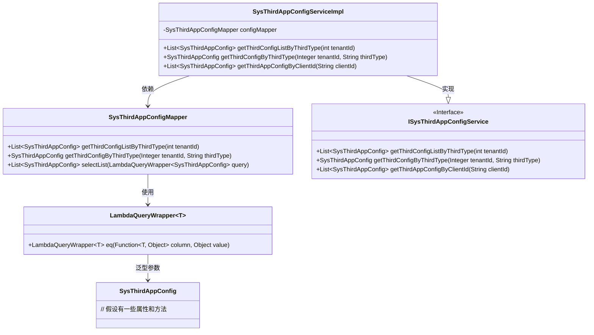
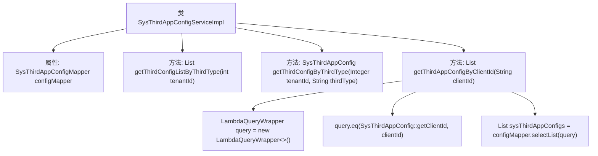

# 基础信息

|      |      |
|------|------|
| 名称 | SysThirdAppConfigServiceImpl |
| 编码语言 | .java |
| 代码路径 | JeecgBoot/jeecg-boot/jeecg-module-system/jeecg-system-biz/src/main/java/org/jeecg/modules/system/service/impl/SysThirdAppConfigServiceImpl.java |
| 包名 | org.jeecg.modules.system.service.impl |
| 依赖项 | ['com.baomidou.mybatisplus.core.conditions.query.LambdaQueryWrapper', 'com.baomidou.mybatisplus.extension.service.impl.ServiceImpl', 'lombok.extern.slf4j.Slf4j', 'org.jeecg.modules.system.entity.SysThirdAppConfig', 'org.jeecg.modules.system.mapper.SysThirdAppConfigMapper', 'org.jeecg.modules.system.service.ISysThirdAppConfigService', 'org.springframework.beans.factory.annotation.Autowired', 'org.springframework.stereotype.Service', 'java.util.List'] |
| 概述说明 | SysThirdAppConfigServiceImpl类实现接口，提供第三方应用配置列表及配置方法。 |

# 说明

SysThirdAppConfigServiceImpl类实现了ISysThirdAppConfigService接口，主要负责获取第三方应用的配置列表及具体配置信息。该类通过实现接口中的方法，提供了对第三方应用配置的查询和管理功能，确保系统能够有效地获取和处理相关配置数据。

# 类列表 Class Summary

| 名称   | 类型  | 说明 |
|-------|------|-------------|
| SysThirdAppConfigServiceImpl | class | SysThirdAppConfigServiceImpl类实现ISysThirdAppConfigService接口，提供获取第三方应用配置列表及配置的方法。 |

## 类 SysThirdAppConfigServiceImpl

|      |      |
|------|------|
| 访问范围 | @Service;@Slf4j;public |
| 类型 | class |
| 名称 | SysThirdAppConfigServiceImpl |
| 说明 | SysThirdAppConfigServiceImpl类实现ISysThirdAppConfigService接口，提供获取第三方应用配置列表及配置的方法。 |

### UML类图

这段代码描述了一个服务类 `SysThirdAppConfigServiceImpl`，它实现了 `ISysThirdAppConfigService` 接口，并依赖于 `SysThirdAppConfigMapper` 来执行数据库操作。`SysThirdAppConfigMapper` 使用 `LambdaQueryWrapper` 来构建查询条件，查询结果返回 `SysThirdAppConfig` 对象列表。整个类图展示了服务类与数据访问层之间的依赖关系，以及接口与实现类之间的继承关系。

### 内部方法调用关系图

这段代码描述了一个名为 `SysThirdAppConfigServiceImpl` 的服务类，它继承自 `ServiceImpl` 并实现了 `ISysThirdAppConfigService` 接口。该类通过 `@Autowired` 注入了 `SysThirdAppConfigMapper` 实例，并提供了三个主要方法：`getThirdConfigListByThirdType`、`getThirdConfigByThirdType` 和 `getThirdAppConfigByClientId`。其中，`getThirdAppConfigByClientId` 方法使用 `LambdaQueryWrapper` 构建查询条件，并通过 `configMapper.selectList` 方法获取符合条件的配置列表。该流程图清晰地展示了类的结构及其方法之间的调用关系。

### 字段列表 Field List

| 名称  | 类型  | 说明 |
|-------|-------|------|
| configMapper | SysThirdAppConfigMapper | 自动注入SysThirdAppConfigMapper实例。 |

### 方法列表 Method List

| 名称  | 类型  | 说明 |
|-------|-------|------|
| getThirdConfigListByThirdType | List<SysThirdAppConfig> | 根据租户ID获取第三方应用配置列表。 |
| getThirdAppConfigByClientId | List<SysThirdAppConfig> | 根据客户端ID查询第三方应用配置列表。 |
| getThirdConfigByThirdType | SysThirdAppConfig | 重写方法，通过租户ID和第三方类型获取第三方应用配置。 |

