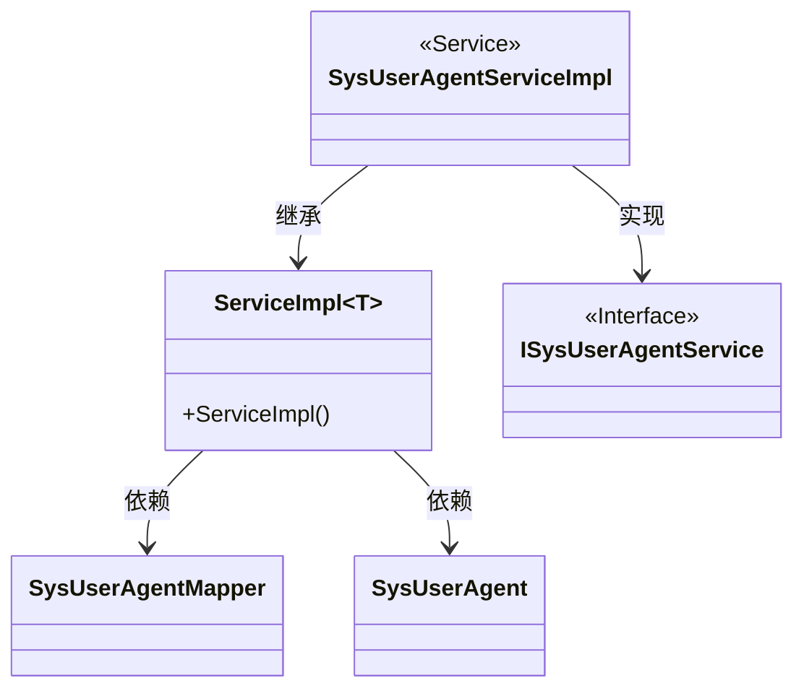
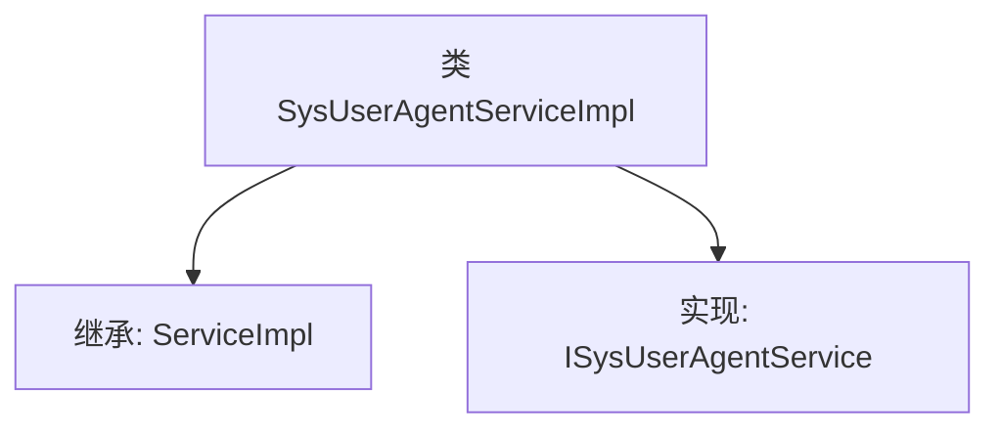

# 基础信息

|      |      |
|------|------|
| 名称 | SysUserAgentServiceImpl |
| 编码语言 | .java |
| 代码路径 | JeecgBoot/jeecg-boot/jeecg-module-system/jeecg-system-biz/src/main/java/org/jeecg/modules/system/service/impl/SysUserAgentServiceImpl.java |
| 包名 | org.jeecg.modules.system.service.impl |
| 依赖项 | ['org.jeecg.modules.system.entity.SysUserAgent', 'org.jeecg.modules.system.mapper.SysUserAgentMapper', 'org.jeecg.modules.system.service.ISysUserAgentService', 'org.springframework.stereotype.Service', 'com.baomidou.mybatisplus.extension.service.impl.ServiceImpl'] |
| 概述说明 | SysUserAgentServiceImpl类继承ServiceImpl并实现ISysUserAgentService接口。 |

# 说明

SysUserAgentServiceImpl类是一个服务实现类，它继承了ServiceImpl类并实现了ISysUserAgentService接口。这意味着SysUserAgentServiceImpl类不仅具备了ServiceImpl类的所有功能和行为，还通过实现ISysUserAgentService接口，提供了该接口定义的所有方法和功能。这种设计使得SysUserAgentServiceImpl类能够灵活地扩展和定制服务逻辑，同时保持了与ServiceImpl类的继承关系，确保基础功能的复用和一致性。

# 类列表 Class Summary

| 名称   | 类型  | 说明 |
|-------|------|-------------|
| SysUserAgentServiceImpl | class | SysUserAgentServiceImpl类继承ServiceImpl并实现ISysUserAgentService接口。 |

## 类 SysUserAgentServiceImpl

|      |      |
|------|------|
| 访问范围 | @Service;public |
| 类型 | class |
| 名称 | SysUserAgentServiceImpl |
| 说明 | SysUserAgentServiceImpl类继承ServiceImpl并实现ISysUserAgentService接口。 |

### UML类图

这段代码展示了一个服务实现类 `SysUserAgentServiceImpl`，它继承了 `ServiceImpl` 泛型类，并实现了 `ISysUserAgentService` 接口。`ServiceImpl` 类依赖于 `SysUserAgentMapper` 和 `SysUserAgent` 类。`SysUserAgentServiceImpl` 类通过继承和实现，提供了对 `SysUserAgent` 实体的服务操作。

### 内部方法调用关系图

这段代码定义了一个名为 `SysUserAgentServiceImpl` 的类，该类继承了 `ServiceImpl<SysUserAgentMapper, SysUserAgent>` 并实现了 `ISysUserAgentService` 接口。`ServiceImpl` 是一个泛型类，接受 `SysUserAgentMapper` 和 `SysUserAgent` 作为类型参数。`SysUserAgentServiceImpl` 类通过继承和实现，具备了 `ServiceImpl` 的功能，并承诺提供 `ISysUserAgentService` 接口中定义的方法。

### 字段列表 Field List

| 名称  | 类型  | 说明 |
|-------|-------|------|

### 方法列表 Method List

| 名称  | 类型  | 说明 |
|-------|-------|------|

