# 基础信息

|      |      |
|------|------|
| 名称 | SysUserDepartServiceImpl |
| 编码语言 | .java |
| 代码路径 | JeecgBoot/jeecg-boot/jeecg-module-system/jeecg-system-biz/src/main/java/org/jeecg/modules/system/service/impl/SysUserDepartServiceImpl.java |
| 包名 | org.jeecg.modules.system.service.impl |
| 依赖项 | ['com.baomidou.mybatisplus.core.conditions.query.LambdaQueryWrapper', 'com.baomidou.mybatisplus.core.metadata.IPage', 'com.baomidou.mybatisplus.extension.plugins.pagination.Page', 'com.baomidou.mybatisplus.extension.service.impl.ServiceImpl', 'org.apache.commons.lang3.StringUtils', 'org.apache.shiro.SecurityUtils', 'org.jeecg.common.config.TenantContext', 'org.jeecg.common.constant.CommonConstant', 'org.jeecg.common.constant.SymbolConstant', 'org.jeecg.common.system.vo.LoginUser', 'org.jeecg.common.util.oConvertUtils', 'org.jeecg.config.mybatis.MybatisPlusSaasConfig', 'org.jeecg.modules.system.entity.SysDepart', 'org.jeecg.modules.system.entity.SysUser', 'org.jeecg.modules.system.entity.SysUserDepart', 'org.jeecg.modules.system.mapper.SysUserDepartMapper', 'org.jeecg.modules.system.mapper.SysUserMapper', 'org.jeecg.modules.system.mapper.SysUserTenantMapper', 'org.jeecg.modules.system.model.DepartIdModel', 'org.jeecg.modules.system.service.ISysDepartService', 'org.jeecg.modules.system.service.ISysUserDepartService', 'org.jeecg.modules.system.service.ISysUserService', 'org.jeecg.modules.system.vo.SysUserDepVo', 'org.springframework.beans.factory.annotation.Autowired', 'org.springframework.context.annotation.Lazy', 'org.springframework.stereotype.Service', 'java.util', 'java.util.stream.Collectors'] |
| 概述说明 | SysUserDepartServiceImpl实现用户与部门关联查询，支持按ID查部门、用户及多租户隔离。 |

# 说明

SysUserDepartServiceImpl类提供了用户与部门之间的关联查询功能，支持通过用户ID查询所属部门，以及通过部门ID查询相关用户。此外，该实现还具备多租户隔离能力，确保不同租户的数据互不干扰，提升了系统的安全性和数据隔离性。

# 类列表 Class Summary

| 名称   | 类型  | 说明 |
|-------|------|-------------|
| SysUserDepartServiceImpl | class | SysUserDepartServiceImpl类实现用户与部门关联查询功能，支持按用户ID查部门、按部门ID查用户及多租户隔离。 |

## 类 SysUserDepartServiceImpl

|      |      |
|------|------|
| 访问范围 | @Service;public |
| 类型 | class |
| 名称 | SysUserDepartServiceImpl |
| 说明 | SysUserDepartServiceImpl类实现用户与部门关联查询功能，支持按用户ID查部门、按部门ID查用户及多租户隔离。 |

### UML类图

```mermaid
classDiagram
    class SysUserDepartServiceImpl {
        -ISysDepartService sysDepartService
        -ISysUserService sysUserService
        -SysUserMapper sysUserMapper
        -SysUserTenantMapper userTenantMapper
        +List~DepartIdModel~ queryDepartIdsOfUser(String userId)
        +List~SysUser~ queryUserByDepId(String depId)
        +List~SysUser~ queryUserByDepCode(String depCode, String realname)
        +IPage~SysUser~ queryDepartUserPageList(String departId, String username, String realname, int pageSize, int pageNo, String id, String isMultiTranslate)
        +IPage~SysUser~ getUserInformation(Integer tenantId, String departId, String keyword, Integer pageSize, Integer pageNo)
        +IPage~SysUser~ getUserInformation(Integer tenantId, String departId, String roleId, String keyword, Integer pageSize, Integer pageNo, String excludeUserIdList)
        +List~SysUser~ getUsersByDepartTenantId(String departId, Integer tenantId)
        -Map~String, String~ getDepNamesByUserIds(List~String~ userIds)
    }

    class ISysDepartService {
        <<Interface>>
        +List~SysDepart~ list(LambdaQueryWrapper~SysDepart~ queryDep)
        +SysDepart getById(String departId)
    }

    class ISysUserService {
        <<Interface>>
        +Map~String, String~ getDepNamesByUserIds(List~String~ userIds)
    }

    class SysUserMapper {
        +List~SysUser~ selectBatchIds(List~String~ userIdList)
        +IPage~SysUser~ selectPage(Page~SysUser~ page, LambdaQueryWrapper~SysUser~ query)
        +List~SysUserDepVo~ getDepNamesByUserIds(List~String~ userIds)
    }

    class SysUserTenantMapper {
        +List~String~ getUserIdsByTenantId(Integer tenantId)
    }

    class SysUserDepartMapper {
        +List~SysUser~ queryDepartUserList(String depCode, String realname)
        +IPage~SysUser~ queryDepartUserPageList(Page~SysUser~ page, String orgCode, String username, String realname)
        +IPage~SysUser~ getUserInformation(Page~SysUser~ page, String orgCode, String keyword, String userId)
        +IPage~SysUser~ getProcessUserList(Page~SysUser~ page, String orgCode, String keyword, Integer tenantId, List~String~ userIdList)
        +List~SysUser~ getUsersByDepartTenantId(String departId, Integer tenantId)
    }

    class SysUser {
        -String id
        -String username
        -String realname
        -String salt
        -String password
        -String status
        -String orgCodeTxt
        +String getId()
        +void setSalt(String salt)
        +void setPassword(String password)
        +void setOrgCodeTxt(String orgCodeTxt)
    }

    class DepartIdModel {
        +DepartIdModel convertByUserDepart(SysDepart depart)
    }

    class SysDepart {
        -String id
        -String tenantId
        -String orgCode
        +String getId()
        +String getTenantId()
        +String getOrgCode()
    }

    class SysUserDepVo {
        -String userId
        -String departName
        +String getUserId()
        +String getDepartName()
    }

    SysUserDepartServiceImpl --> ISysDepartService : 依赖
    SysUserDepartServiceImpl --> ISysUserService : 依赖
    SysUserDepartServiceImpl --> SysUserMapper : 依赖
    SysUserDepartServiceImpl --> SysUserTenantMapper : 依赖
    SysUserDepartServiceImpl --> SysUserDepartMapper : 依赖
    SysUserDepartServiceImpl --> SysUser : 依赖
    SysUserDepartServiceImpl --> DepartIdModel : 依赖
    SysUserDepartServiceImpl --> SysDepart : 依赖
    SysUserDepartServiceImpl --> SysUserDepVo : 依赖
```

### 描述
`SysUserDepartServiceImpl` 是一个服务类，负责处理用户与部门之间的关联操作。它依赖于多个服务和Mapper，如 `ISysDepartService`、`ISysUserService`、`SysUserMapper` 和 `SysUserTenantMapper`，通过这些依赖实现用户部门信息的查询、用户信息的获取等功能。类中包含了多个方法，如 `queryDepartIdsOfUser`、`queryUserByDepId` 等，用于根据用户ID查询部门信息、根据部门ID查询用户信息等操作。该类还处理了多租户模式下的数据隔离问题。

### 内部方法调用关系图

```mermaid
graph TD
    A["类SysUserDepartServiceImpl"]
    B["属性: ISysDepartService sysDepartService"]
    C["属性: ISysUserService sysUserService"]
    D["属性: SysUserMapper sysUserMapper"]
    E["属性: SysUserTenantMapper userTenantMapper"]
    F["方法: List<DepartIdModel> queryDepartIdsOfUser(String userId)"]
    G["方法: List<SysUser> queryUserByDepId(String depId)"]
    H["方法: List<SysUser> queryUserByDepCode(String depCode, String realname)"]
    I["方法: IPage<SysUser> queryDepartUserPageList(String departId, String username, String realname, int pageSize, int pageNo, String id, String isMultiTranslate)"]
    J["方法: IPage<SysUser> getUserInformation(Integer tenantId, String departId, String keyword, Integer pageSize, Integer pageNo)"]
    K["方法: IPage<SysUser> getUserInformation(Integer tenantId, String departId, String roleId, String keyword, Integer pageSize, Integer pageNo, String excludeUserIdList)"]
    L["方法: List<SysUser> getUsersByDepartTenantId(String departId, Integer tenantId)"]
    M["方法: Map<String, String> getDepNamesByUserIds(List<String> userIds)"]

    A --> B
    A --> C
    A --> D
    A --> E
    A --> F
    A --> G
    A --> H
    A --> I
    A --> J
    A --> K
    A --> L
    A --> M
```

该流程图展示了 `SysUserDepartServiceImpl` 类的结构和主要方法。该类主要负责处理用户与部门之间的关系，包括查询用户所属部门、根据部门查询用户信息、分页查询用户等功能。每个方法都依赖于类中注入的服务和映射器，如 `sysDepartService`、`sysUserService`、`sysUserMapper` 和 `userTenantMapper`，通过这些依赖完成具体的业务逻辑。

### 字段列表 Field List

| 名称  | 类型  | 说明 |
|-------|-------|------|
| sysDepartService | ISysDepartService | 自动注入系统部门服务接口实例。 |
| userTenantMapper | SysUserTenantMapper | 自动注入SysUserTenantMapper实例。 |
| sysUserMapper | SysUserMapper | 自动注入SysUserMapper实例。 |
| sysUserService | ISysUserService | 使用@Autowired自动注入ISysUserService实例。 |

### 方法列表 Method List

| 名称  | 类型  | 说明 |
|-------|-------|------|
| getUsersByDepartTenantId | List<SysUser> | 根据部门和租户ID查询用户列表。 |
| queryUserByDepId | List<SysUser> | 根据部门ID查询用户列表，返回不含密码信息的用户数据。 |
| getUserInformation | IPage<SysUser> | 根据租户和部门ID查询用户信息，支持关键词搜索和分页。 |
| getDepNamesByUserIds | Map<String, String> | 根据用户ID获取部门名称并生成映射表。 |
| queryDepartIdsOfUser | List<DepartIdModel> | 根据用户ID查询部门ID列表，支持租户SaaS模式。 |
| queryUserByDepCode | List<SysUser> | 根据部门代码和姓名查询用户，优化后去除密码信息并返回用户列表。 |
| queryDepartUserPageList | IPage<SysUser> | 方法查询部门用户分页列表，根据部门ID、用户名等条件筛选并返回用户信息。 |
| getUserInformation | IPage<SysUser> | 根据部门或角色查询用户信息，支持租户过滤和关键词搜索，返回分页结果。 |

