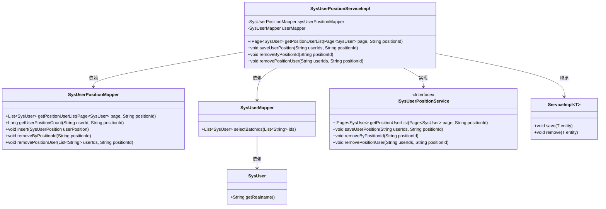

# 基础信息

|      |      |
|------|------|
| 名称 | SysUserPositionServiceImpl |
| 编码语言 | .java |
| 代码路径 | JeecgBoot/jeecg-boot/jeecg-module-system/jeecg-system-biz/src/main/java/org/jeecg/modules/system/service/impl/SysUserPositionServiceImpl.java |
| 包名 | org.jeecg.modules.system.service.impl |
| 依赖项 | ['com.baomidou.mybatisplus.core.metadata.IPage', 'com.baomidou.mybatisplus.extension.plugins.pagination.Page', 'org.jeecg.common.constant.SymbolConstant', 'org.jeecg.common.exception.JeecgBootException', 'org.jeecg.common.util.oConvertUtils', 'org.jeecg.modules.system.entity.SysPosition', 'org.jeecg.modules.system.entity.SysUser', 'org.jeecg.modules.system.entity.SysUserPosition', 'org.jeecg.modules.system.mapper.SysUserMapper', 'org.jeecg.modules.system.mapper.SysUserPositionMapper', 'org.jeecg.modules.system.service.ISysUserPositionService', 'org.springframework.stereotype.Service', 'java.util', 'java.util.stream.Collectors', 'com.baomidou.mybatisplus.extension.service.impl.ServiceImpl', 'org.springframework.beans.factory.annotation.Autowired'] |
| 概述说明 | SysUserPositionServiceImpl类提供用户职位管理功能，支持查询、保存和删除操作。 |

# 说明

SysUserPositionServiceImpl类负责用户职位管理，提供了查询、保存和删除职位用户的功能。该类通过实现这些核心操作，确保用户与职位之间的关系得到有效管理和维护。

# 类列表 Class Summary

| 名称   | 类型  | 说明 |
|-------|------|-------------|
| SysUserPositionServiceImpl | class | SysUserPositionServiceImpl类实现用户职位管理，包括查询、保存、删除职位用户功能。 |

## 类 SysUserPositionServiceImpl

|      |      |
|------|------|
| 访问范围 | @Service;public |
| 类型 | class |
| 名称 | SysUserPositionServiceImpl |
| 说明 | SysUserPositionServiceImpl类实现用户职位管理，包括查询、保存、删除职位用户功能。 |

### UML类图

这段代码展示了 `SysUserPositionServiceImpl` 类如何通过继承 `ServiceImpl` 并实现 `ISysUserPositionService` 接口来处理用户与职位的关系。`SysUserPositionServiceImpl` 依赖于 `SysUserPositionMapper` 和 `SysUserMapper` 来执行数据库操作，包括获取职位用户列表、保存用户职位关系、删除职位和用户等操作。代码通过异常处理来确保用户职位关系的唯一性，并在用户已存在时抛出异常。

### 内部方法调用关系图

```mermaid
graph TD
    A["类SysUserPositionServiceImpl"]
    B["属性: SysUserPositionMapper sysUserPositionMapper"]
    C["属性: SysUserMapper userMapper"]
    D["方法: IPage<SysUser> getPositionUserList(Page<SysUser> page, String positionId)"]
    E["方法: void saveUserPosition(String userIds, String positionId)"]
    F["方法: void removeByPositionId(String positionId)"]
    G["方法: void removePositionUser(String userIds, String positionId)"]
    H["内部操作: page.setRecords(sysUserPositionMapper.getPositionUserList(page, positionId))"]
    I["内部操作: String[] userIdArray = userIds.split(SymbolConstant.COMMA)"]
    J["内部操作: StringBuilder userBuilder = new StringBuilder()"]
    K["内部操作: Long count = sysUserPositionMapper.getUserPositionCount(userId, positionId)"]
    L["内部操作: SysUserPosition userPosition = new SysUserPosition()"]
    M["内部操作: userPosition.setPositionId(positionId)"]
    N["内部操作: userPosition.setUserId(userId)"]
    O["内部操作: sysUserPositionMapper.insert(userPosition)"]
    P["内部操作: userBuilder.append(userId).append(SymbolConstant.COMMA)"]
    Q["内部操作: String uIds = userBuilder.toString()"]
    R["内部操作: oConvertUtils.isNotEmpty(uIds)"]
    S["内部操作: List<SysUser> sysUsers = userMapper.selectBatchIds(Arrays.asList(uIds.split(SymbolConstant.COMMA)))"]
    T["内部操作: String realnames = sysUsers.stream().map(SysUser::getRealname).collect(Collectors.joining(SymbolConstant.COMMA))"]
    U["内部操作: throw new JeecgBootException(realnames + '已存在该职位中')"]
    V["内部操作: sysUserPositionMapper.removeByPositionId(positionId)"]
    W["内部操作: sysUserPositionMapper.removePositionUser(Arrays.asList(userIdArray), positionId)"]

    A --> B
    A --> C
    A --> D
    A --> E
    A --> F
    A --> G
    D --> H
    E --> I
    E --> J
    E --> K
    E --> L
    L --> M
    L --> N
    L --> O
    E --> P
    E --> Q
    E --> R
    R --> S
    S --> T
    T --> U
    F --> V
    G --> W
```

这段代码展示了`SysUserPositionServiceImpl`类的实现，该类继承自`ServiceImpl`并实现了`ISysUserPositionService`接口。代码主要处理用户与职位之间的关系，包括获取职位用户列表、保存用户职位、删除职位以及移除职位用户等操作。流程图详细描述了各个方法的内部调用关系，特别是`saveUserPosition`方法中复杂的逻辑处理，包括用户是否已存在于职位中的检查、新用户职位的插入以及异常情况的处理。

### 字段列表 Field List

| 名称  | 类型  | 说明 |
|-------|-------|------|
| userMapper | SysUserMapper | 自动注入SysUserMapper实例到userMapper字段。 |
| sysUserPositionMapper | SysUserPositionMapper | 自动注入SysUserPositionMapper实例。 |

### 方法列表 Method List

| 名称  | 类型  | 说明 |
|-------|-------|------|
| removeByPositionId | void | 通过positionId删除用户职位信息。 |
| getPositionUserList | IPage<SysUser> | 该方法通过positionId查询职位用户列表并返回分页结果。 |
| removePositionUser | void | 方法移除指定职位用户，分割用户ID并调用Mapper执行删除。 |
| saveUserPosition | void | 保存用户职位关系，检查用户是否已存在，存在则提示，否则插入新记录。 |

