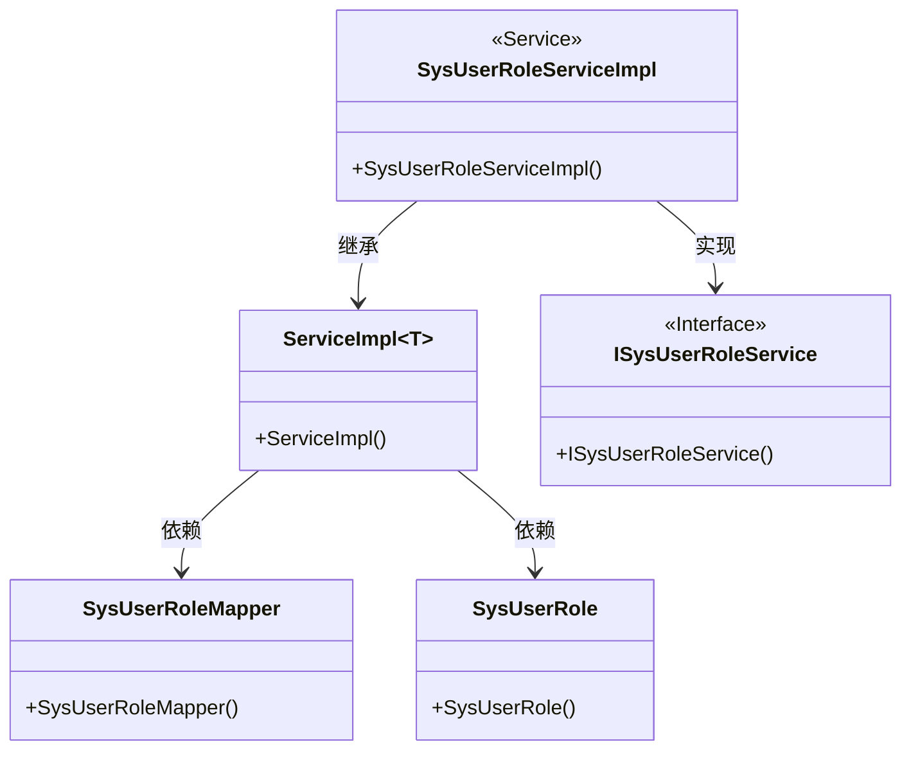
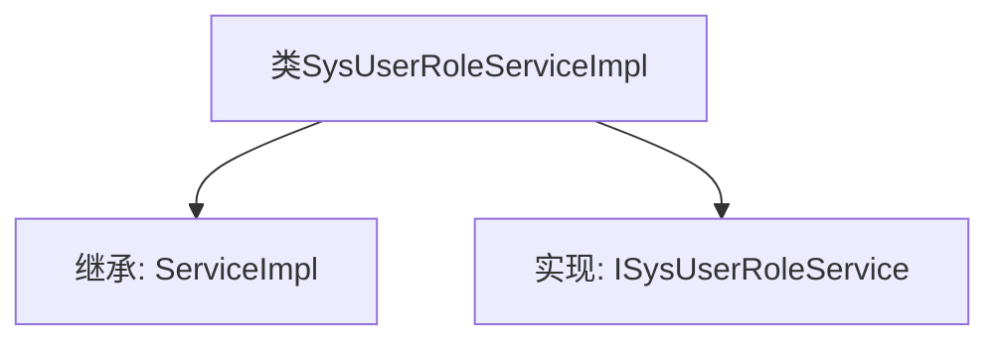

# 基础信息

|      |      |
|------|------|
| 名称 | SysUserRoleServiceImpl |
| 编码语言 | .java |
| 代码路径 | JeecgBoot/jeecg-boot/jeecg-module-system/jeecg-system-biz/src/main/java/org/jeecg/modules/system/service/impl/SysUserRoleServiceImpl.java |
| 包名 | org.jeecg.modules.system.service.impl |
| 依赖项 | ['java.util.IdentityHashMap', 'java.util.List', 'java.util.Map', 'org.jeecg.modules.system.entity.SysRole', 'org.jeecg.modules.system.entity.SysUser', 'org.jeecg.modules.system.entity.SysUserRole', 'org.jeecg.modules.system.mapper.SysUserRoleMapper', 'org.jeecg.modules.system.service.ISysRoleService', 'org.jeecg.modules.system.service.ISysUserRoleService', 'org.jeecg.modules.system.service.ISysUserService', 'org.springframework.beans.factory.annotation.Autowired', 'org.springframework.stereotype.Service', 'com.baomidou.mybatisplus.extension.service.impl.ServiceImpl'] |
| 概述说明 | SysUserRoleServiceImpl继承ServiceImpl并实现ISysUserRoleService接口。 |

# 说明

SysUserRoleServiceImpl类是一个具体的服务实现类，它继承了ServiceImpl类并实现了ISysUserRoleService接口。这表明SysUserRoleServiceImpl类不仅具备了ServiceImpl类中的通用功能，还实现了ISysUserRoleService接口中定义的所有方法，从而提供了特定的业务逻辑实现。通过这种继承和实现的方式，SysUserRoleServiceImpl类能够有效地管理用户与角色之间的关系，确保系统在用户角色管理方面的功能完整性和一致性。

# 类列表 Class Summary

| 名称   | 类型  | 说明 |
|-------|------|-------------|
| SysUserRoleServiceImpl | class | SysUserRoleServiceImpl类继承ServiceImpl并实现ISysUserRoleService接口。 |

## 类 SysUserRoleServiceImpl

|      |      |
|------|------|
| 访问范围 | @Service;public |
| 类型 | class |
| 名称 | SysUserRoleServiceImpl |
| 说明 | SysUserRoleServiceImpl类继承ServiceImpl并实现ISysUserRoleService接口。 |

### UML类图

这段代码展示了一个Spring服务类`SysUserRoleServiceImpl`，它继承了`ServiceImpl`并实现了`ISysUserRoleService`接口。`ServiceImpl`是一个泛型类，依赖于`SysUserRoleMapper`和`SysUserRole`。通过这种设计，`SysUserRoleServiceImpl`能够提供与用户角色相关的服务功能，同时利用`ServiceImpl`的通用功能。

### 内部方法调用关系图

这段代码定义了一个名为 `SysUserRoleServiceImpl` 的类，该类继承了 `ServiceImpl<SysUserRoleMapper, SysUserRole>` 并实现了 `ISysUserRoleService` 接口。`@Service` 注解表明该类是一个服务层的组件，通常用于业务逻辑的处理。通过继承 `ServiceImpl`，该类获得了基本的 CRUD 操作能力，而实现 `ISysUserRoleService` 接口则定义了特定的业务方法。

### 字段列表 Field List

| 名称  | 类型  | 说明 |
|-------|-------|------|

### 方法列表 Method List

| 名称  | 类型  | 说明 |
|-------|-------|------|

