# 基础信息

|      |      |
|------|------|
| 名称 | SysUserServiceImpl |
| 编码语言 | .java |
| 代码路径 | JeecgBoot/jeecg-boot/jeecg-module-system/jeecg-system-biz/src/main/java/org/jeecg/modules/system/service/impl/SysUserServiceImpl.java |
| 包名 | org.jeecg.modules.system.service.impl |
| 依赖项 | ['cn.hutool.core.collection.CollectionUtil', 'cn.hutool.core.util.RandomUtil', 'com.alibaba.fastjson.JSONArray', 'com.alibaba.fastjson.JSONObject', 'com.aliyuncs.exceptions.ClientException', 'com.baomidou.mybatisplus.core.conditions.query.LambdaQueryWrapper', 'com.baomidou.mybatisplus.core.conditions.query.QueryWrapper', 'com.baomidou.mybatisplus.core.conditions.update.UpdateWrapper', 'com.baomidou.mybatisplus.core.metadata.IPage', 'com.baomidou.mybatisplus.core.toolkit.CollectionUtils', 'com.baomidou.mybatisplus.extension.plugins.pagination.Page', 'com.baomidou.mybatisplus.extension.service.impl.ServiceImpl', 'lombok.extern.slf4j.Slf4j', 'org.apache.commons.lang.StringUtils', 'org.apache.commons.lang3.ObjectUtils', 'org.apache.shiro.SecurityUtils', 'org.jeecg.common.api.dto.message.MessageDTO', 'org.jeecg.common.api.vo.Result', 'org.jeecg.common.config.TenantContext', 'org.jeecg.common.constant.CacheConstant', 'org.jeecg.common.constant.CommonConstant', 'org.jeecg.common.constant.FillRuleConstant', 'org.jeecg.common.constant.SymbolConstant', 'org.jeecg.common.constant.enums.DySmsEnum', 'org.jeecg.common.constant.enums.MessageTypeEnum', 'org.jeecg.common.constant.enums.RoleIndexConfigEnum', 'org.jeecg.common.constant.enums.SysAnnmentTypeEnum', 'org.jeecg.common.desensitization.annotation.SensitiveEncode', 'org.jeecg.common.exception.JeecgBootException', 'org.jeecg.common.system.vo.LoginUser', 'org.jeecg.common.system.vo.SysUserCacheInfo', 'org.jeecg.common.util', 'org.jeecg.config.mybatis.MybatisPlusSaasConfig', 'org.jeecg.modules.base.service.BaseCommonService', 'org.jeecg.modules.message.handle.impl.SystemSendMsgHandle', 'org.jeecg.modules.system.entity', 'org.jeecg.modules.system.mapper', 'org.jeecg.modules.system.model.SysUserSysDepartModel', 'org.jeecg.modules.system.service.ISysRoleIndexService', 'org.jeecg.modules.system.service.ISysThirdAccountService', 'org.jeecg.modules.system.service.ISysUserService', 'org.jeecg.modules.system.vo.SysUserDepVo', 'org.jeecg.modules.system.vo.SysUserPositionVo', 'org.jeecg.modules.system.vo.UserAvatar', 'org.jeecg.modules.system.vo.lowapp.AppExportUserVo', 'org.jeecg.modules.system.vo.lowapp.DepartAndUserInfo', 'org.jeecg.modules.system.vo.lowapp.DepartInfo', 'org.jeecg.modules.system.vo.lowapp.UpdateDepartInfo', 'org.jeecgframework.poi.excel.ExcelImportUtil', 'org.jeecgframework.poi.excel.def.NormalExcelConstants', 'org.jeecgframework.poi.excel.entity.ExportParams', 'org.jeecgframework.poi.excel.entity.ImportParams', 'org.jeecgframework.poi.excel.view.JeecgEntityExcelView', 'org.jetbrains.annotations.Nullable', 'org.springframework.beans.BeanUtils', 'org.springframework.beans.factory.NoSuchBeanDefinitionException', 'org.springframework.beans.factory.annotation.Autowired', 'org.springframework.cache.annotation.CacheEvict', 'org.springframework.cache.annotation.Cacheable', 'org.springframework.stereotype.Service', 'org.springframework.transaction.annotation.Transactional', 'org.springframework.web.multipart.MultipartFile', 'org.springframework.web.multipart.MultipartHttpServletRequest', 'org.springframework.web.servlet.ModelAndView', 'javax.annotation.Resource', 'javax.servlet.http.HttpServletRequest', 'java.io.IOException', 'java.util', 'java.util.stream.Collectors'] |
| 概述说明 | SysUserServiceImpl实现用户管理功能，涵盖查询、密码操作、用户增删改及权限管理。 |

# 说明

SysUserServiceImpl类实现了用户管理功能，涵盖了查询用户信息、重置用户密码、修改用户密码、删除用户、添加新用户、编辑用户信息、获取用户角色以及权限管理等核心操作。这些功能全面支持了用户管理的基本需求，确保系统能够高效地进行用户账户的维护和管理。

# 类列表 Class Summary

| 名称   | 类型  | 说明 |
|-------|------|-------------|
| SysUserServiceImpl | class | SysUserServiceImpl实现用户管理功能，包括查询、重置密码、修改密码、删除用户、添加用户、编辑用户、获取用户角色和权限等操作。 |


## 类 SysUserServiceImpl

|      |      |
|------|------|
| 访问范围 | @Service;@Slf4j;public |
| 类型 | class |
| 名称 | SysUserServiceImpl |
| 说明 | SysUserServiceImpl实现用户管理功能，包括查询、重置密码、修改密码、删除用户、添加用户、编辑用户、获取用户角色和权限等操作。 |


### UML类图

```mermaid
classDiagram
    class SysUserServiceImpl {
        -SysUserMapper userMapper
        -SysPermissionMapper sysPermissionMapper
        -SysUserRoleMapper sysUserRoleMapper
        -SysUserDepartMapper sysUserDepartMapper
        -SysDepartMapper sysDepartMapper
        -SysRoleMapper sysRoleMapper
        -SysDepartRoleUserMapper departRoleUserMapper
        -SysDepartRoleMapper sysDepartRoleMapper
        -BaseCommonService baseCommonService
        -SysThirdAccountMapper sysThirdAccountMapper
        -ThirdAppWechatEnterpriseServiceImpl wechatEnterpriseService
        -ThirdAppDingtalkServiceImpl dingtalkService
        -ISysRoleIndexService sysRoleIndexService
        -SysTenantMapper sysTenantMapper
        -SysUserTenantMapper relationMapper
        -SysUserTenantMapper userTenantMapper
        -SysUserPositionMapper sysUserPositionMapper
        -SysPositionMapper sysPositionMapper
        -SystemSendMsgHandle systemSendMsgHandle
        -ISysThirdAccountService sysThirdAccountService
        -RedisUtil redisUtil
        +Result~IPage~SysUser~~ queryPageList(HttpServletRequest req, QueryWrapper~SysUser~ queryWrapper, Integer pageSize, Integer pageNo)
        +Result~?~ resetPassword(String username, String oldpassword, String newpassword, String confirmpassword)
        +Result~?~ changePassword(SysUser sysUser)
        +boolean deleteUser(String userId)
        +boolean deleteBatchUsers(String userIds)
        +SysUser getUserByName(String username)
        +void addUserWithRole(SysUser user, String roles)
        +void editUserWithRole(SysUser user, String roles)
        +List~String~ getRole(String username)
        +SysRoleIndex getDynamicIndexByUserRole(String username, String version)
        +Set~String~ getUserRolesSet(String username)
        +Set~String~ getUserRoleSetById(String userId)
        +Set~String~ getUserPermissionsSet(String userId)
        +SysUserCacheInfo getCacheUser(String username)
        +IPage~SysUser~ getUserByDepId(Page~SysUser~ page, String departId, String username)
        +IPage~SysUser~ getUserByDepIds(Page~SysUser~ page, List~String~ departIds, String username)
        +Map~String, String~ getDepNamesByUserIds(List~String~ userIds)
        +IPage~SysUserSysDepartModel~ queryUserByOrgCode(String orgCode, SysUser userParams, IPage page)
        +IPage~SysUser~ getUserByRoleId(Page~SysUser~ page, String roleId, String username)
        +void updateUserDepart(String username, String orgCode, Integer loginTenantId)
        +SysUser getUserByPhone(String phone)
        +SysUser getUserByEmail(String email)
        +void addUserWithDepart(SysUser user, String selectedParts)
        +void editUserWithDepart(SysUser user, String departs)
        +Result~?~ checkUserIsEffective(SysUser sysUser)
        +List~SysUser~ queryLogicDeleted()
        +List~SysUser~ queryLogicDeleted(LambdaQueryWrapper~SysUser~ wrapper)
        +boolean revertLogicDeleted(List~String~ userIds, SysUser updateEntity)
        +boolean removeLogicDeleted(List~String~ userIds)
        +boolean updateNullPhoneEmail()
        +void saveThirdUser(SysUser sysUser)
        +List~SysUser~ queryByDepIds(List~String~ departIds, String username)
        +void saveUser(SysUser user, String selectedRoles, String selectedDeparts, String relTenantIds)
        +void editUser(SysUser user, String roles, String departs, String relTenantIds, String updateFromPage)
        +List~String~ userIdToUsername(Collection~String~ userIdList)
        +LoginUser getEncodeUserInfo(String username)
        +void userQuit(String username)
        +List~SysUser~ getQuitList(Integer tenantId)
        +void updateStatusAndFlag(List~String~ userIds, SysUser sysUser)
        +Result~JSONObject~ setLoginTenant(SysUser sysUser, JSONObject obj, String username, Result~JSONObject~ result)
        +void setUserTenantIds(SysUser sysUser)
        +void saveUserTenant(String userId, String relTenantIds)
        +void editUserTenants(String userId, String relTenantIds)
        +void deleteTenantByUserId(String userId, Integer tenantId)
        +void batchEditUsers(JSONObject json)
        +DepartAndUserInfo searchByKeyword(String keyword)
        +UpdateDepartInfo getUpdateDepartInfo(String departId)
        +void doUpdateDepartInfo(UpdateDepartInfo info)
        +void changeDepartChargePerson(JSONObject json)
        +void getParentDepart(SysDepart depart, List~String~ orgName, List~String~ orgId)
        +void editTenantUser(SysUser sysUser, String tenantId, String departs, String roles)
        +void updateStatus(String id, String status)
        +void updateTenantDepart(SysUser user, String tenantId, String departs)
        +void saveUserPosition(String userId, String positionIds)
        +void editUserPosition(String userId, String positionIds)
        +void userPositionId(SysUser sysUser)
        +String getDepartIdByOrCode(String orgCode)
        +String getJoinRoleCodeByUserId(String userId)
        +void removeDepartmentManager(List~String~ departChargeUserIdList, List~SysUser~ departChargeUsers, String departId)
        +ModelAndView exportAppUser(HttpServletRequest request)
        +Result~?~ importAppUser(HttpServletRequest request)
        +void addOrEditPosition(String userId, String position, Boolean isEdit, Integer tenantId, Map~String, String~ positionMap)
        +void addSysUserPosition(String userId, String positionId)
        +void addOrEditDepart(String userId, String depart, Integer tenantId, Map~String, SysDepart~ departMap)
        +void addUserTenant(String userId, Integer tenantId, String invitedUsername, String tenantName)
        +void checkUserAdminRejectDel(String userIds)
        +void changePhone(JSONObject json, String username)
        +void verifyPhone(String phone, String smsCode)
        +void sendChangePhoneSms(JSONObject jsonObject, String username, String ipAddress)
        +void sendLogOffPhoneSms(JSONObject jsonObject, String username, String ipAddress)
        +void userLogOff(JSONObject jsonObject, String username)
        +void sendPhoneSms(String phone, String clientIp, String redisKey)
    }

    class <<Interface>> ISysUserService {
        +Result~IPage~SysUser~~ queryPageList(HttpServletRequest req, QueryWrapper~SysUser~ queryWrapper, Integer pageSize, Integer pageNo)
        +Result~?~ resetPassword(String username, String oldpassword, String newpassword, String confirmpassword)
        +Result~?~ changePassword(SysUser sysUser)
        +boolean deleteUser(String userId)
        +boolean deleteBatchUsers(String userIds)
        +SysUser getUserByName(String username)
        +void addUserWithRole(SysUser user, String roles)
        +void editUserWithRole(SysUser user, String roles)
        +List~String~ getRole(String username)
        +SysRoleIndex getDynamicIndexByUserRole(String username, String version)
        +Set~String~ getUserRolesSet(String username)
        +Set~String~ getUserRoleSetById(String userId)
        +Set~String~ getUserPermissionsSet(String userId)
        +SysUserCacheInfo getCacheUser(String username)
        +IPage~SysUser~ getUserByDepId(Page~SysUser~ page, String departId, String username)
        +IPage~SysUser~ getUserByDepIds(Page~SysUser~ page, List~String~ departIds, String username)
        +Map~String, String~ getDepNamesByUserIds(List~String~ userIds)
        +IPage~SysUserSysDepartModel~ queryUserByOrgCode(String orgCode, SysUser userParams, IPage page)
        +IPage~SysUser~ getUserByRoleId(Page~SysUser~ page, String roleId, String username)
        +void updateUserDepart(String username, String orgCode, Integer loginTenantId)
        +SysUser getUserByPhone(String phone)
        +SysUser getUserByEmail(String email)
        +void addUserWithDepart(SysUser user, String selectedParts)
        +void editUserWithDepart(SysUser user, String departs)
        +Result~?~ checkUserIsEffective(SysUser sysUser)
        +List~SysUser~ queryLogicDeleted()
        +List~SysUser~ queryLogicDeleted(LambdaQueryWrapper~SysUser~ wrapper)
        +boolean revertLogicDeleted(List~String~ userIds, SysUser updateEntity)
        +boolean removeLogicDeleted(List~String~ userIds)
        +boolean updateNullPhoneEmail()
        +void saveThirdUser(SysUser sysUser)
        +List~SysUser~ queryByDepIds(List~String~ departIds, String username)
        +void saveUser(SysUser user, String selectedRoles, String selectedDeparts, String relTenantIds)
        +void editUser(SysUser user, String roles, String departs, String relTenantIds, String updateFromPage)
        +List~String~ userIdToUsername(Collection~String~ userIdList)
        +LoginUser getEncodeUserInfo(String username)
        +void userQuit(String username)
        +List~SysUser~ getQuitList(Integer tenantId)
        +void updateStatusAndFlag(List~String~ userIds, SysUser sysUser)
        +Result~JSONObject~ setLoginTenant(SysUser sysUser, JSONObject obj, String username, Result~JSONObject~ result)
        +void setUserTenantIds(SysUser sysUser)
        +void saveUserTenant(String userId, String relTenantIds)
        +void editUserTenants(String userId, String relTenantIds)
        +void deleteTenantByUserId(String userId, Integer tenantId)
        +void batchEditUsers(JSONObject json)
        +DepartAndUserInfo searchByKeyword(String keyword)
        +UpdateDepartInfo getUpdateDepartInfo(String departId)
        +void doUpdateDepartInfo(UpdateDepartInfo info)
        +void changeDepartChargePerson(JSONObject json)
        +void getParentDepart(SysDepart depart, List~String~ orgName, List~String~ orgId)
        +void editTenantUser(SysUser sysUser, String tenantId, String departs, String roles)
        +void updateStatus(String id, String status)
        +void updateTenantDepart(SysUser user, String tenantId, String departs)
        +void saveUserPosition(String userId, String positionIds)
        +void editUserPosition(String userId, String positionIds)
        +void userPositionId(SysUser sysUser)
        +String getDepartIdByOrCode(String orgCode)
        +String getJoinRoleCodeByUserId(String userId)
        +void removeDepartmentManager(List~String~ departChargeUserIdList, List~SysUser~ departChargeUsers, String departId)
        +ModelAndView exportAppUser(HttpServletRequest request)
        +Result~?~ importAppUser(HttpServletRequest request)
        +void addOrEditPosition(String userId, String position, Boolean isEdit, Integer tenantId, Map~String, String~ positionMap)
        +void addSysUserPosition(String userId, String positionId)
        +void addOrEditDepart(String userId, String depart, Integer tenantId, Map~String, SysDepart~ departMap)
        +void addUserTenant(String userId, Integer tenantId, String invitedUsername, String tenantName)
        +void checkUserAdminRejectDel(String userIds)
        +void changePhone(JSONObject json, String username)
        +void verifyPhone(String phone, String smsCode)
        +void sendChangePhoneSms(JSONObject jsonObject, String username, String ipAddress)
        +void sendLogOffPhoneSms(JSONObject jsonObject, String username, String ipAddress)
        +void userLogOff(JSONObject jsonObject, String username)
        +void sendPhoneSms(String phone, String clientIp, String redisKey)
    }

    SysUserServiceImpl --> ISysUserService : 实现
```

这段代码是一个复杂的用户管理服务实现类 `SysUserServiceImpl`，它实现了 `ISysUserService` 接口。该类主要负责用户管理相关的业务逻辑，包括用户查询、密码重置、用户角色管理、部门管理、租户管理、用户导入导出等功能。代码中使用了大量的依赖注入，通过 `@Autowired` 和 `@Resource` 注解注入了多个 Mapper 和 Service 类，以实现对数据库的操作和业务逻辑的处理。该类还使用了缓存、事务管理等技术来优化性能和保证数据一致性。


### 内部方法调用关系图

```mermaid
graph TD
    A["SysUserServiceImpl"]
    B["queryPageList"]
    C["resetPassword"]
    D["changePassword"]
    E["deleteUser"]
    F["deleteBatchUsers"]
    G["getUserByName"]
    H["addUserWithRole"]
    I["editUserWithRole"]
    J["getRole"]
    K["getDynamicIndexByUserRole"]
    L["getUserRolesSet"]
    M["getUserRoleSetById"]
    N["getUserPermissionsSet"]
    O["getCacheUser"]
    P["getUserByDepId"]
    Q["getUserByDepIds"]
    R["getDepNamesByUserIds"]
    S["queryUserByOrgCode"]
    T["getUserByRoleId"]
    U["updateUserDepart"]
    V["getUserByPhone"]
    W["getUserByEmail"]
    X["addUserWithDepart"]
    Y["editUserWithDepart"]
    Z["checkUserIsEffective"]
    AA["queryLogicDeleted"]
    AB["queryLogicDeleted"]
    AC["revertLogicDeleted"]
    AD["removeLogicDeleted"]
    AE["updateNullPhoneEmail"]
    AF["saveThirdUser"]
    AG["queryByDepIds"]
    AH["saveUser"]
    AI["editUser"]
    AJ["userIdToUsername"]
    AK["getEncodeUserInfo"]
    AL["userQuit"]
    AM["getQuitList"]
    AN["updateStatusAndFlag"]
    AO["setLoginTenant"]
    AP["setUserTenantIds"]
    AQ["saveUserTenant"]
    AR["editUserTenants"]
    AS["deleteTenantByUserId"]
    AT["batchEditUsers"]
    AU["searchByKeyword"]
    AV["getUpdateDepartInfo"]
    AW["doUpdateDepartInfo"]
    AX["changeDepartChargePerson"]
    AY["editTenantUser"]
    AZ["updateStatus"]
    BA["updateTenantDepart"]
    BB["saveUserPosition"]
    BC["editUserPosition"]
    BD["userPositionId"]
    BE["getDepartIdByOrCode"]
    BF["getJoinRoleCodeByUserId"]
    BG["removeDepartmentManager"]
    BH["exportAppUser"]
    BI["importAppUser"]
    BJ["addOrEditPosition"]
    BK["addSysUserPosition"]
    BL["addOrEditDepart"]
    BM["addUserTenant"]
    BN["checkUserAdminRejectDel"]
    BO["changePhone"]
    BP["verifyPhone"]
    BQ["sendChangePhoneSms"]
    BR["sendLogOffPhoneSms"]
    BS["userLogOff"]
    BT["sendPhoneSms"]

    A --> B
    A --> C
    A --> D
    A --> E
    A --> F
    A --> G
    A --> H
    A --> I
    A --> J
    A --> K
    A --> L
    A --> M
    A --> N
    A --> O
    A --> P
    A --> Q
    A --> R
    A --> S
    A --> T
    A --> U
    A --> V
    A --> W
    A --> X
    A --> Y
    A --> Z
    A --> AA
    A --> AB
    A --> AC
    A --> AD
    A --> AE
    A --> AF
    A --> AG
    A --> AH
    A --> AI
    A --> AJ
    A --> AK
    A --> AL
    A --> AM
    A --> AN
    A --> AO
    A --> AP
    A --> AQ
    A --> AR
    A --> AS
    A --> AT
    A --> AU
    A --> AV
    A --> AW
    A --> AX
    A --> AY
    A --> AZ
    A --> BA
    A --> BB
    A --> BC
    A --> BD
    A --> BE
    A --> BF
    A --> BG
    A --> BH
    A --> BI
    A --> BJ
    A --> BK
    A --> BL
    A --> BM
    A --> BN
    A --> BO
    BO --> BP
    A --> BQ
    A --> BR
    BR --> BS
    BQ --> BT
    BR --> BT
```



这段代码是一个用户管理服务类 `SysUserServiceImpl`，提供了丰富的用户管理功能，包括用户查询、密码重置、用户删除、用户角色管理、部门管理、职位管理等。通过 `@Service` 注解标记为 Spring 的服务类，并使用了多个 `@Autowired` 注入依赖的 Mapper 和 Service。代码中还使用了缓存、事务管理等机制来优化性能和保证数据一致性。

### 字段列表 Field List

| 名称  | 类型  | 说明 |
|-------|-------|------|
| sysPermissionMapper | SysPermissionMapper | 自动注入SysPermissionMapper对象。 |
| sysRoleMapper | SysRoleMapper | 自动注入SysRoleMapper对象。 |
| sysTenantMapper | SysTenantMapper | 自动注入SysTenantMapper实例。 |
| sysRoleIndexService | ISysRoleIndexService | 自动注入系统角色索引服务实例。 |
| userMapper | SysUserMapper | 自动注入SysUserMapper实例到userMapper字段。 |
| redisUtil | RedisUtil | 使用Autowired自动注入RedisUtil工具类实例。 |
| departRoleUserMapper | SysDepartRoleUserMapper | 自动注入SysDepartRoleUserMapper对象。 |
| userTenantMapper | SysUserTenantMapper | 自动注入SysUserTenantMapper实例。 |
| relationMapper | SysUserTenantMapper | 自动注入SysUserTenantMapper实例。 |
| sysUserDepartMapper | SysUserDepartMapper | 自动注入SysUserDepartMapper实例。 |
| sysDepartRoleMapper | SysDepartRoleMapper | 自动注入SysDepartRoleMapper实例。 |
| sysDepartMapper | SysDepartMapper | 自动注入SysDepartMapper依赖。 |
| baseCommonService | BaseCommonService | 该代码片段声明了一个私有变量baseCommonService，类型为BaseCommonService。 |
| dingtalkService | ThirdAppDingtalkServiceImpl | 自动注入第三方钉钉服务实现类。 |
| systemSendMsgHandle | SystemSendMsgHandle | 自动注入系统消息处理实例。 |
| sysThirdAccountService | ISysThirdAccountService | 自动注入系统第三方账户服务接口实例。 |
| wechatEnterpriseService | ThirdAppWechatEnterpriseServiceImpl | 自动注入微信企业服务实现类实例。 |
| sysUserPositionMapper | SysUserPositionMapper | 自动注入SysUserPositionMapper实例。 |
| sysThirdAccountMapper | SysThirdAccountMapper | 自动注入SysThirdAccountMapper实例。 |
| sysUserRoleMapper | SysUserRoleMapper | 自动注入SysUserRoleMapper实例。 |
| sysPositionMapper | SysPositionMapper | 自动注入SysPositionMapper对象。 |

### 方法列表 Method List

| 名称  | 类型  | 说明 |
|-------|-------|------|
| getRole | List<String> | 重写方法getRole，根据用户名查询用户角色列表。 |
| getUserByPhone | SysUser | 通过手机号查询用户信息的方法。 |
| getUserByDepId | IPage<SysUser> | 根据部门ID和用户名分页查询用户信息。 |
| getDepNamesByUserIds | Map<String, String> | 根据用户ID获取部门名称，并返回映射结果。 |
| getParentDepart | void | 递归获取部门父级信息并存储名称和ID。 |
| revertLogicDeleted | boolean | 该方法清空用户缓存并恢复逻辑删除的用户。 |
| addUserWithRole | void | 方法添加用户并关联角色，支持事务回滚。 |
| getQuitList | List<SysUser> | 重写方法获取指定租户的离职用户列表。 |
| checkUserAdminRejectDel | void | 检查并禁止删除管理员用户。 |
| deleteUser | boolean | 删除用户前验证管理员身份，并清除缓存。 |
| changeDepartChargePerson | void | 根据用户状态更新部门负责人信息。 |
| queryLogicDeleted | List<SysUser> | 查询回收站中未离职的用户列表。 |
| saveThirdUser | void | 保存第三方用户并分配角色。 |
| deleteBatchUsers | boolean | 管理员删除批量用户，清除缓存并事务回滚。 |
| getUserByEmail | SysUser | 通过邮箱查询用户信息的Java方法。 |
| getUpdateDepartInfo | UpdateDepartInfo | 根据部门ID获取更新信息，包括子部门和负责人列表。 |
| getUserByRoleId | IPage<SysUser> | 根据角色ID和用户名获取用户列表，并设置部门和职位信息。 |
| changePassword | Result<?> | 方法修改用户密码，更新盐值和加密密码后返回成功信息。 |
| queryDepartChargePersons | List<SysUser> | 查询部门负责人，确保其不能被删除。 |
| queryByDepIds | List<SysUser> | 根据部门ID和用户名查询用户列表。 |
| checkUserIsEffective | Result<?> | 检查用户有效性，处理不存在、注销和冻结情况，返回相应错误信息。 |
| userPositionId | void | 方法userPositionId根据用户ID获取职位列表并设置用户职位。 |
| getEncodeUserInfo | LoginUser | 根据用户名获取加密用户信息并缓存。 |
| saveUserPosition | void | 根据用户ID和职位ID数组，批量保存用户职位信息。 |
| batchEditUsers | void | 批量修改用户职位和部门，更新职位用户关系表和部门关联。 |
| getNextOrgCode | String | 该方法通过父ID生成并返回下一个组织代码。 |
| saveUserTenant | void | 保存用户租户关系，更新或插入状态为1。 |
| getDepartIdByOrCode | String | 通过组织代码获取部门ID，若无效返回空。 |
| getUserPermissionsSet | Set<String> | 获取用户权限集，默认加入test角色，返回权限集合。 |
| editUserWithRole | void | 更新用户信息并重新分配角色，先删除旧角色再添加新角色。 |
| removeLogicDeleted | boolean | 逻辑删除用户及其关联数据，包括部门、角色、第三方App和租户信息。 |
| editUserPosition | void | 该方法先删除用户职位，再新增用户职位数据。 |
| setLoginTenant | Result<JSONObject> | 获取用户租户信息，更新登录租户ID并设置会话租户。 |
| removeDepartmentManager | void | 移除指定部门的负责人，更新其部门ID列表。 |
| addUserWithDepart | void | 方法`addUserWithDepart`用于添加用户及其部门，支持事务回滚。 |
| sendPhoneSms | void | 发送短信验证码，检查IP请求频率，验证码10分钟内有效。 |
| getUserByDepIds | IPage<SysUser> | 重写方法，通过部门ID和用户名获取用户分页数据。 |
| searchByKeyword | DepartAndUserInfo | 根据关键词搜索用户和部门信息，返回包含用户头像和部门信息的对象。 |
| editTenantUser | void | 编辑租户用户信息，更新用户数据，处理部门与职位变更。 |
| editUserTenants | void | 根据用户ID和租户ID更新用户租户关系，处理新增、删除和更新操作。 |
| exportAppUser | ModelAndView | 根据部门ID导出用户数据，整合部门名称和职位信息，封装为Excel文件导出。 |
| addSysUserPosition | void | 方法检查用户职位数量，若为零则新增用户职位记录。 |
| getUserByName | SysUser | 通过用户名查询用户信息并设置关联租户ID。 |
| setUserTenantIds | void | 该方法根据用户ID获取租户ID列表并设置到用户对象中。 |
| updateTenantDepart | void | 更新租户部门信息，查询、修改并删除用户部门关联及角色关系。 |
| doUpdateDepartInfo | void | 更新部门信息及负责人，包括上级部门、部门名称和负责人列表。 |
| resetPassword | Result<?> | 重置密码方法：验证旧密码，更新新密码，返回结果。 |
| queryLogicDeleted | List<SysUser> | 重写方法查询逻辑删除用户，条件为删除标志为1。 |
| userLogOff | void | 用户注销功能：验证手机号和短信验证码，匹配后删除用户并清除缓存。 |
| addOrEditDepart | void | 批量关联用户与部门，新增或查询部门信息，维护部门层级关系。 |
| getUserRolesSet | Set<String> | 根据用户名查询用户角色集合并转换为HashSet返回。 |
| sendChangePhoneSms | void | 方法发送手机号变更短信，验证旧手机号匹配或新手机号未注册，并发送验证码。 |
| queryPageList | Result<IPage<SysUser>> | 该方法根据请求参数查询用户列表，支持部门、状态、租户等条件过滤，并返回分页结果。 |
| sendLogOffPhoneSms | void | 发送注销手机短信，验证用户手机号匹配后发送短信。 |
| updateStatus | void | 清除用户缓存并更新用户状态。 |
| getJoinRoleCodeByUserId | String | 根据用户ID获取角色代码，支持租户过滤，返回逗号分隔的代码列表。 |
| addOrEditPosition | void | 根据用户ID和租户ID，添加或编辑职位信息，并更新职位与用户关系。 |
| importAppUser | Result<?> | 导入用户数据，处理更新和新增，记录成功和错误行数。 |
| verifyPhone | void | 验证手机号与短信码，若失效或不匹配则抛出异常，验证后清空验证码。 |
| deleteTenantByUserId | void | 根据用户ID和租户ID删除租户关系。 |
| editUser | void | 编辑用户信息，包括租户、角色、部门、手机号、邮箱和职位。 |
| addUserTenant | void | 方法添加用户租户并发送邀请通知。 |
| userIdToUsername | List<String> | 将用户ID集合转换为用户名列表。 |
| saveUser | void | 保存用户、租户、角色、部门及职位信息。 |
| editUserWithDepart | void | 更新用户及部门信息，删除旧部门关联并添加新部门关联。 |
| getCacheUser | SysUserCacheInfo | 该方法根据用户名获取用户缓存信息，包括用户代码、姓名、组织代码及多部门支持。 |
| queryUserByOrgCode | IPage<SysUserSysDepartModel> | 根据部门代码查询用户信息，包括职位，并返回分页结果。 |
| userQuit | void | 用户离职方法，检查用户和租户存在后更新租户用户状态为离职。 |
| updateUserDepart | void | 更新用户部门信息并清除缓存。 |
| changePhone | void | 方法验证并更新用户手机号，包括验证原手机号、验证码及新手机号。 |
| updateNullPhoneEmail | boolean | 事务更新空字符串为null的电话和邮箱字段。 |
| updateStatusAndFlag | void | 更新用户状态和标记的批量操作。 |
| getDynamicIndexByUserRole | SysRoleIndex | 根据用户角色和版本动态获取角色首页配置，优先返回启用状态的角色首页，若无则返回默认首页或null。 |
| getUserRoleSetById | Set<String> | 根据用户ID查询角色集合并返回哈希集。 |


