# 基础信息

|      |      |
|------|------|
| 名称 | SysUserTenantServiceImpl |
| 编码语言 | .java |
| 代码路径 | JeecgBoot/jeecg-boot/jeecg-module-system/jeecg-system-biz/src/main/java/org/jeecg/modules/system/service/impl/SysUserTenantServiceImpl.java |
| 包名 | org.jeecg.modules.system.service.impl |
| 依赖项 | ['com.baomidou.mybatisplus.core.conditions.query.LambdaQueryWrapper', 'com.baomidou.mybatisplus.core.metadata.IPage', 'com.baomidou.mybatisplus.extension.plugins.pagination.Page', 'org.apache.commons.lang.StringUtils', 'org.apache.shiro.SecurityUtils', 'org.jeecg.common.constant.CacheConstant', 'org.jeecg.common.constant.CommonConstant', 'org.jeecg.common.constant.SymbolConstant', 'org.jeecg.common.exception.JeecgBootException', 'org.jeecg.common.system.vo.LoginUser', 'org.jeecg.common.util.CommonUtils', 'org.jeecg.common.util.oConvertUtils', 'org.jeecg.modules.system.entity.SysTenant', 'org.jeecg.modules.system.entity.SysUser', 'org.jeecg.modules.system.entity.SysUserTenant', 'org.jeecg.modules.system.mapper.SysTenantPackUserMapper', 'org.jeecg.modules.system.mapper.SysUserMapper', 'org.jeecg.modules.system.mapper.SysUserPositionMapper', 'org.jeecg.modules.system.mapper.SysUserTenantMapper', 'org.jeecg.modules.system.service.ISysUserTenantService', 'org.jeecg.modules.system.vo.SysUserDepVo', 'org.jeecg.modules.system.vo.SysUserTenantVo', 'org.springframework.beans.BeanUtils', 'org.springframework.beans.factory.NoSuchBeanDefinitionException', 'org.springframework.beans.factory.annotation.Autowired', 'org.springframework.cache.annotation.CacheEvict', 'org.springframework.context.annotation.Lazy', 'org.springframework.stereotype.Service', 'com.baomidou.mybatisplus.extension.service.impl.ServiceImpl', 'org.springframework.transaction.annotation.Transactional', 'java.util.HashMap', 'java.util.List', 'java.util.Map', 'java.util.stream.Collectors'] |
| 概述说明 | SysUserTenantServiceImpl类管理用户租户关系，支持分页查询和状态更新。 |

# 说明

SysUserTenantServiceImpl类主要负责管理用户与租户之间的关系，提供了分页查询和状态更新等核心功能，确保用户与租户的关联信息能够高效、准确地维护和操作。

# 类列表 Class Summary

| 名称   | 类型  | 说明 |
|-------|------|-------------|
| SysUserTenantServiceImpl | class | SysUserTenantServiceImpl类实现用户与租户关系管理，提供分页查询、状态更新等功能。 |

## 类 SysUserTenantServiceImpl

|      |      |
|------|------|
| 访问范围 | @Service;public |
| 类型 | class |
| 名称 | SysUserTenantServiceImpl |
| 说明 | SysUserTenantServiceImpl类实现用户与租户关系管理，提供分页查询、状态更新等功能。 |

### UML类图

```mermaid
classDiagram
    class SysUserTenantServiceImpl {
        -SysUserTenantMapper userTenantMapper
        -SysUserMapper userMapper
        -SysUserPositionMapper userPositionMapper
        -SysTenantPackUserMapper packUserMapper
        +Page~SysUser~ getPageUserList(Page~SysUser~ page, Integer userTenantId, SysUser user)
        +List~SysUser~ setUserTenantIds(List~SysUser~ records)
        +List~String~ getUserIdsByTenantId(Integer tenantId)
        +List~Integer~ getTenantIdsByUserId(String userId)
        +List~SysUserTenantVo~ getTenantListByUserId(String userId, List~String~ userTenantStatus)
        +void updateUserTenantStatus(String id, String tenantId, String userTenantStatus)
        +IPage~SysUserTenantVo~ getUserTenantPageList(Page~SysUserTenantVo~ page, List~String~ status, SysUser user, Integer tenantId)
        +Map~String, String~ getDepNamesByUserIds(List~String~ userIds)
        +void putCancelQuit(List~String~ userIds, Integer tenantId)
        +Integer userTenantIzExist(String userId, Integer tenantId)
        +IPage~SysTenant~ getTenantPageListByUserId(Page~SysTenant~ page, String userId, List~String~ userTenantStatus, SysUserTenantVo sysUserTenantVo)
        +void agreeJoinTenant(String userId, Integer tenantId)
        +void refuseJoinTenant(String userId, Integer tenantId)
        +SysUserTenant getUserTenantByTenantId(String userId, Integer tenantId)
        +Long getUserCount(Integer tenantId, String tenantStatus)
    }

    class ServiceImpl~T~ {
        <<Interface>>
    }

    class ISysUserTenantService {
        <<Interface>>
        +Page~SysUser~ getPageUserList(Page~SysUser~ page, Integer userTenantId, SysUser user)
        +List~SysUser~ setUserTenantIds(List~SysUser~ records)
        +List~String~ getUserIdsByTenantId(Integer tenantId)
        +List~Integer~ getTenantIdsByUserId(String userId)
        +List~SysUserTenantVo~ getTenantListByUserId(String userId, List~String~ userTenantStatus)
        +void updateUserTenantStatus(String id, String tenantId, String userTenantStatus)
        +IPage~SysUserTenantVo~ getUserTenantPageList(Page~SysUserTenantVo~ page, List~String~ status, SysUser user, Integer tenantId)
        +void putCancelQuit(List~String~ userIds, Integer tenantId)
        +Integer userTenantIzExist(String userId, Integer tenantId)
        +IPage~SysTenant~ getTenantPageListByUserId(Page~SysTenant~ page, String userId, List~String~ userTenantStatus, SysUserTenantVo sysUserTenantVo)
        +void agreeJoinTenant(String userId, Integer tenantId)
        +void refuseJoinTenant(String userId, Integer tenantId)
        +SysUserTenant getUserTenantByTenantId(String userId, Integer tenantId)
        +Long getUserCount(Integer tenantId, String tenantStatus)
    }

    class SysUserTenantMapper {
        <<Interface>>
        +Page~SysUser~ getPageUserList(Page~SysUser~ page, Integer userTenantId, SysUser user)
        +List~Integer~ getTenantIdsByUserId(String userId)
        +List~String~ getUserIdsByTenantId(Integer tenantId)
        +List~SysUserTenantVo~ getTenantListByUserId(String userId, List~String~ userTenantStatus)
        +SysUserTenant selectOne(LambdaQueryWrapper~SysUserTenant~ query)
        +IPage~SysUserTenantVo~ getUserTenantPageList(Page~SysUserTenantVo~ page, List~String~ status, SysUser user, Integer tenantId)
        +void putCancelQuit(List~String~ userIds, Integer tenantId)
        +Integer userTenantIzExist(String userId, Integer tenantId)
        +IPage~SysTenant~ getTenantPageListByUserId(Page~SysTenant~ page, String userId, List~String~ userTenantStatus, SysUserTenantVo sysUserTenantVo)
        +void agreeJoinTenant(String userId, Integer tenantId)
        +void refuseJoinTenant(String userId, Integer tenantId)
        +SysUserTenant getUserTenantByTenantId(String userId, Integer tenantId)
        +Long getUserCount(Integer tenantId, String tenantStatus)
    }

    class SysUserMapper {
        <<Interface>>
        +List~SysUserDepVo~ getDepNamesByUserIds(List~String~ userIds)
    }

    class SysUserPositionMapper {
        <<Interface>>
        +List~String~ getPositionIdByUserId(String userId)
    }

    class SysTenantPackUserMapper {
        <<Interface>>
    }

    SysUserTenantServiceImpl --> ISysUserTenantService : 实现
    SysUserTenantServiceImpl --> SysUserTenantMapper : 依赖
    SysUserTenantServiceImpl --> SysUserMapper : 依赖
    SysUserTenantServiceImpl --> SysUserPositionMapper : 依赖
    SysUserTenantServiceImpl --> SysTenantPackUserMapper : 依赖
    SysUserTenantServiceImpl --> ServiceImpl~SysUserTenant~ : 继承
```

这段代码描述了一个名为 `SysUserTenantServiceImpl` 的服务类，它继承了 `ServiceImpl` 并实现了 `ISysUserTenantService` 接口。该类主要负责处理用户与租户之间的关系，包括获取用户列表、设置租户ID、更新租户状态等操作。它依赖于多个Mapper接口，如 `SysUserTenantMapper`、`SysUserMapper`、`SysUserPositionMapper` 和 `SysTenantPackUserMapper`，通过这些接口与数据库进行交互。类图中清晰地展示了类之间的继承、实现和依赖关系。

### 内部方法调用关系图

```mermaid
graph TD
    A["类SysUserTenantServiceImpl"]
    B["属性: SysUserTenantMapper userTenantMapper"]
    C["属性: SysUserMapper userMapper"]
    D["属性: SysUserPositionMapper userPositionMapper"]
    E["属性: SysTenantPackUserMapper packUserMapper"]
    F["方法: Page<SysUser> getPageUserList(Page<SysUser> page, Integer userTenantId, SysUser user)"]
    G["方法: List<SysUser> setUserTenantIds(List<SysUser> records)"]
    H["方法: List<String> getUserIdsByTenantId(Integer tenantId)"]
    I["方法: List<Integer> getTenantIdsByUserId(String userId)"]
    J["方法: List<SysUserTenantVo> getTenantListByUserId(String userId, List<String> userTenantStatus)"]
    K["方法: void updateUserTenantStatus(String id, String tenantId, String userTenantStatus)"]
    L["方法: IPage<SysUserTenantVo> getUserTenantPageList(Page<SysUserTenantVo> page, List<String> status, SysUser user, Integer tenantId)"]
    M["方法: Map<String, String> getDepNamesByUserIds(List<String> userIds)"]
    N["方法: void putCancelQuit(List<String> userIds, Integer tenantId)"]
    O["方法: Integer userTenantIzExist(String userId, Integer tenantId)"]
    P["方法: IPage<SysTenant> getTenantPageListByUserId(Page<SysTenant> page, String userId, List<String> userTenantStatus, SysUserTenantVo sysUserTenantVo)"]
    Q["方法: void agreeJoinTenant(String userId, Integer tenantId)"]
    R["方法: void refuseJoinTenant(String userId, Integer tenantId)"]
    S["方法: SysUserTenant getUserTenantByTenantId(String userId, Integer tenantId)"]
    T["方法: Long getUserCount(Integer tenantId, String tenantStatus)"]

    A --> B
    A --> C
    A --> D
    A --> E
    A --> F
    A --> G
    A --> H
    A --> I
    A --> J
    A --> K
    A --> L
    A --> M
    A --> N
    A --> O
    A --> P
    A --> Q
    A --> R
    A --> S
    A --> T
```

**描述**：`SysUserTenantServiceImpl`类是一个服务实现类，继承自`ServiceImpl`并实现了`ISysUserTenantService`接口。该类主要负责处理与用户租户相关的业务逻辑，包括获取用户列表、设置用户租户ID、更新用户租户状态、获取租户列表等操作。通过依赖注入的方式，该类使用了多个Mapper接口来访问数据库，并提供了丰富的方法来处理各种用户租户相关的业务需求。

### 字段列表 Field List

| 名称  | 类型  | 说明 |
|-------|-------|------|
| userTenantMapper | SysUserTenantMapper | 自动注入SysUserTenantMapper实例。 |
| userPositionMapper | SysUserPositionMapper | 自动注入SysUserPositionMapper实例。 |
| userMapper | SysUserMapper | 自动注入SysUserMapper实例到userMapper变量。 |
| packUserMapper | SysTenantPackUserMapper | 自动注入SysTenantPackUserMapper实例。 |

### 方法列表 Method List

| 名称  | 类型  | 说明 |
|-------|-------|------|
| putCancelQuit | void | 清除用户缓存并取消用户退出操作。 |
| agreeJoinTenant | void | 清除用户缓存并同意用户加入租户。 |
| getTenantListByUserId | List<SysUserTenantVo> | 根据用户ID和租户状态获取租户列表。 |
| getTenantIdsByUserId | List<Integer> | 根据用户ID获取租户ID列表。 |
| refuseJoinTenant | void | 用户拒绝加入租户，调用mapper方法处理。 |
| getTenantPageListByUserId | IPage<SysTenant> | 根据用户ID和状态获取租户分页列表。 |
| getUserTenantByTenantId | SysUserTenant | 根据用户ID和租户ID查询用户租户信息。 |
| getPageUserList | Page<SysUser> | 重写方法，根据租户ID和用户信息分页查询用户列表。 |
| userTenantIzExist | Integer | 该方法检查指定用户和租户是否存在，并返回结果。 |
| getUserIdsByTenantId | List<String> | 根据租户ID获取用户ID列表。 |
| getDepNamesByUserIds | Map<String, String> | 根据用户ID获取部门名称并返回映射关系。 |
| setUserTenantIds | List<SysUser> | 方法设置用户租户ID，遍历用户列表并查询租户ID，更新用户租户信息后返回。 |
| getUserCount | Long | 重写方法获取租户用户数量，调用Mapper查询租户ID和状态对应的用户数。 |
| updateUserTenantStatus | void | 更新用户租户状态，检查租户数据有效性并执行更新操作。 |
| getUserTenantPageList | IPage<SysUserTenantVo> | 该方法获取用户租户分页列表，设置部门名称、租户ID和职位信息，并返回分页结果。 |

