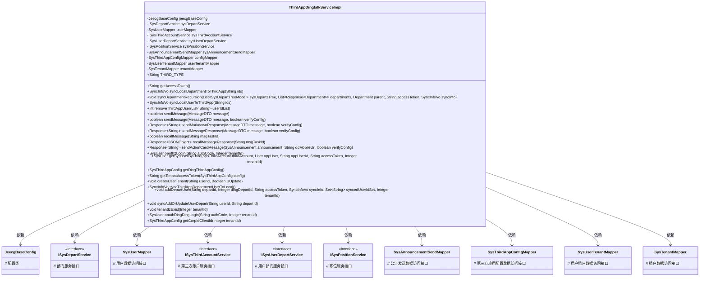

# 基础信息

|      |      |
|------|------|
| 名称 | ThirdAppDingtalkServiceImpl |
| 编码语言 | .java |
| 代码路径 | JeecgBoot/jeecg-boot/jeecg-module-system/jeecg-system-biz/src/main/java/org/jeecg/modules/system/service/impl/ThirdAppDingtalkServiceImpl.java |
| 包名 | org.jeecg.modules.system.service.impl |
| 依赖项 | ['cn.hutool.core.util.ObjectUtil', 'com.alibaba.fastjson.JSON', 'com.alibaba.fastjson.JSONObject', 'com.baomidou.mybatisplus.core.conditions.query.LambdaQueryWrapper', 'com.baomidou.mybatisplus.core.toolkit.Wrappers', 'com.jeecg.dingtalk.api.base.JdtBaseAPI', 'com.jeecg.dingtalk.api.core.response.Response', 'com.jeecg.dingtalk.api.core.util.HttpUtil', 'com.jeecg.dingtalk.api.core.vo.AccessToken', 'com.jeecg.dingtalk.api.core.vo.PageResult', 'com.jeecg.dingtalk.api.department.JdtDepartmentAPI', 'com.jeecg.dingtalk.api.department.vo.Department', 'com.jeecg.dingtalk.api.message.JdtMessageAPI', 'com.jeecg.dingtalk.api.message.vo.ActionCardMessage', 'com.jeecg.dingtalk.api.message.vo.MarkdownMessage', 'com.jeecg.dingtalk.api.message.vo.Message', 'com.jeecg.dingtalk.api.message.vo.TextMessage', 'com.jeecg.dingtalk.api.oauth2.JdtOauth2API', 'com.jeecg.dingtalk.api.oauth2.vo.ContactUser', 'com.jeecg.dingtalk.api.user.JdtUserAPI', 'com.jeecg.dingtalk.api.user.body.GetUserListBody', 'com.jeecg.dingtalk.api.user.vo.User', 'lombok.extern.slf4j.Slf4j', 'org.apache.commons.lang.StringUtils', 'org.jeecg.common.api.dto.message.MessageDTO', 'org.jeecg.common.config.TenantContext', 'org.jeecg.common.constant.CommonConstant', 'org.jeecg.common.constant.SymbolConstant', 'org.jeecg.common.constant.enums.MessageTypeEnum', 'org.jeecg.common.exception.JeecgBootBizTipException', 'org.jeecg.common.exception.JeecgBootException', 'org.jeecg.common.system.util.JwtUtil', 'org.jeecg.common.util', 'org.jeecg.config.JeecgBaseConfig', 'org.jeecg.config.mybatis.MybatisPlusSaasConfig', 'org.jeecg.modules.system.entity', 'org.jeecg.modules.system.mapper', 'org.jeecg.modules.system.model.SysDepartTreeModel', 'org.jeecg.modules.system.model.ThirdLoginModel', 'org.jeecg.modules.system.service', 'org.jeecg.modules.system.vo.thirdapp.JdtDepartmentTreeVo', 'org.jeecg.modules.system.vo.thirdapp.SyncInfoVo', 'org.springframework.beans.BeanUtils', 'org.springframework.beans.factory.annotation.Autowired', 'org.springframework.dao.DuplicateKeyException', 'org.springframework.stereotype.Service', 'java.util', 'java.util.stream.Collectors'] |
| 概述说明 | 钉钉服务类处理部门用户同步及消息发送。 |

# 说明

钉钉服务实现类是一个专门处理与钉钉平台相关功能的类。它主要负责部门的同步、用户的同步以及消息的发送等核心操作。通过这个类，可以实现与钉钉系统的无缝对接，确保部门结构和用户信息的实时更新，并能够高效地发送消息，提升企业内部沟通的效率。

# 类列表 Class Summary

| 名称   | 类型  | 说明 |
|-------|------|-------------|
| ThirdAppDingtalkServiceImpl | class | 钉钉服务实现类，处理部门、用户同步及消息发送等功能。 |

## 类 ThirdAppDingtalkServiceImpl

|      |      |
|------|------|
| 访问范围 | @Slf4j;@Service;public |
| 类型 | class |
| 名称 | ThirdAppDingtalkServiceImpl |
| 说明 | 钉钉服务实现类，处理部门、用户同步及消息发送等功能。 |

### UML类图

### 描述
`ThirdAppDingtalkServiceImpl` 是一个实现 `IThirdAppService` 接口的服务类，主要用于处理与钉钉第三方应用的集成。它通过依赖注入的方式获取了多个服务和数据访问对象，提供了获取访问令牌、同步本地部门到钉钉、同步本地用户到钉钉、发送消息、撤回消息等功能。类图中展示了 `ThirdAppDingtalkServiceImpl` 与多个服务类和数据访问类之间的依赖关系，这些依赖关系帮助实现类完成与钉钉的交互操作。

### 内部方法调用关系图

```mermaid
graph TD
    A["类ThirdAppDingtalkServiceImpl"]
    B["属性: JeecgBaseConfig jeecgBaseConfig"]
    C["属性: ISysDepartService sysDepartService"]
    D["属性: SysUserMapper userMapper"]
    E["属性: ISysThirdAccountService sysThirdAccountService"]
    F["属性: ISysUserDepartService sysUserDepartService"]
    G["属性: ISysPositionService sysPositionService"]
    H["属性: SysAnnouncementSendMapper sysAnnouncementSendMapper"]
    I["属性: SysThirdAppConfigMapper configMapper"]
    J["属性: SysUserTenantMapper userTenantMapper"]
    K["属性: SysTenantMapper tenantMapper"]
    L["常量: String THIRD_TYPE = 'dingtalk'"]
    M["方法: String getAccessToken()"]
    N["方法: SyncInfoVo syncLocalDepartmentToThirdApp(String ids)"]
    O["方法: void syncDepartmentRecursion(List<SysDepartTreeModel> sysDepartsTree, List<Response<Department>> departments, Department parent, String accessToken, SyncInfoVo syncInfo)"]
    P["方法: SyncInfoVo syncLocalUserToThirdApp(String ids)"]
    Q["方法: int removeThirdAppUser(List<String> userIdList)"]
    R["方法: boolean sendMessage(MessageDTO message)"]
    S["方法: boolean sendMessage(MessageDTO message, boolean verifyConfig)"]
    T["方法: Response<String> sendMarkdownResponse(MessageDTO message, boolean verifyConfig)"]
    U["方法: Response<String> sendMessageResponse(MessageDTO message, boolean verifyConfig)"]
    V["方法: boolean recallMessage(String msgTaskId)"]
    W["方法: Response<JSONObject> recallMessageResponse(String msgTaskId)"]
    X["方法: Response<String> sendActionCardMessage(SysAnnouncement announcement, String ddMobileUrl, boolean verifyConfig)"]
    Y["方法: SysUser oauth2Login(String authCode, Integer tenantId)"]
    Z["方法: SysUser getSysUserByThird(SysThirdAccount thirdAccount, User appUser, String appUserId, String accessToken, Integer tenantId)"]
    AA["方法: SysThirdAppConfig getDingThirdAppConfig()"]
    AB["方法: String getTenantAccessToken(SysThirdAppConfig config)"]
    AC["方法: void createUserTenant(String userId, Boolean isUpdate)"]
    AD["方法: SyncInfoVo syncThirdAppDepartmentUserToLocal()"]
    AE["方法: void addDepartUser(String departId, Integer dingDepartId, String accessToken, SyncInfoVo syncInfo, Set<String> syncedUserIdSet, Integer tenantId)"]
    AF["方法: void syncAddOrUpdateUserDepart(String userId, String departId)"]
    AG["方法: void tenantIzExist(Integer tenantId)"]
    AH["方法: SysUser oauthDingDingLogin(String authCode, Integer tenantId)"]
    AI["方法: SysThirdAppConfig getCorpIdClientId(Integer tenantId)"]

    A --> B
    A --> C
    A --> D
    A --> E
    A --> F
    A --> G
    A --> H
    A --> I
    A --> J
    A --> K
    A --> L
    A --> M
    A --> N
    A --> O
    A --> P
    A --> Q
    A --> R
    A --> S
    A --> T
    A --> U
    A --> V
    A --> W
    A --> X
    A --> Y
    A --> Z
    A --> AA
    A --> AB
    A --> AC
    A --> AD
    A --> AE
    A --> AF
    A --> AG
    A --> AH
    A --> AI
```

这段代码定义了一个名为 `ThirdAppDingtalkServiceImpl` 的类，用于处理与钉钉第三方应用相关的业务逻辑。该类通过多个 `@Autowired` 注解注入了一系列服务类和Mapper，用于访问和操作数据库。类中包含多个方法，如获取访问令牌、同步本地部门到第三方应用、同步本地用户到第三方应用、发送消息、撤回消息等。代码还涉及到了用户、部门、租户等实体的操作，并且通过递归方法处理了复杂的业务逻辑。

### 字段列表 Field List

| 名称  | 类型  | 说明 |
|-------|-------|------|
| jeecgBaseConfig | JeecgBaseConfig | 自动注入JeecgBaseConfig配置实例。 |
| configMapper | SysThirdAppConfigMapper | 自动注入SysThirdAppConfigMapper实例。 |
| userMapper | SysUserMapper | 自动注入SysUserMapper实例到userMapper变量。 |
| sysThirdAccountService | ISysThirdAccountService | 自动注入系统第三方账户服务接口实例。 |
| userTenantMapper | SysUserTenantMapper | 自动注入SysUserTenantMapper实例。 |
| sysAnnouncementSendMapper | SysAnnouncementSendMapper | 自动注入公告发送映射器实例。 |
| sysDepartService | ISysDepartService | 自动注入系统部门服务实例。 |
| sysUserDepartService | ISysUserDepartService | 自动注入系统用户部门服务实例。 |
| tenantMapper | SysTenantMapper | 自动注入SysTenantMapper实例。 |
| sysPositionService | ISysPositionService | 自动注入系统职位服务实例。 |
| THIRD_TYPE = "dingtalk" | String | 定义了一个不可变的字符串常量THIRD_TYPE，其值为"dingtalk"。 |

### 方法列表 Method List

| 名称  | 类型  | 说明 |
|-------|-------|------|
| sendMessage | boolean | 方法根据消息类型发送响应，返回发送结果。 |
| syncAddOrUpdateUserDepart | void | 同步添加或更新用户部门关系，检查用户是否在部门中，不存在则新增。 |
| tenantIzExist | void | 检查租户ID是否存在，若不存在则抛出异常。 |
| sysUserToDtUser | User | 将SysUser对象转换为User对象，并关联username。 |
| syncUserCollectErrInfo | boolean | 同步用户信息，失败记录错误码，成功记录成功信息。 |
| getUserDepart | List<SysDepart> | 根据用户ID查询部门列表，若无则返回空。 |
| getDepartmentByDepartId | Department | 通过部门ID在列表中查找并返回对应部门对象。 |
| dtDepartmentToSysDepart | SysDepart | 将部门对象转换为系统部门对象，复制属性并设置名称和顺序。 |
| dtUserToSysUser | SysUser | 将用户数据转换为系统用户，设置默认密码和状态。 |
| sysDepartToDtDepartment | Department | 将部门树模型转换为目标部门对象，并设置源标识符。 |
| syncDepartCollectErrInfo | boolean | 同步部门信息，失败记录错误码，成功记录成功信息。 |
| getUserListByDeptIdRecursion | void | 递归获取钉钉部门用户列表并同步到本地。 |
| thirdAccountSaveOrUpdate | void | 第三方账户保存或更新方法，处理用户信息和状态。 |
| recallMessage | boolean | 方法recallMessage通过msgTaskId撤回消息，成功返回true，失败返回false。 |
| sendMessage | boolean | 重写sendMessage方法，调用带参数的sendMessage并默认传递false。 |
| syncLocalDepartmentToThirdApp | SyncInfoVo | 同步本地部门至第三方应用，处理部门增删及用户迁移。 |
| getDingThirdAppConfig | SysThirdAppConfig | 获取钉钉第三方应用配置，验证租户存在后返回配置。 |
| syncDepartCollectErrInfo | boolean | 方法处理部门同步错误，记录失败信息并返回false。 |
| syncDepartmentToLocalRecursion | void | 递归同步部门信息，更新或新增部门，并可选同步用户。 |
| oauth2Login | SysUser | 通过授权码登录，获取用户信息并创建或更新系统用户。 |
| getTenantAccessToken | String | 方法获取租户访问令牌，失败返回空。 |
| syncDepartmentRecursion | void | 递归同步部门信息，处理更新和创建操作，并收集错误信息。 |
| getSysUserByThird | SysUser | 通过第三方账号获取系统用户，若未绑定则创建新用户。 |
| createUserTenant | void | 根据租户控制配置，检查并创建或更新用户租户关系。 |
| syncThirdAppDepartmentUserToLocal | SyncInfoVo | 同步第三方应用部门用户到本地，处理token获取、部门列表检查及递归同步。 |
| syncLocalUserToThirdApp | SyncInfoVo | 同步本地用户至第三方应用，处理获取、更新及创建用户信息，并记录同步结果。 |
| getAccessToken | String | 获取租户模式下钉钉配置的访问令牌，未配置则返回空。 |
| sendMessageResponse | Response<String> | 发送钉钉消息前验证配置和令牌，封装消息并发送。 |
| dtUserToSysUser | SysUser | 将User对象转换为SysUser对象，更新电话、姓名、邮箱、手机和工号，避免唯一键冲突。 |
| oauthDingDingLogin | SysUser | 钉钉登录验证租户存在，获取accessToken并查询用户信息。 |
| sendActionCardMessage | Response<String> | 发送钉钉通知，验证配置并获取访问令牌，生成并推送消息。 |
| recallMessageResponse | Response<JSONObject> | 该方法通过租户模式隔离，获取钉钉配置和访问令牌，调用API撤回消息。 |
| removeThirdAppUser | int | 移除第三方应用用户，获取租户访问令牌，删除指定用户并返回成功数量。 |
| sysUserToDtUser | User | 将系统用户数据同步至目标用户对象，包括姓名、电话、职位、邮箱及部门信息。 |
| getCorpIdClientId | SysThirdAppConfig | 根据租户ID获取第三方应用配置中的企业ID和客户端ID。 |
| syncUserCollectErrInfo | boolean | 同步用户信息时，检测到重复邮箱或工号则提示更换，否则记录错误信息并返回失败。 |
| addDepartUser | void | 递归获取用户列表，同步更新或创建用户及其部门信息。 |
| sendMarkdownResponse | Response<String> | 发送钉钉Markdown消息，验证配置并封装消息内容。 |
| sysDepartToDtDepartment | Department | 将部门树模型转换为部门对象，设置名称、父ID和排序。 |

