# 基础信息

|      |      |
|------|------|
| 名称 | ThirdAppWechatEnterpriseServiceImpl |
| 编码语言 | .java |
| 代码路径 | JeecgBoot/jeecg-boot/jeecg-module-system/jeecg-system-biz/src/main/java/org/jeecg/modules/system/service/impl/ThirdAppWechatEnterpriseServiceImpl.java |
| 包名 | org.jeecg.modules.system.service.impl |
| 依赖项 | ['cn.hutool.core.util.ObjectUtil', 'com.alibaba.fastjson.JSONArray', 'com.alibaba.fastjson.JSONObject', 'com.baomidou.mybatisplus.core.conditions.query.LambdaQueryWrapper', 'com.baomidou.mybatisplus.core.toolkit.Wrappers', 'com.jeecg.qywx.api.base.JwAccessTokenAPI', 'com.jeecg.qywx.api.core.common.AccessToken', 'com.jeecg.qywx.api.department.JwDepartmentAPI', 'com.jeecg.qywx.api.department.vo.DepartMsgResponse', 'com.jeecg.qywx.api.department.vo.Department', 'com.jeecg.qywx.api.message.JwMessageAPI', 'com.jeecg.qywx.api.message.vo', 'com.jeecg.qywx.api.user.JwUserAPI', 'com.jeecg.qywx.api.user.vo.User', 'lombok.extern.slf4j.Slf4j', 'org.apache.commons.lang.StringUtils', 'org.apache.http.HttpEntity', 'org.apache.http.client.config.RequestConfig', 'org.apache.http.client.methods.CloseableHttpResponse', 'org.apache.http.client.methods.HttpPost', 'org.apache.http.entity.ContentType', 'org.apache.http.entity.StringEntity', 'org.apache.http.impl.client.CloseableHttpClient', 'org.apache.http.impl.client.HttpClients', 'org.apache.http.util.EntityUtils', 'org.jeecg.common.api.dto.message.MessageDTO', 'org.jeecg.common.config.TenantContext', 'org.jeecg.common.constant.CommonConstant', 'org.jeecg.common.constant.SymbolConstant', 'org.jeecg.common.constant.enums.MessageTypeEnum', 'org.jeecg.common.exception.JeecgBootException', 'org.jeecg.common.system.util.JwtUtil', 'org.jeecg.common.util.PasswordUtil', 'org.jeecg.common.util.RestUtil', 'org.jeecg.common.util.SpringContextUtils', 'org.jeecg.common.util.oConvertUtils', 'org.jeecg.config.JeecgBaseConfig', 'org.jeecg.config.mybatis.MybatisPlusSaasConfig', 'org.jeecg.modules.system.entity', 'org.jeecg.modules.system.mapper', 'org.jeecg.modules.system.model.SysDepartTreeModel', 'org.jeecg.modules.system.service', 'org.jeecg.modules.system.vo.thirdapp.JwDepartmentTreeVo', 'org.jeecg.modules.system.vo.thirdapp.JwSysUserDepartVo', 'org.jeecg.modules.system.vo.thirdapp.JwUserDepartVo', 'org.jeecg.modules.system.vo.thirdapp.SyncInfoVo', 'org.springframework.beans.BeanUtils', 'org.springframework.beans.factory.annotation.Autowired', 'org.springframework.dao.DuplicateKeyException', 'org.springframework.stereotype.Service', 'java.io.IOException', 'java.util', 'java.util.concurrent.atomic.AtomicBoolean', 'java.util.stream.Collectors'] |
| 概述说明 | 企业微信服务类，支持部门用户同步及消息发送。 |

# 说明

企业微信服务实现类主要包含三大功能模块：部门管理、用户同步和消息发送。部门管理模块负责处理企业组织架构中的部门信息，确保部门数据的准确性和实时性。用户同步模块用于实现企业微信与内部系统的用户数据同步，保持用户信息的一致性。消息发送模块则提供了便捷的消息传递功能，支持多种消息类型的发送，确保企业内部沟通的高效性和及时性。这些功能共同构成了企业微信服务实现类的核心，助力企业实现高效的管理和沟通。

# 类列表 Class Summary

| 名称   | 类型  | 说明 |
|-------|------|-------------|
| ThirdAppWechatEnterpriseServiceImpl | class | 企业微信服务实现类，包含部门、用户同步及消息发送功能。 |

## 类 ThirdAppWechatEnterpriseServiceImpl

|      |      |
|------|------|
| 访问范围 | @Slf4j;@Service;public |
| 类型 | class |
| 名称 | ThirdAppWechatEnterpriseServiceImpl |
| 说明 | 企业微信服务实现类，包含部门、用户同步及消息发送功能。 |

### UML类图

```mermaid
classDiagram
    class ThirdAppWechatEnterpriseServiceImpl {
        -JeecgBaseConfig jeecgBaseConfig
        -ISysDepartService sysDepartService
        -SysUserMapper userMapper
        -ISysThirdAccountService sysThirdAccountService
        -ISysUserDepartService sysUserDepartService
        -ISysPositionService sysPositionService
        -SysAnnouncementSendMapper sysAnnouncementSendMapper
        -SysThirdAppConfigMapper configMapper
        -SysTenantMapper sysTenantMapper
        -SysUserTenantMapper sysUserTenantMapper
        -SysThirdAccountMapper sysThirdAccountMapper
        -SysTenantMapper tenantMapper
        -String ERR_CODE
        -String THIRD_TYPE
        +String getAccessToken()
        +String getAppAccessToken(SysThirdAppConfig config)
        +SyncInfoVo syncLocalDepartmentToThirdApp(String ids)
        -void deleteDepartRecursion(List~JwDepartmentTreeVo~ children, String accessToken, boolean ifLocal)
        -void syncDepartmentRecursion(List~SysDepartTreeModel~ sysDepartsTree, List~Department~ departments, Department parent, String accessToken)
        +SyncInfoVo syncThirdAppDepartmentToLocal(Integer tenantId, Map~String,String~ map)
        -void syncDepartmentToLocalRecursion(List~JwDepartmentTreeVo~ departmentTreeList, String sysParentId, String username, SyncInfoVo syncInfo, Integer tenantId, Map~String,String~ map)
        +SyncInfoVo syncLocalUserToThirdApp(String ids)
        -void thirdAccountSaveOrUpdate(SysThirdAccount sysThirdAccount, String sysUserId, String qwUserId, String wechatRealName, Integer tenantId)
        -boolean syncUserCollectErrInfo(int errCode, SysUser sysUser, SyncInfoVo syncInfo)
        -boolean syncUserCollectErrInfo(Exception e, User qwUser, SyncInfoVo syncInfo)
        -boolean syncDepartCollectErrInfo(Exception e, Department department, SyncInfoVo syncInfo)
        -User sysUserToQwUser(SysUser sysUser)
        -User sysUserToQwUser(SysUser sysUser, User user)
        -List~SysDepart~ getUserDepart(SysUser sysUser)
        -SysUser qwUserToSysUser(User user)
        -SysUser qwUserToSysUser(User qwUser, SysUser oldSysUser)
        -Department sysDepartToQwDepartment(SysDepartTreeModel departTree, String parentId)
        -Department sysDepartToQwDepartment(SysDepartTreeModel departTree, Department department, String parentId)
        -SysDepart qwDepartmentToSysDepart(Department department, SysDepart oldSysDepart)
        +int removeThirdAppUser(List~String~ userIdList)
        +boolean sendMessage(MessageDTO message)
        +boolean sendMessage(MessageDTO message, boolean verifyConfig)
        +JSONObject sendMessageResponse(MessageDTO message, boolean verifyConfig)
        +JSONObject sendMarkdownResponse(MessageDTO message, boolean verifyConfig)
        +JSONObject sendTextCardMessage(SysAnnouncement announcement, boolean verifyConfig)
        -String getTouser(String origin, boolean toAll)
        +Map~String,String~ getUserIdByThirdCode(String code, String accessToken)
        +SysUser oauth2Login(String code, Integer tenantId)
        -SysUser getSysUserByThird(SysThirdAccount thirdAccount, User appUser, String appUserId, String accessToken, String userTicket, Integer tenantId)
        -SysThirdAppConfig getWeChatThirdAppConfig()
        -User getUserByUserTicket(String userTicket, String accessToken)
        +JwSysUserDepartVo getThirdUserByWechat(Integer tenantId)
        +SyncInfoVo syncWechatEnterpriseDepartAndUserToLocal(String jwUserDepartJson, Integer tenantId)
        -void syncDepartAndUser(SyncInfoVo syncInfoVo, Integer tenantId, Map~String,String~ idsMap, String jwUserDepartJson)
        -String saveUser(String username, String wechatRealName, SyncInfoVo syncInfo, String wechatUserId)
        -void createUserTenant(String userId, Boolean isUpdate, Integer tenantId)
        -void userDepartSaveOrUpdate(Map~String,String~ idsMap, String sysUserId, String[] departIds)
        +List~JwUserDepartVo~ getThirdUserBindByWechat(int tenantId)
    }

    class JeecgBaseConfig {
        // 配置类，包含基础配置信息
    }

    class ISysDepartService {
        <<Interface>>
        +List~SysDepartTreeModel~ queryTreeList()
    }

    class SysUserMapper {
        +List~SysUser~ selectList(LambdaQueryWrapper~SysUser~ queryWrapper)
        +SysUser selectById(String id)
        +SysUser getUserByPhone(String phone)
        +void updateById(SysUser sysUser)
        +void insert(SysUser sysUser)
    }

    class ISysThirdAccountService {
        <<Interface>>
        +SysThirdAccount getOneBySysUserId(String sysUserId, String thirdType)
        +void saveOrUpdate(SysThirdAccount sysThirdAccount)
        +SysThirdAccount getOneByUuidAndThirdType(String uuid, String thirdType, Integer tenantId, String wechatUserId)
        +SysThirdAccount createUser(String mobile, String wechatUserId, Integer tenantId)
    }

    class ISysUserDepartService {
        <<Interface>>
        +List~SysUserDepart~ list(LambdaQueryWrapper~SysUserDepart~ queryWrapper)
        +long count(LambdaQueryWrapper~SysUserDepart~ queryWrapper)
        +void save(SysUserDepart sysUserDepart)
    }

    class ISysPositionService {
        <<Interface>>
        +List~SysPosition~ getPositionList(String userId)
    }

    class SysAnnouncementSendMapper {
        +SysAnnouncementSend selectOne(LambdaQueryWrapper~SysAnnouncementSend~ queryWrapper)
    }

    class SysThirdAppConfigMapper {
        +SysThirdAppConfig getThirdConfigByThirdType(Integer tenantId, String type)
    }

    class SysTenantMapper {
        +SysTenant selectById(Integer tenantId)
        +Long tenantIzExist(Integer tenantId)
    }

    class SysUserTenantMapper {
        +Integer userTenantIzExist(String userId, Integer tenantId)
        +void insert(SysUserTenant userTenant)
    }

    class SysThirdAccountMapper {
        +List~JwUserDepartVo~ getThirdUserBindByWechat(int tenantId, String thirdType)
    }

    ThirdAppWechatEnterpriseServiceImpl --> JeecgBaseConfig : 依赖
    ThirdAppWechatEnterpriseServiceImpl --> ISysDepartService : 依赖
    ThirdAppWechatEnterpriseServiceImpl --> SysUserMapper : 依赖
    ThirdAppWechatEnterpriseServiceImpl --> ISysThirdAccountService : 依赖
    ThirdAppWechatEnterpriseServiceImpl --> ISysUserDepartService : 依赖
    ThirdAppWechatEnterpriseServiceImpl --> ISysPositionService : 依赖
    ThirdAppWechatEnterpriseServiceImpl --> SysAnnouncementSendMapper : 依赖
    ThirdAppWechatEnterpriseServiceImpl --> SysThirdAppConfigMapper : 依赖
    ThirdAppWechatEnterpriseServiceImpl --> SysTenantMapper : 依赖
    ThirdAppWechatEnterpriseServiceImpl --> SysUserTenantMapper : 依赖
    ThirdAppWechatEnterpriseServiceImpl --> SysThirdAccountMapper : 依赖
```

### 描述
`ThirdAppWechatEnterpriseServiceImpl` 是一个实现 `IThirdAppService` 接口的类，主要负责与第三方企业微信应用进行交互。它通过依赖注入的方式使用多个服务和Mapper类，实现了获取AccessToken、同步部门与用户信息、发送消息等功能。类中包含多个私有方法用于递归处理部门与用户的同步操作，并提供了多种错误处理机制。通过该类，可以实现本地系统与企业微信之间的数据同步与交互。

### 内部方法调用关系图

这段代码是一个企业微信第三方应用服务的实现类，主要功能包括获取AccessToken、同步部门和用户信息、发送消息等。代码通过多个方法实现了企业微信与本地系统的数据同步，包括部门和用户的增删改查操作。每个方法都通过调用企业微信的API来完成相应的业务逻辑，并通过日志记录操作结果。代码中还包含了一些递归方法，用于处理部门和用户的层级关系。整体流程通过多个方法的组合来完成企业微信与本地系统的数据同步和消息发送功能。

### 字段列表 Field List

| 名称  | 类型  | 说明 |
|-------|-------|------|
| jeecgBaseConfig | JeecgBaseConfig | 自动注入JeecgBaseConfig配置实例。 |
| tenantMapper | SysTenantMapper | 自动注入SysTenantMapper实例。 |
| sysTenantMapper | SysTenantMapper | 自动注入SysTenantMapper实例。 |
| sysUserDepartService | ISysUserDepartService | 自动注入用户部门服务接口实例。 |
| userMapper | SysUserMapper | 自动注入SysUserMapper实例。 |
| sysThirdAccountService | ISysThirdAccountService | 自动注入系统第三方账户服务接口实例。 |
| sysAnnouncementSendMapper | SysAnnouncementSendMapper | 自动注入公告发送映射器实例。 |
| sysDepartService | ISysDepartService | 自动注入系统部门服务实例。 |
| ERR_CODE = "errcode" | String | 定义常量ERR_CODE，值为"errcode"。 |
| sysThirdAccountMapper | SysThirdAccountMapper | 自动注入SysThirdAccountMapper对象实例。 |
| sysPositionService | ISysPositionService | 自动注入系统职位服务实例。 |
| sysUserTenantMapper | SysUserTenantMapper | 自动注入SysUserTenantMapper实例。 |
| THIRD_TYPE = "wechat_enterprise" | String | 定义常量THIRD_TYPE为"wechat_enterprise"。 |
| configMapper | SysThirdAppConfigMapper | 自动注入SysThirdAppConfigMapper实例。 |

### 方法列表 Method List

| 名称  | 类型  | 说明 |
|-------|-------|------|
| sendMessage | boolean | 重写sendMessage方法，调用带布尔参数的版本，默认值为false。 |
| getWeChatThirdAppConfig | SysThirdAppConfig | 获取微信第三方应用配置，基于租户ID和消息类型。 |
| sysUserToQwUser | User | 将SysUser转换为QwUser，通过username关联用户ID。 |
| syncDepartCollectErrInfo | boolean | 方法同步部门信息失败时记录错误信息并返回false。 |
| getUserDepart | List<SysDepart> | 根据用户ID查询所属部门列表，若无则返回空。 |
| getAccessToken | String | 获取企业微信AccessToken，通过租户模式隔离配置表。 |
| getSysUserByThird | SysUser | 根据第三方账户获取系统用户，绑定或创建新用户。 |
| removeThirdAppUser | int | 删除第三方应用用户，返回成功删除数量。 |
| getUserIdByThirdCode | Map<String,String> | 通过第三方代码和访问令牌获取用户ID和用户票据。 |
| syncUserCollectErrInfo | boolean | 同步用户信息时，根据错误码记录失败或成功信息，返回布尔值。 |
| saveUser | String | 保存用户信息，设置密码和状态，返回用户ID或空字符串。 |
| syncUserCollectErrInfo | boolean | 同步用户信息失败时记录错误并返回false。 |
| syncWechatEnterpriseDepartAndUserToLocal | SyncInfoVo | 同步微信企业部门及用户到本地，返回同步结果。 |
| getThirdUserByWechat | JwSysUserDepartVo | 通过微信获取第三方用户信息，包括用户ID和部门ID，并返回用户列表。 |
| thirdAccountSaveOrUpdate | void | 方法保存或更新第三方账户信息，设置用户ID、状态、类型及租户ID。 |
| syncDepartmentToLocalRecursion | void | 递归同步部门信息，更新或创建部门，处理子级部门，记录成功与错误信息。 |
| qwDepartmentToSysDepart | SysDepart | 将部门对象转换为系统部门对象，保留旧属性并设置新标识符、名称和排序。 |
| syncLocalUserToThirdApp | SyncInfoVo | 同步本地用户至第三方应用，处理失败信息并更新或创建用户。 |
| oauth2Login | SysUser | 检查租户存在性，获取企业微信配置和令牌，验证用户信息并返回系统用户。 |
| qwUserToSysUser | SysUser | 将User对象转换为SysUser对象，设置默认状态和密码加密。 |
| getThirdUserBindByWechat | List<JwUserDepartVo> | 方法通过微信获取第三方用户绑定信息，返回用户部门列表。 |
| syncLocalDepartmentToThirdApp | SyncInfoVo | 同步本地部门至第三方应用，处理获取token、部门数据及递归同步。 |
| createUserTenant | void | 方法检查用户是否在租户下，若不存在则新增租户用户。 |
| sysDepartToQwDepartment | Department | 私有方法将系统部门树模型转换为企业微信部门对象。 |
| getUserByUserTicket | User | 通过用户票据和访问令牌获取用户信息，使用HTTP POST请求，处理响应并返回用户对象。 |
| sysUserToQwUser | User | 将SysUser数据同步到企业微信User对象，包括部门、职位、状态等信息。 |
| syncDepartAndUser | void | 同步企业微信用户和部门信息，包括新建或更新用户、租户用户表、第三方账号表和用户部门关系表。 |
| deleteDepartRecursion | void | 递归删除部门，保留本地部门，移动成员至根部门。 |
| sendMessage | boolean | 重写sendMessage方法，根据消息类型发送响应并检查错误码。 |
| syncDepartmentRecursion | void | 递归同步部门信息，更新或创建部门并处理子级。 |
| sendTextCardMessage | JSONObject | 发送微信文本卡片消息，验证配置并获取访问令牌，设置接收用户和消息内容，最终发送消息。 |
| getTouser | String | 根据条件返回接收者，toAll为真返回@all，否则查询并拼接第三方用户ID。 |
| getAppAccessToken | String | 通过租户模式隔离，获取企业微信和钉钉的AccessToken。 |
| userDepartSaveOrUpdate | void | 保存或更新用户部门关系，检查并新增不存在的关系。 |
| sysDepartToQwDepartment | Department | 将部门树模型转换为目标部门对象，设置名称、父ID和排序。 |
| qwUserToSysUser | SysUser | 将企业微信用户数据转换为系统用户对象，更新姓名、职位、工号、性别、邮箱、手机、状态和座机号。 |
| syncThirdAppDepartmentToLocal | SyncInfoVo | 同步第三方应用部门到本地，获取访问令牌，验证并递归同步部门信息。 |
| sendMarkdownResponse | JSONObject | 方法发送Markdown消息，验证配置并获取访问令牌，最终调用API发送。 |
| sendMessageResponse | JSONObject | 发送消息方法，验证配置并获取令牌，构造消息体后调用API发送。 |

