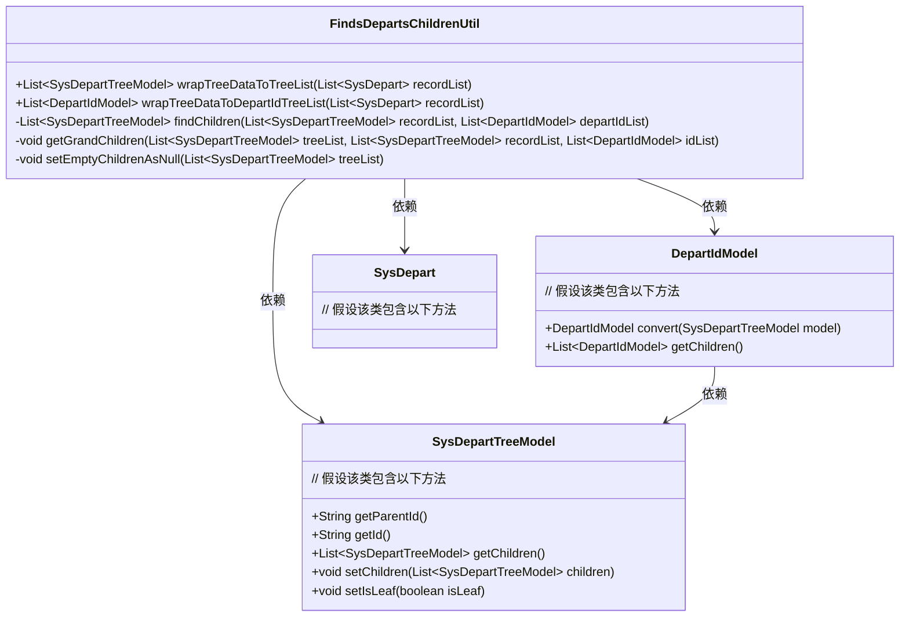
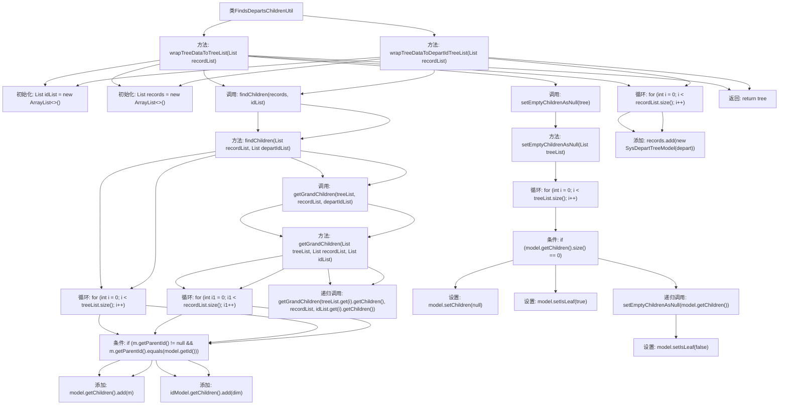

# 基础信息

|      |      |
|------|------|
| 名称 | FindsDepartsChildrenUtil |
| 编码语言 | .java |
| 代码路径 | JeecgBoot/jeecg-boot/jeecg-module-system/jeecg-system-biz/src/main/java/org/jeecg/modules/system/util/FindsDepartsChildrenUtil.java |
| 包名 | org.jeecg.modules.system.util |
| 依赖项 | ['org.jeecg.common.constant.CommonConstant', 'org.jeecg.common.util.RedisUtil', 'org.jeecg.common.util.oConvertUtils', 'org.jeecg.modules.system.entity.SysDepart', 'org.jeecg.modules.system.model.DepartIdModel', 'org.jeecg.modules.system.model.SysDepartTreeModel', 'org.springframework.beans.factory.annotation.Autowired', 'java.util.ArrayList', 'java.util.List'] |
| 概述说明 | 将SysDepart列表转为树结构并封装子节点。 |

# 说明

该内容描述了一个将SysDepart列表转换为树结构的过程，并封装子节点。具体操作涉及将扁平化的部门列表重新组织成层次化的树形结构，每个节点包含其子节点信息，以便更直观地表示部门间的层级关系。此过程通常用于优化数据展示和简化层级管理。

# 类列表 Class Summary

| 名称   | 类型  | 说明 |
|-------|------|-------------|
| FindsDepartsChildrenUtil | class | 将SysDepart列表转换为树结构并封装子节点。 |

## 类 FindsDepartsChildrenUtil

|      |      |
|------|------|
| 访问范围 | public |
| 类型 | class |
| 名称 | FindsDepartsChildrenUtil |
| 说明 | 将SysDepart列表转换为树结构并封装子节点。 |

### UML类图

**描述：**
`FindsDepartsChildrenUtil` 是一个工具类，用于处理部门树结构的转换和操作。它提供了多个方法，将 `SysDepart` 类型的列表转换为 `SysDepartTreeModel` 类型的树结构，并生成 `DepartIdModel` 列表。该类通过递归方法 `findChildren` 和 `getGrandChildren` 来构建树结构，并使用 `setEmptyChildrenAsNull` 方法将没有子节点的列表设置为 `null`。这些操作依赖于 `SysDepartTreeModel` 和 `DepartIdModel` 类，分别表示部门树节点和部门ID模型。

### 内部方法调用关系图

这段代码主要处理部门树结构的数据转换和封装。`wrapTreeDataToTreeList`和`wrapTreeDataToDepartIdTreeList`方法将`SysDepart`类型的列表转换为`SysDepartTreeModel`和`DepartIdModel`类型的列表。`findChildren`方法用于找到顶级父节点并封装到树结构中，`getGrandChildren`方法递归查找并封装所有子节点，`setEmptyChildrenAsNull`方法将没有子节点的列表设置为`null`。整个流程通过递归和循环操作，确保树结构的完整性和正确性。

### 字段列表 Field List

| 名称  | 类型  | 说明 |
|-------|-------|------|

### 方法列表 Method List

| 名称  | 类型  | 说明 |
|-------|-------|------|
| wrapTreeDataToTreeList | List<SysDepartTreeModel> | 将部门列表转换为树形结构，清理全局集合并返回树形数据。 |
| getGrandChildren | void | 递归遍历树结构，匹配父子节点并构建子节点列表。 |
| findChildren | List<SysDepartTreeModel> | 查找并构建部门树结构，返回根节点列表。 |
| setEmptyChildrenAsNull | void | 将树列表中无子节点的节点子列表设为null并标记为叶子节点。 |
| wrapTreeDataToDepartIdTreeList | List<DepartIdModel> | 将部门数据转换为树形结构并返回ID列表。 |

