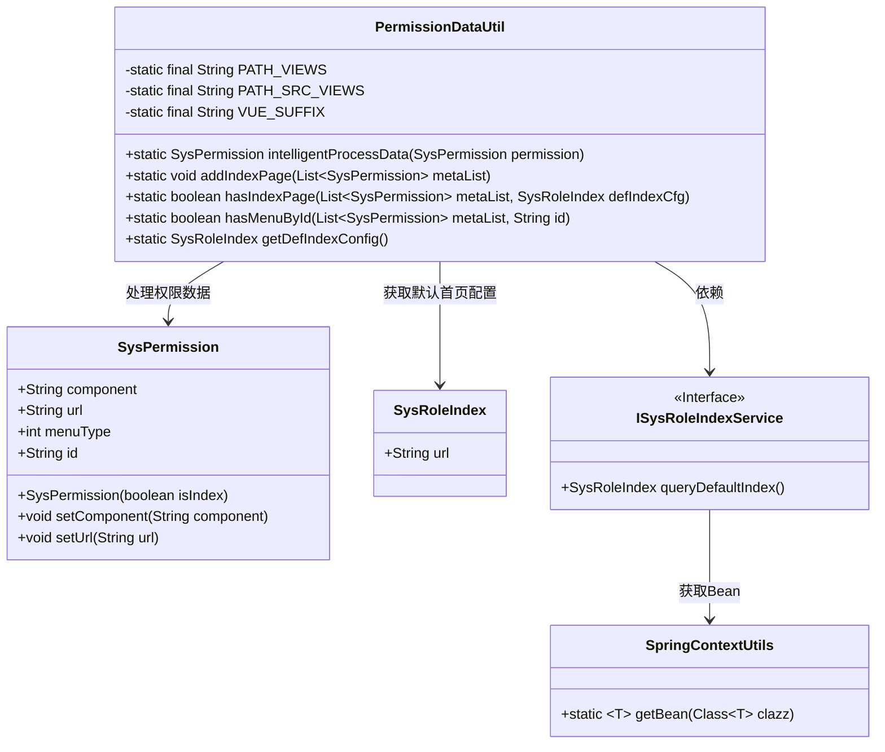
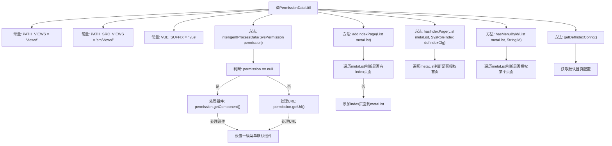

# 基础信息

|      |      |
|------|------|
| 名称 | PermissionDataUtil |
| 编码语言 | .java |
| 代码路径 | JeecgBoot/jeecg-boot/jeecg-module-system/jeecg-system-biz/src/main/java/org/jeecg/modules/system/util/PermissionDataUtil.java |
| 包名 | org.jeecg.modules.system.util |
| 依赖项 | ['org.jeecg.common.constant.CommonConstant', 'org.jeecg.common.constant.SymbolConstant', 'org.jeecg.common.util.SpringContextUtils', 'org.jeecg.common.util.oConvertUtils', 'org.jeecg.modules.system.entity.SysPermission', 'org.jeecg.modules.system.entity.SysRoleIndex', 'org.jeecg.modules.system.service.ISysRoleIndexService', 'java.util.List'] |
| 概述说明 | 权限数据处理工具类，具备错误处理、首页添加及授权判断功能。 |

# 说明

权限数据处理工具类是一款功能全面的软件工具，主要用于处理与权限相关的数据。该工具类具备智能处理错误数据的能力，能够自动识别并修正数据中的异常或错误，确保数据的准确性和完整性。此外，工具类还支持添加首页的功能，方便用户快速访问和管理权限数据。同时，工具类提供了判断授权的功能，能够根据预设规则或条件，自动判断用户是否具备相应的操作权限，从而有效控制系统的访问权限。这些功能共同构成了一个高效、可靠的权限数据处理解决方案，适用于各类需要权限管理的应用场景。

# 类列表 Class Summary

| 名称   | 类型  | 说明 |
|-------|------|-------------|
| PermissionDataUtil | class | 权限数据处理工具类，包含智能处理错误数据、添加首页、判断授权等功能。 |

## 类 PermissionDataUtil

|      |      |
|------|------|
| 访问范围 | public |
| 类型 | class |
| 名称 | PermissionDataUtil |
| 说明 | 权限数据处理工具类，包含智能处理错误数据、添加首页、判断授权等功能。 |

### UML类图

### 描述
`PermissionDataUtil` 是一个工具类，用于处理权限数据。它包含多个静态方法，如 `intelligentProcessData` 用于智能处理权限数据，`addIndexPage` 用于添加默认首页，`hasIndexPage` 用于判断是否有首页权限，`hasMenuById` 用于通过ID判断是否有某个页面的权限，`getDefIndexConfig` 用于获取默认首页配置。该类依赖于 `SysPermission`、`SysRoleIndex` 和 `ISysRoleIndexService` 等类，并通过 `SpringContextUtils` 获取服务实例。

### 内部方法调用关系图

这段代码定义了一个名为 `PermissionDataUtil` 的工具类，主要用于处理权限相关的数据。它包含多个方法，用于智能处理权限数据、添加默认页面、判断是否授权首页或某个页面，以及获取默认首页配置。代码通过常量定义了路径和后缀，并在方法中进行了各种判断和处理，以确保权限数据的正确性和完整性。

### 字段列表 Field List

| 名称  | 类型  | 说明 |
|-------|-------|------|
| PATH_VIEWS = "views/" | String | 定义常量PATH_VIEWS，值为"views/"。 |
| VUE_SUFFIX = ".vue" | String | 私有静态常量VUE_SUFFIX值为".vue"。 |
| PATH_SRC_VIEWS = "src/views/" | String | 定义静态常量PATH_SRC_VIEWS，值为"src/views/"。 |

### 方法列表 Method List

| 名称  | 类型  | 说明 |
|-------|-------|------|
| hasMenuById | boolean | 检查列表中是否存在指定ID的菜单项。 |
| addIndexPage | void | 检查权限列表是否包含默认首页，若无则添加。 |
| intelligentProcessData | SysPermission | 处理权限组件和URL，修正路径和组件设置。 |
| getDefIndexConfig | SysRoleIndex | 获取默认系统角色索引配置的方法。 |
| hasIndexPage | boolean | 检查权限列表中是否存在默认首页配置的URL。 |

