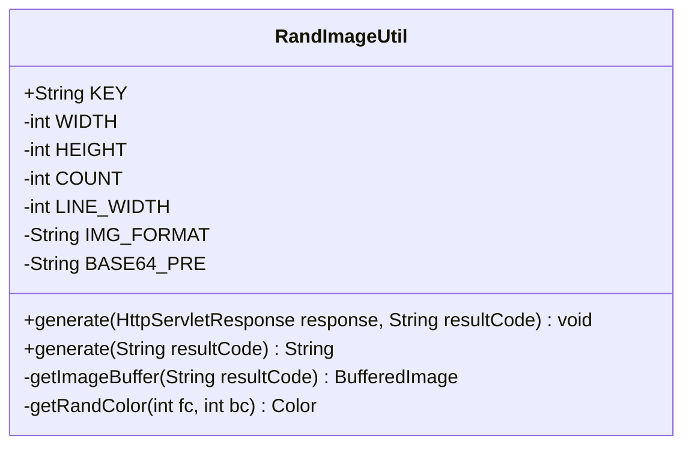

# 基础信息

|      |      |
|------|------|
| 名称 | RandImageUtil |
| 编码语言 | .java |
| 代码路径 | JeecgBoot/jeecg-boot/jeecg-module-system/jeecg-system-biz/src/main/java/org/jeecg/modules/system/util/RandImageUtil.java |
| 包名 | org.jeecg.modules.system.util |
| 依赖项 | ['javax.imageio.ImageIO', 'javax.servlet.http.HttpServletResponse', 'java.awt', 'java.awt.image.BufferedImage', 'java.io.ByteArrayOutputStream', 'java.io.IOException', 'java.security.NoSuchAlgorithmException', 'java.security.SecureRandom', 'java.util.Base64', 'java.util.Random'] |
| 概述说明 | 生成随机验证码图片工具类，支持直接输出和Base64编码。 |

# 说明

生成随机验证码图片工具类是一个功能强大的工具，主要用于创建随机验证码图片。该工具类支持两种输出方式：直接输出验证码图片和将图片以Base64编码形式输出。直接输出方式可以快速生成并显示验证码图片，而Base64编码方式则适用于需要将图片嵌入到网页或其他文本环境中的场景。该工具类通过灵活的接口设计，满足不同应用场景的需求，确保验证码生成过程高效且安全。

# 类列表 Class Summary

| 名称   | 类型  | 说明 |
|-------|------|-------------|
| RandImageUtil | class | 生成随机验证码图片工具类，支持直接输出和Base64编码。 |

## 类 RandImageUtil

|      |      |
|------|------|
| 访问范围 | public |
| 类型 | class |
| 名称 | RandImageUtil |
| 说明 | 生成随机验证码图片工具类，支持直接输出和Base64编码。 |

### UML类图

**描述：**
`RandImageUtil` 类用于生成包含随机验证码的图片，并提供两种输出方式：直接通过 `HttpServletResponse` 返回图片或生成 Base64 编码的图片字符串。类中定义了图片的尺寸、干扰线数量、颜色等常量，并通过 `getImageBuffer` 方法在内存中创建并绘制图片。`getRandColor` 方法用于生成随机颜色，确保验证码图片的安全性。该类适用于需要生成验证码图片的场景。

### 内部方法调用关系图

```mermaid
graph TD
    A["类RandImageUtil"]
    B["常量: String KEY"]
    C["常量: int WIDTH"]
    D["常量: int HEIGHT"]
    E["常量: int COUNT"]
    F["常量: int LINE_WIDTH"]
    G["常量: String IMG_FORMAT"]
    H["常量: String BASE64_PRE"]
    I["方法: generate(HttpServletResponse response, String resultCode)"]
    J["方法: generate(String resultCode)"]
    K["方法: getImageBuffer(String resultCode)"]
    L["方法: getRandColor(int fc, int bc)"]
    M["生成BufferedImage"]
    N["获取Graphics2D"]
    O["设定背景颜色"]
    P["设定边框颜色"]
    Q["生成SecureRandom"]
    R["随机产生干扰线"]
    S["显示认证码"]
    T["图象生效"]
    U["生成base64字符串"]
    V["输出图象到页面"]

    A --> B
    A --> C
    A --> D
    A --> E
    A --> F
    A --> G
    A --> H
    A --> I
    A --> J
    A --> K
    A --> L
    I --> V
    J --> U
    K --> M
    K --> N
    K --> O
    K --> P
    K --> Q
    K --> R
    K --> S
    K --> T
    K --> V
    K --> U
```

**描述：**  
这段代码定义了一个`RandImageUtil`类，用于生成包含随机干扰线和认证码的图像。通过`generate`方法可以直接将图像输出到HTTP响应或生成base64字符串。`getImageBuffer`方法负责在内存中创建图像，设置背景和边框颜色，生成随机干扰线，并显示认证码。`getRandColor`方法用于生成给定范围内的随机颜色。整体流程包括图像生成、干扰线绘制、认证码显示以及最终的图像输出或base64编码。

### 字段列表 Field List

| 名称  | 类型  | 说明 |
|-------|-------|------|
| KEY = "JEECG_LOGIN_KEY" | String | 定义常量KEY，值为"JEECG_LOGIN_KEY"。 |
| BASE64_PRE = "data:image/jpg;base64," | String | 定义BASE64图片前缀字符串常量。 |
| COUNT = 200 | int | 定义私有静态常量COUNT，值为200。 |
| HEIGHT = 35 | int | 定义了一个私有的静态整型常量HEIGHT，值为35。 |
| IMG_FORMAT = "JPEG" | String | 定义私有静态常量IMG_FORMAT，值为"JPEG"。 |
| WIDTH = 105 | int | 定义了一个私有的静态整型常量WIDTH，值为105。 |
| LINE_WIDTH = 2 | int | 定义了一个私有的静态常量LINE_WIDTH，其值为2。 |

### 方法列表 Method List

| 名称  | 类型  | 说明 |
|-------|-------|------|
| getRandColor | Color | 生成指定范围内的随机颜色。 |
| generate | void | 生成图像并输出到HTTP响应流。 |
| generate | String | 生成Base64编码的图像字符串，删除换行符并返回结果。 |
| getImageBuffer | BufferedImage | 生成带干扰线和验证码的图像，使用SHA1PRNG随机数算法确保安全性。 |

