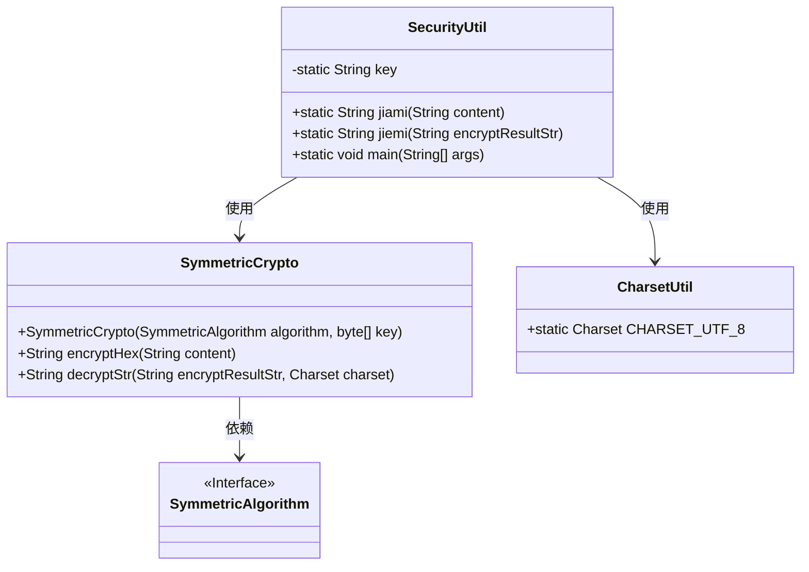
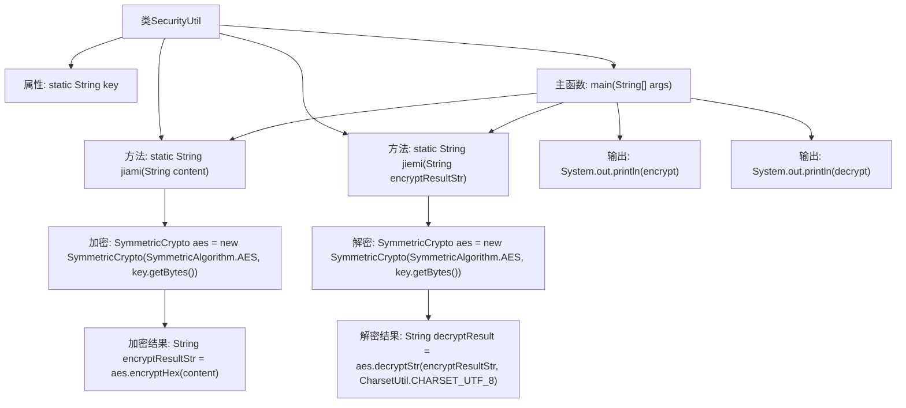

# 基础信息

|      |      |
|------|------|
| 名称 | SecurityUtil |
| 编码语言 | .java |
| 代码路径 | JeecgBoot/jeecg-boot/jeecg-module-system/jeecg-system-biz/src/main/java/org/jeecg/modules/system/util/SecurityUtil.java |
| 包名 | org.jeecg.modules.system.util |
| 依赖项 | ['cn.hutool.core.util.CharsetUtil', 'cn.hutool.crypto.symmetric.SymmetricAlgorithm', 'cn.hutool.crypto.symmetric.SymmetricCrypto'] |
| 概述说明 | SecurityUtil类提供AES加密解密功能，含加密解密方法，采用固定密钥。 |

# 说明

SecurityUtil类实现了AES加密解密功能，提供了加密和解密两个核心方法。该类使用固定的密钥进行加密和解密操作，确保数据的安全性和一致性。通过这两个方法，用户可以对数据进行加密保护，并在需要时进行解密还原。整个实现简洁高效，适用于需要数据加密的场景。

# 类列表 Class Summary

| 名称   | 类型  | 说明 |
|-------|------|-------------|
| SecurityUtil | class | SecurityUtil类实现AES加密解密功能，包含加密和解密方法，使用固定密钥。 |

## 类 SecurityUtil

|      |      |
|------|------|
| 访问范围 | public |
| 类型 | class |
| 名称 | SecurityUtil |
| 说明 | SecurityUtil类实现AES加密解密功能，包含加密和解密方法，使用固定密钥。 |

### UML类图

**描述**：`SecurityUtil` 类提供了 AES 加密和解密功能，使用 `SymmetricCrypto` 类进行加密和解密操作。`SymmetricCrypto` 依赖于 `SymmetricAlgorithm` 接口来指定加密算法。`SecurityUtil` 类还使用了 `CharsetUtil` 类来指定字符编码。通过 `jiami` 和 `jiemi` 方法，`SecurityUtil` 类能够对字符串进行加密和解密操作。

### 内部方法调用关系图

这段代码定义了一个名为 `SecurityUtil` 的类，用于进行AES加密和解密操作。类中包含一个静态的加密密钥 `key`，以及两个方法 `jiami` 和 `jiemi`，分别用于加密和解密字符串。`main` 方法演示了如何使用这两个方法：首先对字符串进行加密，然后对加密后的字符串进行解密，并输出加密和解密的结果。代码通过 `SymmetricCrypto` 类实现AES算法，确保了数据的安全性。

### 字段列表 Field List

| 名称  | 类型  | 说明 |
|-------|-------|------|
| key = "JEECGBOOT1423670" | String | 定义了一个静态私有字符串变量key，值为"JEECGBOOT1423670"。 |

### 方法列表 Method List

| 名称  | 类型  | 说明 |
|-------|-------|------|
| jiami | String | 使用AES算法加密字符串并返回加密结果。 |
| jiemi | String | 静态方法jiemi使用AES对称加密算法解密字符串，返回解密结果。 |
| main | void | Java代码示例：加密字符串并解密输出。 |

