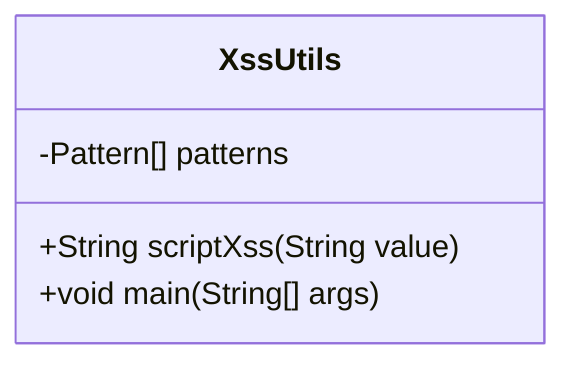
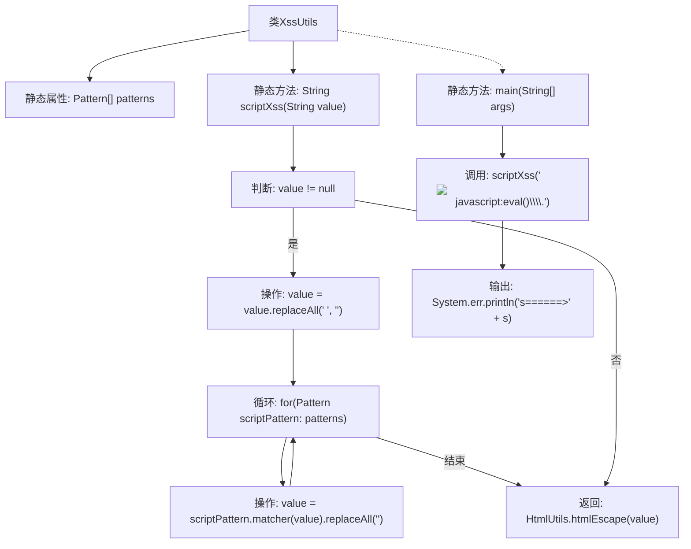

# 基础信息

|      |      |
|------|------|
| 名称 | XssUtils |
| 编码语言 | .java |
| 代码路径 | JeecgBoot/jeecg-boot/jeecg-module-system/jeecg-system-biz/src/main/java/org/jeecg/modules/system/util/XssUtils.java |
| 包名 | org.jeecg.modules.system.util |
| 依赖项 | ['org.springframework.web.util.HtmlUtils', 'java.util.regex.Pattern'] |
| 概述说明 | XssUtils类用正则表达式清除XSS攻击代码，确保安全。 |

# 说明

XssUtils类利用正则表达式技术对输入内容进行检测和过滤，有效清除潜在的XSS攻击代码，从而保障系统的安全性。通过这一机制，能够防止恶意脚本注入，确保用户输入数据的纯净和安全。

# 类列表 Class Summary

| 名称   | 类型  | 说明 |
|-------|------|-------------|
| XssUtils | class | XssUtils类通过正则表达式过滤并清除输入中的XSS攻击代码，确保安全性。 |

## 类 XssUtils

|      |      |
|------|------|
| 访问范围 | public |
| 类型 | class |
| 名称 | XssUtils |
| 说明 | XssUtils类通过正则表达式过滤并清除输入中的XSS攻击代码，确保安全性。 |

### UML类图

**描述：**
`XssUtils` 类主要用于防止跨站脚本攻击（XSS），通过预定义的正则表达式模式匹配和替换潜在的恶意脚本内容。`patterns` 数组包含多个正则表达式，用于匹配常见的XSS攻击模式，如`", Pattern.CASE_INSENSITIVE),        //src='...'        Pattern.compile("src[\r\n]*=[\r\n]*\\\'(.*?)\\\'", Pattern.CASE_INSENSITIVE | Pattern.MULTILINE | Pattern.DOTALL),        Pattern.compile("src[\r\n]*=[\r\n]*\\\"(.*?)\\\"", Pattern.CASE_INSENSITIVE | Pattern.MULTILINE | Pattern.DOTALL),        //script tags        Pattern.compile("</script>", Pattern.CASE_INSENSITIVE),        Pattern.compile("<script(.*?)>", Pattern.CASE_INSENSITIVE | Pattern.MULTILINE | Pattern.DOTALL),        //eval(...)        Pattern.compile("eval\\((.*?)\\)", Pattern.CASE_INSENSITIVE | Pattern.MULTILINE | Pattern.DOTALL),        //expression(...)        Pattern.compile("e­xpression\\((.*?)\\)", Pattern.CASE_INSENSITIVE | Pattern.MULTILINE | Pattern.DOTALL),        //javascript:...        Pattern.compile("javascript:", Pattern.CASE_INSENSITIVE),        //vbscript:...        Pattern.compile("vbscript:", Pattern.CASE_INSENSITIVE),        //onload(...)=...        Pattern.compile("onload(.*?)=", Pattern.CASE_INSENSITIVE | Pattern.MULTILINE | Pattern.DOTALL),    } | Pattern[] | 定义多个正则表达式模式，用于匹配脚本片段、src属性、脚本标签等。 |

### 方法列表 Method List

| 名称  | 类型  | 说明 |
|-------|-------|------|
| main | void | Java代码检测并处理XSS攻击字符串。 |
| scriptXss | String | 该方法用于过滤输入字符串中的XSS攻击，移除空格并替换恶意脚本，最后进行HTML转义。 |

