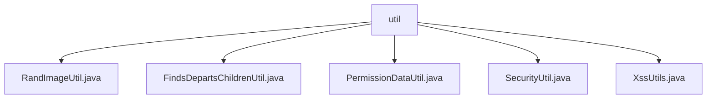

# 基础信息

|      |      |
|------|------|
| 名称 | util |
| 编码语言 | .java |
| 代码路径 | JeecgBoot/jeecg-boot/jeecg-module-system/jeecg-system-biz/src/main/java/org/jeecg/modules/system/util |
| 包名 | JeecgBoot.jeecg-boot.jeecg-module-system.jeecg-system-biz.src.main.java.org.jeecg.modules.system.util |
| 概述说明 | 生成验证码、树形部门、权限处理、AES加密、XSS过滤工具类。 |

# 说明

## 概述
该代码模块是一个功能丰富的工具集合，主要用于处理系统中的各种实用功能，包括验证码生成、树形结构转换、权限数据处理、数据加密以及XSS攻击防护。这些工具类通过灵活的接口设计和高效的实现，满足了不同业务场景的需求，确保了系统的高效性、安全性和易用性。

## 主要业务场景
1. **验证码生成**：生成随机验证码图片，支持直接输出和Base64编码输出，适用于用户注册、登录等需要验证码验证的场景。
2. **树形结构转换**：将扁平化的部门列表转换为层次化的树形结构，优化数据展示，适用于部门管理、组织结构展示等场景。
3. **权限数据处理**：处理与权限相关的数据，具备错误数据智能处理、首页添加和授权判断功能，适用于系统权限管理和访问控制场景。
4. **数据加密**：提供AES加密解密功能，确保数据的安全性和一致性，适用于敏感数据存储和传输场景。
5. **XSS攻击防护**：利用正则表达式技术对输入内容进行检测和过滤，防止恶意脚本注入，适用于用户输入处理和系统安全防护场景。

### 包内部结构视图

该流程图展示了`util`文件夹下的文件层级关系。`util`作为根节点，包含了五个子节点，分别是`RandImageUtil.java`、`FindsDepartsChildrenUtil.java`、`PermissionDataUtil.java`、`SecurityUtil.java`和`XssUtils.java`。这些文件都属于`util`文件夹，且没有进一步的子文件夹结构。

# 文件列表 File List

| 名称   | 类型  | 说明 |
|-------|------|-------------|
| [XssUtils.java](XssUtils.md) | file | XssUtils类用正则表达式清除XSS攻击代码，确保安全。 |
| [FindsDepartsChildrenUtil.java](FindsDepartsChildrenUtil.md) | file | 将SysDepart列表转为树结构并封装子节点。 |
| [SecurityUtil.java](SecurityUtil.md) | file | SecurityUtil类提供AES加密解密功能，含加密解密方法，采用固定密钥。 |
| [PermissionDataUtil.java](PermissionDataUtil.md) | file | 权限数据处理工具类，具备错误处理、首页添加及授权判断功能。 |
| [RandImageUtil.java](RandImageUtil.md) | file | 生成随机验证码图片工具类，支持直接输出和Base64编码。 |

