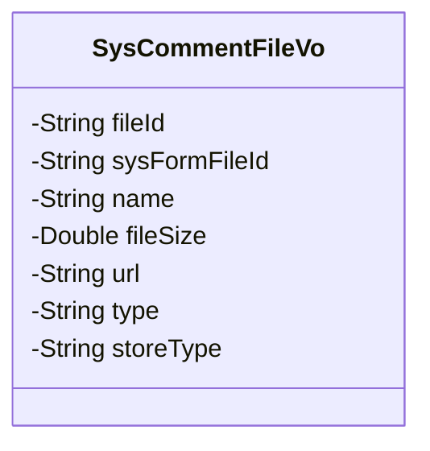
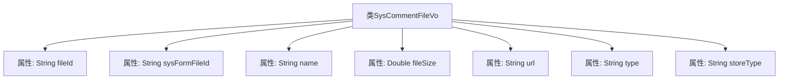

# 基础信息

|      |      |
|------|------|
| 名称 | SysCommentFileVo |
| 编码语言 | .java |
| 代码路径 | JeecgBoot/jeecg-boot/jeecg-module-system/jeecg-system-biz/src/main/java/org/jeecg/modules/system/vo/SysCommentFileVo.java |
| 包名 | org.jeecg.modules.system.vo |
| 依赖项 | ['lombok.Data'] |
| 概述说明 | SysCommentFileVo类包含文件ID、表单文件ID、名称、大小、地址、类型和存储类型属性。 |

# 说明

SysCommentFileVo类是一个用于表示系统评论文件的类，包含多个关键属性。这些属性包括文件ID，用于唯一标识文件；表单文件ID，关联表单中的文件；名称，表示文件的名称；大小，记录文件的大小；地址，存储文件的路径或链接；类型，描述文件的类型；以及存储类型，指示文件的存储方式。这些属性共同构成了该类的完整信息结构，便于在系统中管理和操作评论文件。

# 类列表 Class Summary

| 名称   | 类型  | 说明 |
|-------|------|-------------|
| SysCommentFileVo | class | SysCommentFileVo类包含文件ID、表单文件ID、名称、大小、地址、类型和存储类型等属性。 |

## 类 SysCommentFileVo

|      |      |
|------|------|
| 访问范围 | @Data;public |
| 类型 | class |
| 名称 | SysCommentFileVo |
| 说明 | SysCommentFileVo类包含文件ID、表单文件ID、名称、大小、地址、类型和存储类型等属性。 |

### UML类图

类图描述：`SysCommentFileVo` 类用于表示系统中的评论文件信息，包含文件的唯一标识 `fileId`、表单文件标识 `sysFormFileId`、文件名称 `name`、文件大小 `fileSize`、文件地址 `url`、文件类型 `type` 以及文件存储类型 `storeType`。这些属性均为私有成员，类图清晰地展示了该类的结构及其包含的属性。

### 内部方法调用关系图

这段代码定义了一个名为 `SysCommentFileVo` 的类，用于表示系统中的文件评论信息。类中包含多个属性，分别用于存储文件的ID、表单文件ID、文件名称、文件大小、文件地址、文件类型以及文件上传类型。这些属性通过 `@Data` 注解自动生成getter和setter方法，简化了代码的编写。流程图展示了类与其属性之间的关联关系，清晰地描述了类的结构。

### 字段列表 Field List

| 名称  | 类型  | 说明 |
|-------|-------|------|
| fileId | String | 定义了一个私有字符串变量fileId。 |
| sysFormFileId | String | 私有字符串变量sysFormFileId。 |
| type | String | 定义了一个私有的字符串类型变量。 |
| storeType | String | 定义了一个私有字符串变量storeType。 |
| fileSize | Double | 文件大小属性，使用Double类型存储。 |
| url | String | 定义一个私有的字符串变量url。 |
| name | String | 声明了一个私有字符串变量name。 |

### 方法列表 Method List

| 名称  | 类型  | 说明 |
|-------|-------|------|

