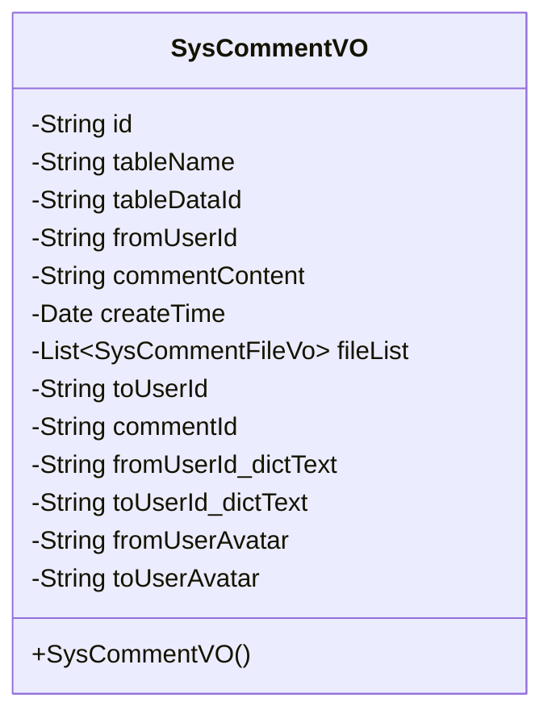

# 基础信息

|      |      |
|------|------|
| 名称 | SysCommentVO |
| 编码语言 | .java |
| 代码路径 | JeecgBoot/jeecg-boot/jeecg-module-system/jeecg-system-biz/src/main/java/org/jeecg/modules/system/vo/SysCommentVO.java |
| 包名 | org.jeecg.modules.system.vo |
| 依赖项 | ['com.fasterxml.jackson.annotation.JsonFormat', 'io.swagger.v3.oas.annotations.media.Schema', 'lombok.Data', 'org.jeecg.common.aspect.annotation.Dict', 'org.springframework.format.annotation.DateTimeFormat', 'java.io.Serializable', 'java.util.Date', 'java.util.List'] |
| 概述说明 | SysCommentVO类包含评论ID、表名、数据ID、用户ID、内容、日期、文件、回复ID及用户信息。 |

# 说明

SysCommentVO类用于存储评论信息，包含评论ID、表名、数据ID、用户ID、评论内容、日期、相关文件、回复ID及用户信息等关键字段，全面记录评论的详细数据和关联信息。

# 类列表 Class Summary

| 名称   | 类型  | 说明 |
|-------|------|-------------|
| SysCommentVO | class | SysCommentVO类包含评论ID、表名、数据ID、用户ID、内容、日期、文件、回复ID及用户信息。 |

## 类 SysCommentVO

|      |      |
|------|------|
| 访问范围 | @Data;public |
| 类型 | class |
| 名称 | SysCommentVO |
| 说明 | SysCommentVO类包含评论ID、表名、数据ID、用户ID、内容、日期、文件、回复ID及用户信息。 |

### UML类图

### 描述
`SysCommentVO` 类是一个用于表示系统评论的数据传输对象（DTO），实现了 `Serializable` 接口以确保其可序列化。该类包含多个字段，如 `id`、`tableName`、`tableDataId` 等，用于存储评论的相关信息。其中，`createTime` 字段通过 `@JsonFormat` 和 `@DateTimeFormat` 注解进行了日期格式化处理。此外，`fileList` 字段用于存储与评论相关的文件信息，`toUserId` 和 `commentId` 字段允许为空，分别表示接收评论的用户ID和评论ID。类中还包含与用户相关的字段，如 `fromUserId_dictText` 和 `toUserId_dictText`，用于存储用户的真实姓名和头像信息。

### 内部方法调用关系图

```mermaid
graph TD
    A["类SysCommentVO"]
    B["属性: String id"]
    C["属性: String tableName"]
    D["属性: String tableDataId"]
    E["属性: String fromUserId"]
    F["属性: String commentContent"]
    G["属性: Date createTime"]
    H["属性: List<SysCommentFileVo> fileList"]
    I["属性: String toUserId"]
    J["属性: String commentId"]
    K["属性: String fromUserId_dictText"]
    L["属性: String toUserId_dictText"]
    M["属性: String fromUserAvatar"]
    N["属性: String toUserAvatar"]
    O["构造方法: SysCommentVO()"]

    A --> B
    A --> C
    A --> D
    A --> E
    A --> F
    A --> G
    A --> H
    A --> I
    A --> J
    A --> K
    A --> L
    A --> M
    A --> N
    A --> O
```

这段代码定义了一个名为 `SysCommentVO` 的类，该类实现了 `Serializable` 接口，用于序列化。类中包含多个属性，如 `id`、`tableName`、`tableDataId` 等，分别用于存储评论的相关信息。其中，`createTime` 属性使用了 `@JsonFormat` 和 `@DateTimeFormat` 注解来格式化日期时间，`toUserId` 属性使用了 `@Dict` 注解来关联字典表。此外，类中还定义了一个无参构造方法 `SysCommentVO()`。

### 字段列表 Field List

| 名称  | 类型  | 说明 |
|-------|-------|------|
| toUserAvatar | String | 定义私有字符串变量toUserAvatar。 |
| tableDataId | String | 私有字符串变量tableDataId。 |
| serialVersionUID = 1L | long | 声明一个私有静态不可变的序列化版本号。 |
| commentId | String | 定义私有字符串变量commentId。 |
| fromUserAvatar | String | 定义私有字符串变量fromUserAvatar。 |
| toUserId_dictText | String | 私有字符串变量toUserId_dictText |
| tableName | String | 定义了一个私有的字符串变量tableName。 |
| toUserId | String | 提取用户ID对应的真实姓名。 |
| id | String | 定义一个私有字符串变量id。 |
| createTime | Date | 创建日期字段，格式为yyyy-MM-dd HH:mm:ss，时区GMT+8。 |
| fromUserId | String | 定义私有字符串变量fromUserId。 |
| fileList | List<SysCommentFileVo> | 私有变量fileList存储SysCommentFileVo类型的列表。 |
| commentContent | String | 私有字符串变量存储评论内容。 |
| fromUserId_dictText | String | 私有字符串变量fromUserId_dictText存储用户ID相关文本。 |

### 方法列表 Method List

| 名称  | 类型  | 说明 |
|-------|-------|------|

