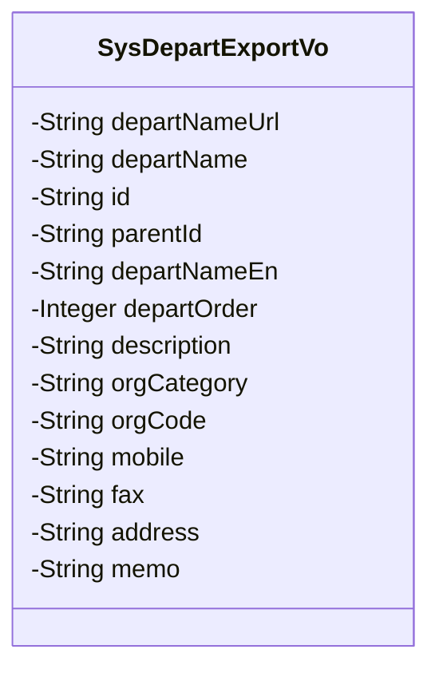

# 基础信息

|      |      |
|------|------|
| 名称 | SysDepartExportVo |
| 编码语言 | .java |
| 代码路径 | JeecgBoot/jeecg-boot/jeecg-module-system/jeecg-system-biz/src/main/java/org/jeecg/modules/system/vo/SysDepartExportVo.java |
| 包名 | org.jeecg.modules.system.vo |
| 依赖项 | ['lombok.Data', 'org.jeecg.common.aspect.annotation.Dict', 'org.jeecgframework.poi.excel.annotation.Excel'] |
| 概述说明 | SysDepartExportVo类包含部门路径、名称、ID、父ID等字段。 |

# 说明

SysDepartExportVo类是一个用于部门信息导出的数据结构，包含了多个关键字段。这些字段包括部门路径、部门名称、部门ID、父部门ID、部门英文名、排序顺序、部门描述、机构类别、部门编码、手机号、传真号码、地址以及备注信息。通过这些字段，可以全面描述和导出部门的相关信息，便于系统管理和数据交换。

# 类列表 Class Summary

| 名称   | 类型  | 说明 |
|-------|------|-------------|
| SysDepartExportVo | class | SysDepartExportVo类包含部门路径、名称、ID、父ID、英文名、排序、描述、机构类别、编码、手机号、传真、地址和备注等字段。 |

## 类 SysDepartExportVo

|      |      |
|------|------|
| 访问范围 | @Data;public |
| 类型 | class |
| 名称 | SysDepartExportVo |
| 说明 | SysDepartExportVo类包含部门路径、名称、ID、父ID、英文名、排序、描述、机构类别、编码、手机号、传真、地址和备注等字段。 |

### UML类图

这段代码定义了一个名为 `SysDepartExportVo` 的类，用于表示部门导出的数据结构。类中包含多个私有字段，如 `departNameUrl`、`departName`、`id` 等，这些字段分别用于存储部门路径、部门名称、部门ID等信息。每个字段都使用了 `@Excel` 注解，用于在导出Excel文件时指定列名和列宽。该类主要用于在系统中导出部门信息时，将部门数据映射到Excel文件的相应列中。

### 内部方法调用关系图

```mermaid
graph TD
    A["类SysDepartExportVo"]
    B["属性: String departNameUrl"]
    C["属性: String departName"]
    D["属性: String id"]
    E["属性: String parentId"]
    F["属性: String departNameEn"]
    G["属性: Integer departOrder"]
    H["属性: String description"]
    I["属性: String orgCategory"]
    J["属性: String orgCode"]
    K["属性: String mobile"]
    L["属性: String fax"]
    M["属性: String address"]
    N["属性: String memo"]

    A --> B
    A --> C
    A --> D
    A --> E
    A --> F
    A --> G
    A --> H
    A --> I
    A --> J
    A --> K
    A --> L
    A --> M
    A --> N
```

这段代码定义了一个名为 `SysDepartExportVo` 的类，主要用于表示部门导出时的数据结构。类中包含多个属性，如部门路径、部门名称、ID、父级ID、英文名、排序、描述、机构类别、机构编码、手机号、传真、地址和备注。每个属性都通过 `@Excel` 注解来定义其在 Excel 文件中的显示名称和列宽。该类的设计旨在方便将部门数据导出到 Excel 文件中，并通过注解确保导出的数据格式化和可读性。

### 字段列表 Field List

| 名称  | 类型  | 说明 |
|-------|-------|------|
| id | String | 定义了一个私有字符串类型的变量id。 |
| orgCode | String | 机构编码字段，类型为字符串，宽度15。 |
| mobile | String | Excel列名为“手机号”，宽度15，类型为字符串。 |
| departNameUrl | String | 部门路径字段，字符串类型，宽度50。 |
| departNameEn | String | 字段departNameEn存储部门英文名，宽度15字符。 |
| memo | String | Excel备注字段，类型为字符串，宽度15字符。 |
| departOrder | Integer | Excel表格中定义了名为“排序”的列，宽度为15，数据类型为整数。 |
| description | String | Excel描述字段定义为私有字符串类型。 |
| departName | String | Excel列名"部门名称"，宽度50，存储部门名称的字符串变量。 |
| address | String | Excel表格中定义了一个名为“地址”的列，宽度为15。 |
| fax | String | Excel表格中定义了一个名为“传真”的私有字符串字段，宽度为15。 |
| parentId | String | 定义私有字符串类型变量parentId。 |
| orgCategory | String | Excel字段：机构类别，宽度15，字典编码org_category。 |

### 方法列表 Method List

| 名称  | 类型  | 说明 |
|-------|-------|------|

