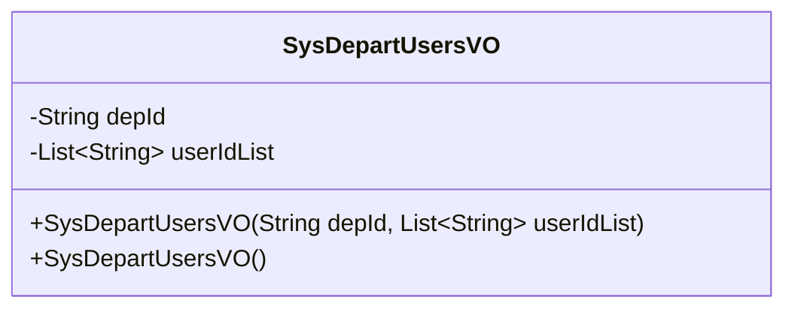
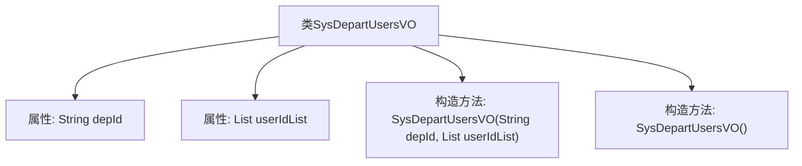

# 基础信息

|      |      |
|------|------|
| 名称 | SysDepartUsersVO |
| 编码语言 | .java |
| 代码路径 | JeecgBoot/jeecg-boot/jeecg-module-system/jeecg-system-biz/src/main/java/org/jeecg/modules/system/vo/SysDepartUsersVO.java |
| 包名 | org.jeecg.modules.system.vo |
| 依赖项 | ['java.io.Serializable', 'java.util.List', 'lombok.Data'] |
| 概述说明 | SysDepartUsersVO类包含部门ID和用户ID列表，提供两种构造函数。 |

# 说明

SysDepartUsersVO类是一个用于表示部门与用户关系的实体类。该类包含两个主要属性：部门ID和用户ID列表。部门ID用于唯一标识一个部门，而用户ID列表则存储了与该部门关联的所有用户的ID。为了便于使用，该类提供了两种构造函数：一个带有部门ID和用户ID列表参数的构造函数，用于初始化对象；另一个是无参构造函数，用于创建空对象。这样的设计使得该类在使用时更加灵活，能够满足不同场景下的需求。

# 类列表 Class Summary

| 名称   | 类型  | 说明 |
|-------|------|-------------|
| SysDepartUsersVO | class | SysDepartUsersVO类包含部门ID和用户ID列表，提供构造函数和无参构造函数。 |

## 类 SysDepartUsersVO

|      |      |
|------|------|
| 访问范围 | @Data;public |
| 类型 | class |
| 名称 | SysDepartUsersVO |
| 说明 | SysDepartUsersVO类包含部门ID和用户ID列表，提供构造函数和无参构造函数。 |

### UML类图

**描述：**  
`SysDepartUsersVO` 类是一个用于表示部门用户信息的实体类，实现了 `Serializable` 接口以确保对象可以序列化。该类包含两个私有成员变量：`depId` 表示部门ID，`userIdList` 表示对应的用户ID集合。类中提供了两个构造函数，一个带有参数的构造函数用于初始化部门ID和用户ID集合，另一个无参构造函数用于修复部门管理中点击添加已有用户失败的问题。

### 内部方法调用关系图

这段代码定义了一个名为 `SysDepartUsersVO` 的类，该类实现了 `Serializable` 接口，表明其实例可以被序列化。类中包含两个属性：`depId` 和 `userIdList`，分别表示部门ID和用户ID集合。类提供了两个构造方法，一个带有参数的构造方法用于初始化这两个属性，另一个无参构造方法用于创建空对象。这段代码主要用于在部门管理中处理部门与用户之间的关系。

### 字段列表 Field List

| 名称  | 类型  | 说明 |
|-------|-------|------|
| serialVersionUID = 1L | long | 定义了一个静态不可变的序列化版本号1L。 |
| depId | String | 定义私有字符串变量depId。 |
| userIdList | List<String> | 私有字符串列表用于存储用户ID。 |

### 方法列表 Method List

| 名称  | 类型  | 说明 |
|-------|-------|------|

