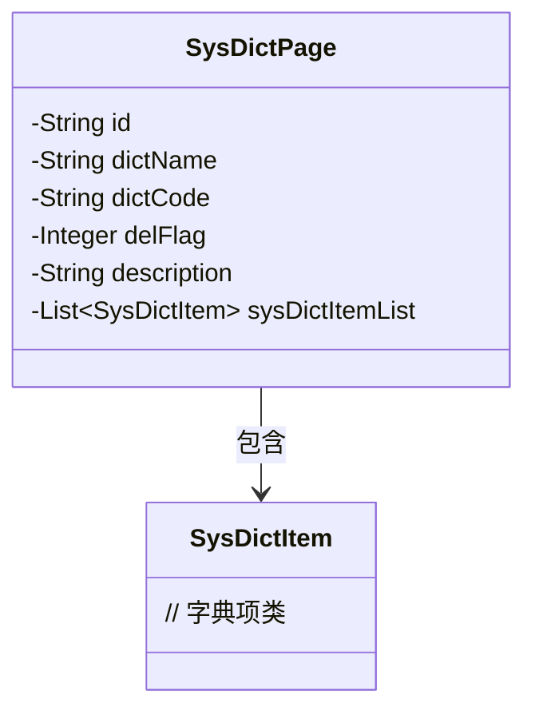
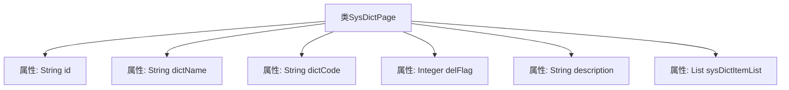

# 基础信息

|      |      |
|------|------|
| 名称 | SysDictPage |
| 编码语言 | .java |
| 代码路径 | JeecgBoot/jeecg-boot/jeecg-module-system/jeecg-system-biz/src/main/java/org/jeecg/modules/system/vo/SysDictPage.java |
| 包名 | org.jeecg.modules.system.vo |
| 依赖项 | ['lombok.Data', 'org.jeecg.modules.system.entity.SysDictItem', 'org.jeecgframework.poi.excel.annotation.Excel', 'org.jeecgframework.poi.excel.annotation.ExcelCollection', 'java.util.List'] |
| 概述说明 | SysDictPage类包含字典ID、名称、编码、删除状态、描述及字典项列表。 |

# 说明

SysDictPage类是一个用于管理字典数据的类，包含多个关键属性。字典ID用于唯一标识每个字典实例。名称属性存储字典的命名信息，便于识别和引用。编码属性用于表示字典的编码格式或类型。删除状态属性标识字典是否已被标记为删除，便于数据管理。描述属性提供对字典的详细说明，帮助用户理解其用途。字典项列表属性存储与字典相关的具体项信息，支持对字典内容的详细操作和管理。这些属性共同构成了SysDictPage类的核心功能，使其能够有效地处理和维护字典数据。

# 类列表 Class Summary

| 名称   | 类型  | 说明 |
|-------|------|-------------|
| SysDictPage | class | SysDictPage类包含字典ID、名称、编码、删除状态、描述及字典项列表。 |

## 类 SysDictPage

|      |      |
|------|------|
| 访问范围 | @Data;public |
| 类型 | class |
| 名称 | SysDictPage |
| 说明 | SysDictPage类包含字典ID、名称、编码、删除状态、描述及字典项列表。 |

### UML类图

这段代码定义了一个名为 `SysDictPage` 的类，用于表示系统字典页面的数据结构。类中包含多个私有字段，如 `id`、`dictName`、`dictCode`、`delFlag` 和 `description`，分别表示字典的主键、名称、编码、删除状态和描述。此外，`SysDictPage` 类还包含一个 `List<SysDictItem>` 类型的字段 `sysDictItemList`，用于存储字典项列表。通过类图可以清晰地看到 `SysDictPage` 类与 `SysDictItem` 类之间的依赖关系，即 `SysDictPage` 类包含 `SysDictItem` 类的实例列表。

### 内部方法调用关系图

这段代码定义了一个名为 `SysDictPage` 的类，该类包含了多个属性，分别用于存储字典的主键、字典名称、字典编码、删除状态、描述以及字典项列表。每个属性都通过注解进行了标记，如 `@Excel` 和 `@ExcelCollection`，这些注解可能用于在生成 Excel 文件时提供额外的信息。代码的结构清晰，属性定义明确，便于后续的数据处理和操作。

### 字段列表 Field List

| 名称  | 类型  | 说明 |
|-------|-------|------|
| id | String | 定义了一个私有字符串类型的变量id。 |
| dictName | String | Excel字典名称字段，宽度20字符。 |
| sysDictItemList | List<SysDictItem> | ExcelCollection注解标记的字典列表变量sysDictItemList。 |
| dictCode | String | 字典编码字段，类型为字符串，宽度30。 |
| description | String | Excel字段描述，宽度30字符，类型为字符串。 |
| delFlag | Integer | 私有整型变量delFlag，用于标记删除状态。 |

### 方法列表 Method List

| 名称  | 类型  | 说明 |
|-------|-------|------|

