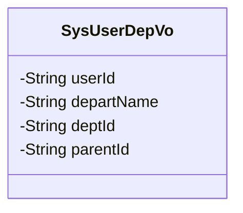
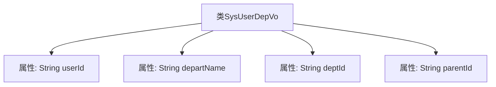

# 基础信息

|      |      |
|------|------|
| 名称 | SysUserDepVo |
| 编码语言 | .java |
| 代码路径 | JeecgBoot/jeecg-boot/jeecg-module-system/jeecg-system-biz/src/main/java/org/jeecg/modules/system/vo/SysUserDepVo.java |
| 包名 | org.jeecg.modules.system.vo |
| 依赖项 | ['lombok.Data'] |
| 概述说明 | SysUserDepVo类含用户ID、部门名称、部门ID及父部门ID。 |

# 说明

SysUserDepVo类是一个用于存储用户与部门相关信息的类，包含四个关键属性：用户ID用于唯一标识用户，部门名称表示用户所属部门的名称，部门ID用于唯一标识该部门，父部门ID则用于标识该部门的上级部门。这些属性共同构成了用户与部门之间的关联关系，便于在系统中进行用户部门信息的查询和管理。

# 类列表 Class Summary

| 名称   | 类型  | 说明 |
|-------|------|-------------|
| SysUserDepVo | class | SysUserDepVo类包含用户ID、部门名称、部门ID及父部门ID。 |

## 类 SysUserDepVo

|      |      |
|------|------|
| 访问范围 | @Data;public |
| 类型 | class |
| 名称 | SysUserDepVo |
| 说明 | SysUserDepVo类包含用户ID、部门名称、部门ID及父部门ID。 |

### UML类图

### 描述
`SysUserDepVo` 类是一个简单的数据传输对象（DTO），用于封装用户与部门相关的信息。它包含四个私有字段：`userId`（用户ID）、`departName`（部门名称）、`deptId`（部门ID）和`parentId`（部门的父级ID）。这些字段用于存储用户所属部门的基本信息，并且这些字段都是私有的，只能通过类的公有方法进行访问和修改。

### 内部方法调用关系图

这段代码定义了一个名为 `SysUserDepVo` 的类，该类包含四个私有属性：`userId`、`departName`、`deptId` 和 `parentId`。这些属性分别用于存储用户ID、部门名称、部门ID以及部门的父级ID。代码的结构清晰，属性之间没有直接的调用关系，主要用于数据的封装和传递。

### 字段列表 Field List

| 名称  | 类型  | 说明 |
|-------|-------|------|
| userId | String | 定义私有字符串变量userId。 |
| parentId | String | 定义私有字符串变量parentId。 |
| deptId | String | 定义了一个私有字符串变量deptId。 |
| departName | String | 私有字符串变量存储部门名称。 |

### 方法列表 Method List

| 名称  | 类型  | 说明 |
|-------|-------|------|

