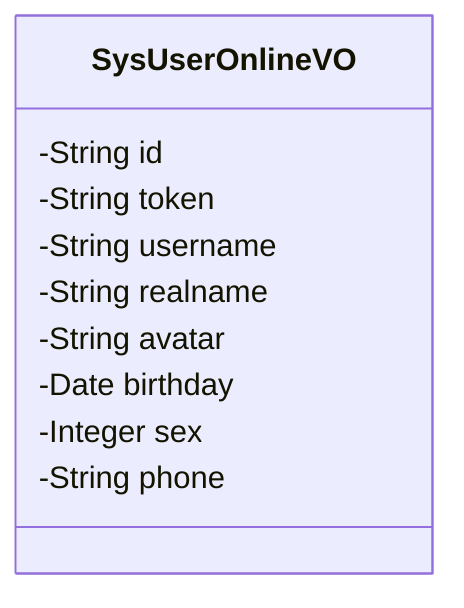
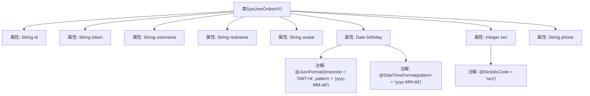

# 基础信息

|      |      |
|------|------|
| 名称 | SysUserOnlineVO |
| 编码语言 | .java |
| 代码路径 | JeecgBoot/jeecg-boot/jeecg-module-system/jeecg-system-biz/src/main/java/org/jeecg/modules/system/vo/SysUserOnlineVO.java |
| 包名 | org.jeecg.modules.system.vo |
| 依赖项 | ['java.util.Date', 'org.jeecg.common.aspect.annotation.Dict', 'org.springframework.format.annotation.DateTimeFormat', 'com.fasterxml.jackson.annotation.JsonFormat', 'lombok.Data'] |
| 概述说明 | SysUserOnlineVO类包含会话ID、编号、用户名、真实名、头像、生日、性别和手机号。 |

# 说明

SysUserOnlineVO类是一个用于存储用户在线信息的实体类，包含多个关键字段。这些字段包括会话ID，用于唯一标识用户的会话；编号，表示用户的唯一标识符；用户名，用户的登录名；真实名，用户的真实姓名；头像，用户的头像信息；生日，用户的出生日期；性别，用户的性别信息；手机号，用户的联系方式。这些字段共同构成了用户在线状态的基本信息，便于系统管理和用户识别。

# 类列表 Class Summary

| 名称   | 类型  | 说明 |
|-------|------|-------------|
| SysUserOnlineVO | class | SysUserOnlineVO类包含会话ID、编号、用户名、真实名、头像、生日、性别和手机号字段。 |

## 类 SysUserOnlineVO

|      |      |
|------|------|
| 访问范围 | @Data;public |
| 类型 | class |
| 名称 | SysUserOnlineVO |
| 说明 | SysUserOnlineVO类包含会话ID、编号、用户名、真实名、头像、生日、性别和手机号字段。 |

### UML类图

类图描述：`SysUserOnlineVO` 类用于表示在线用户的视图对象，包含用户的会话信息、个人信息以及联系方式等属性。其中，`id` 和 `token` 用于标识会话，`username` 和 `realname` 分别表示用户名和真实姓名，`avatar` 存储用户头像，`birthday` 使用特定格式存储用户生日，`sex` 表示用户性别，`phone` 存储用户手机号。

### 内部方法调用关系图

这段代码定义了一个名为 `SysUserOnlineVO` 的类，用于表示在线用户的信息。类中包含多个属性，如会话ID、会话编号、用户名、真实姓名、头像、生日、性别和手机号。其中，生日属性使用了 `@JsonFormat` 和 `@DateTimeFormat` 注解来指定日期格式和时区，性别属性使用了 `@Dict` 注解来关联字典代码。该类的结构清晰地展示了用户信息的各个字段及其相关注解。

### 字段列表 Field List

| 名称  | 类型  | 说明 |
|-------|-------|------|
| id | String | 定义了一个私有字符串类型的变量id。 |
| realname | String | 定义了一个私有字符串变量realname。 |
| avatar | String | 定义私有字符串类型变量avatar。 |
| phone | String | 定义一个私有的字符串类型变量phone。 |
| birthday | Date | 日期格式为"yyyy-MM-dd"，时区为GMT+8。 |
| sex | Integer | 定义私有整型变量sex，用于表示性别。 |
| username | String | 定义了一个私有字符串类型的用户名变量。 |
| token | String | 声明一个私有的字符串类型变量token。 |

### 方法列表 Method List

| 名称  | 类型  | 说明 |
|-------|-------|------|

