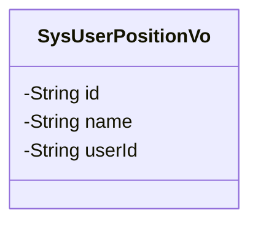
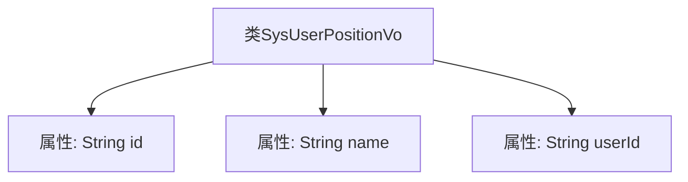

# 基础信息

|      |      |
|------|------|
| 名称 | SysUserPositionVo |
| 编码语言 | .java |
| 代码路径 | JeecgBoot/jeecg-boot/jeecg-module-system/jeecg-system-biz/src/main/java/org/jeecg/modules/system/vo/SysUserPositionVo.java |
| 包名 | org.jeecg.modules.system.vo |
| 依赖项 | ['lombok.Data'] |
| 概述说明 | SysUserPositionVo类包含职位ID、职务名称和用户ID字段。 |

# 说明

SysUserPositionVo类是一个用于表示用户职位信息的实体类，包含三个主要字段：职位id、职务名称和用户id。职位id用于唯一标识一个职位，职务名称用于描述该职位的具体名称，用户id则用于关联与该职位相关的用户。这些字段共同构成了用户职位信息的基础数据结构，便于在系统中进行职位管理和用户关联操作。

# 类列表 Class Summary

| 名称   | 类型  | 说明 |
|-------|------|-------------|
| SysUserPositionVo | class | SysUserPositionVo类包含职位id、职务名称和用户id字段。 |

## 类 SysUserPositionVo

|      |      |
|------|------|
| 访问范围 | @Data;public |
| 类型 | class |
| 名称 | SysUserPositionVo |
| 说明 | SysUserPositionVo类包含职位id、职务名称和用户id字段。 |

### UML类图

**描述：**  
`SysUserPositionVo` 类是一个简单的数据类，用于表示用户职位信息。它包含三个私有属性：`id`（职位ID）、`name`（职务名称）和 `userId`（用户ID）。这些属性通常用于存储和传递用户职位相关的数据，可能在系统中用于展示用户职位信息或进行相关业务逻辑处理。

### 内部方法调用关系图

这段代码定义了一个名为 `SysUserPositionVo` 的类，该类包含三个私有属性：`id`、`name` 和 `userId`。这些属性分别用于存储职位ID、职务名称和用户ID。代码使用了Lombok的 `@Data` 注解，自动生成了getter、setter、toString等方法，简化了代码的编写。流程图展示了类与其属性之间的直接关系，清晰地反映了类的结构。

### 字段列表 Field List

| 名称  | 类型  | 说明 |
|-------|-------|------|
| id | String | 定义了一个私有字符串类型的变量id。 |
| userId | String | 定义一个私有字符串变量userId。 |
| name | String | 定义私有字符串变量name。 |

### 方法列表 Method List

| 名称  | 类型  | 说明 |
|-------|-------|------|

