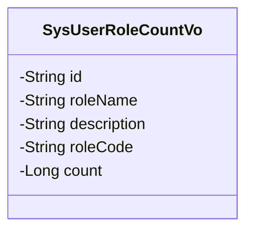
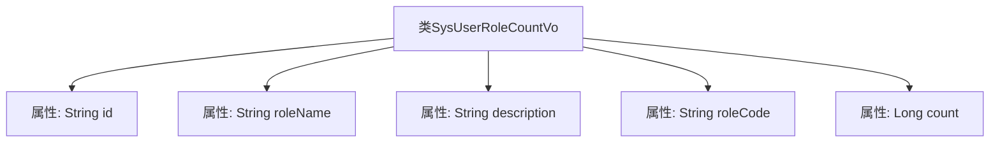

# 基础信息

|      |      |
|------|------|
| 名称 | SysUserRoleCountVo |
| 编码语言 | .java |
| 代码路径 | JeecgBoot/jeecg-boot/jeecg-module-system/jeecg-system-biz/src/main/java/org/jeecg/modules/system/vo/SysUserRoleCountVo.java |
| 包名 | org.jeecg.modules.system.vo |
| 依赖项 | ['lombok.Data'] |
| 概述说明 | SysUserRoleCountVo类记录角色ID、名称、描述、编码及用户数量。 |

# 说明

SysUserRoleCountVo类是一个用于存储和表示角色相关信息的实体类。它包含了角色的唯一标识符（角色ID）、角色的名称、角色的详细描述、角色的编码以及与该角色关联的用户数量。通过这些属性，该类能够全面描述一个角色的基本信息及其在系统中的使用情况，便于在系统中进行角色管理和用户统计。

# 类列表 Class Summary

| 名称   | 类型  | 说明 |
|-------|------|-------------|
| SysUserRoleCountVo | class | SysUserRoleCountVo类包含角色ID、名称、描述、编码及用户数量信息。 |

## 类 SysUserRoleCountVo

|      |      |
|------|------|
| 访问范围 | @Data;public |
| 类型 | class |
| 名称 | SysUserRoleCountVo |
| 说明 | SysUserRoleCountVo类包含角色ID、名称、描述、编码及用户数量信息。 |

### UML类图

这段代码定义了一个名为 `SysUserRoleCountVo` 的类，用于表示系统用户角色统计信息。类中包含五个私有属性：`id`（角色ID）、`roleName`（角色名称）、`description`（角色描述）、`roleCode`（角色编码）和 `count`（角色下的用户数量）。该类主要用于封装与用户角色相关的统计数据，便于在系统中进行数据传递和处理。

### 内部方法调用关系图

该流程图展示了`SysUserRoleCountVo`类的结构，包括其五个属性：`id`、`roleName`、`description`、`roleCode`和`count`。每个属性都与类`SysUserRoleCountVo`直接关联，表示该类用于存储角色及其相关信息的视图对象。代码通过`@Data`注解自动生成getter和setter方法，简化了数据访问和修改的操作。

### 字段列表 Field List

| 名称  | 类型  | 说明 |
|-------|-------|------|
| id | String | 定义了一个私有的字符串类型变量id。 |
| count | Long | 私有长整型变量count。 |
| roleCode | String | 定义私有字符串变量roleCode。 |
| description | String | 私有字符串变量描述。 |
| roleName | String | 定义私有字符串变量roleName。 |

### 方法列表 Method List

| 名称  | 类型  | 说明 |
|-------|-------|------|

