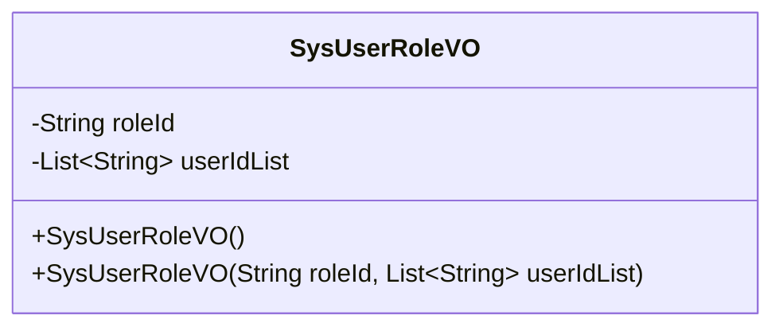
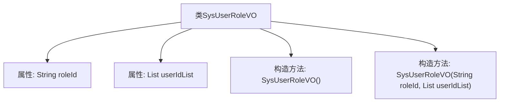

# 基础信息

|      |      |
|------|------|
| 名称 | SysUserRoleVO |
| 编码语言 | .java |
| 代码路径 | JeecgBoot/jeecg-boot/jeecg-module-system/jeecg-system-biz/src/main/java/org/jeecg/modules/system/vo/SysUserRoleVO.java |
| 包名 | org.jeecg.modules.system.vo |
| 依赖项 | ['lombok.Data', 'java.io.Serializable', 'java.util.List'] |
| 概述说明 | SysUserRoleVO类包含角色ID和用户ID列表，支持序列化。 |

# 说明

SysUserRoleVO类是一个用于表示系统用户角色信息的类，它包含两个主要属性：角色ID和用户ID列表。该类的设计支持序列化功能，意味着可以将对象转换为可存储或传输的格式，以便在不同的系统或网络环境中进行数据交换。通过角色ID和用户ID列表，该类能够有效地管理用户与角色之间的关联关系，为系统权限管理和用户角色分配提供了基础支持。

# 类列表 Class Summary

| 名称   | 类型  | 说明 |
|-------|------|-------------|
| SysUserRoleVO | class | SysUserRoleVO类包含角色ID和用户ID列表，支持序列化。 |

## 类 SysUserRoleVO

|      |      |
|------|------|
| 访问范围 | @Data;public |
| 类型 | class |
| 名称 | SysUserRoleVO |
| 说明 | SysUserRoleVO类包含角色ID和用户ID列表，支持序列化。 |

### UML类图

**描述：**  
`SysUserRoleVO` 类是一个用于表示系统用户角色视图对象的数据传输类，实现了 `Serializable` 接口以确保其可序列化。该类包含两个私有成员变量：`roleId` 表示角色ID，`userIdList` 表示与该角色关联的用户ID列表。类中提供了两个构造函数，一个无参构造函数和一个带参构造函数，用于初始化 `roleId` 和 `userIdList`。

### 内部方法调用关系图

这段代码定义了一个名为 `SysUserRoleVO` 的类，该类实现了 `Serializable` 接口，表明它可以被序列化。类中包含两个属性：`roleId` 和 `userIdList`，分别表示角色ID和对应的用户ID集合。类提供了两个构造方法：一个无参构造方法用于初始化对象，另一个带参构造方法用于在创建对象时直接设置 `roleId` 和 `userIdList` 的值。

### 字段列表 Field List

| 名称  | 类型  | 说明 |
|-------|-------|------|
| serialVersionUID = 1L | long | 定义序列化版本号的静态常量。 |
| roleId | String | 私有字符串变量roleId。 |
| userIdList | List<String> | 私有字符串列表存储用户ID。 |

### 方法列表 Method List

| 名称  | 类型  | 说明 |
|-------|-------|------|

