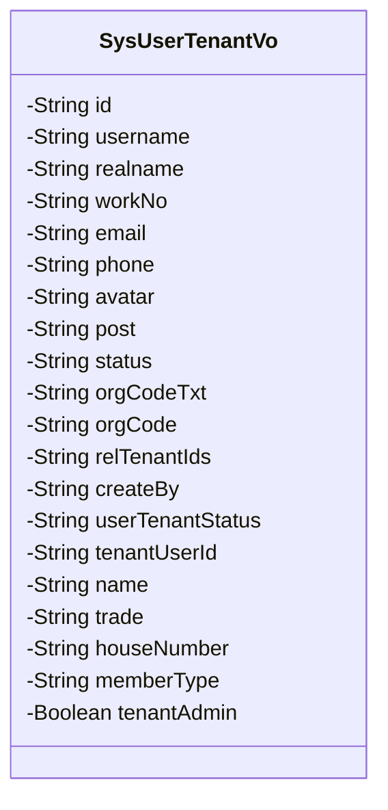

# 基础信息

|      |      |
|------|------|
| 名称 | SysUserTenantVo |
| 编码语言 | .java |
| 代码路径 | JeecgBoot/jeecg-boot/jeecg-module-system/jeecg-system-biz/src/main/java/org/jeecg/modules/system/vo/SysUserTenantVo.java |
| 包名 | org.jeecg.modules.system.vo |
| 依赖项 | ['lombok.Data', 'org.jeecg.common.aspect.annotation.Dict'] |
| 概述说明 | SysUserTenantVo类包含用户基本信息、职位、审核状态、部门、租户及管理员标识等字段。 |

# 说明

SysUserTenantVo类是一个用于存储用户相关信息的类，包含用户ID、账号、昵称、工号、邮箱、手机号、头像、职位、审核状态、部门信息、租户信息、会员状态及管理员标识等字段。这些字段涵盖了用户的基本信息、职位信息、审核状态、所属部门、租户信息、会员状态以及是否为管理员等重要属性，全面描述了用户在不同场景下的详细信息。

# 类列表 Class Summary

| 名称   | 类型  | 说明 |
|-------|------|-------------|
| SysUserTenantVo | class | SysUserTenantVo类包含用户ID、账号、昵称、工号、邮箱、手机号、头像、职位、审核状态、部门信息、租户信息、会员状态及管理员标识等字段。 |

## 类 SysUserTenantVo

|      |      |
|------|------|
| 访问范围 | @Data;public |
| 类型 | class |
| 名称 | SysUserTenantVo |
| 说明 | SysUserTenantVo类包含用户ID、账号、昵称、工号、邮箱、手机号、头像、职位、审核状态、部门信息、租户信息、会员状态及管理员标识等字段。 |

### UML类图

### 描述
`SysUserTenantVo` 类是一个用于表示用户与租户相关信息的实体类。它包含了用户的ID、账号、昵称、工号、邮箱、手机号、头像、职位、审核状态、部门名称、部门代码、租户ID、租户创建人、用户租户状态、租户用户ID、租户名称、所属行业、门牌号、会员类型以及是否为租户管理员等属性。这些属性主要用于存储和传递用户与租户之间的关联信息，便于在系统中进行用户管理和租户管理操作。

### 内部方法调用关系图

```mermaid
graph TD
    A["类SysUserTenantVo"]
    B["属性: String id"]
    C["属性: String username"]
    D["属性: String realname"]
    E["属性: String workNo"]
    F["属性: String email"]
    G["属性: String phone"]
    H["属性: String avatar"]
    I["属性: String post"]
    J["属性: String status"]
    K["属性: String orgCodeTxt"]
    L["属性: String orgCode"]
    M["属性: String relTenantIds"]
    N["属性: String createBy"]
    O["属性: String userTenantStatus"]
    P["属性: String tenantUserId"]
    Q["属性: String name"]
    R["属性: String trade"]
    S["属性: String houseNumber"]
    T["属性: String memberType"]
    U["属性: Boolean tenantAdmin"]

    A --> B
    A --> C
    A --> D
    A --> E
    A --> F
    A --> G
    A --> H
    A --> I
    A --> J
    A --> K
    A --> L
    A --> M
    A --> N
    A --> O
    A --> P
    A --> Q
    A --> R
    A --> S
    A --> T
    A --> U
```

这段代码定义了一个名为`SysUserTenantVo`的类，该类包含了多个属性，用于描述用户与租户的相关信息。这些属性包括用户ID、用户名、昵称、工号、邮箱、手机号、头像、职位、审核状态、部门名称、部门代码、租户ID、租户创建人、用户租户状态、用户租户ID、租户名称、所属行业、门牌号、会员类型以及是否为租户管理员。这些属性通过`@Data`注解自动生成了getter和setter方法，简化了代码的编写。

### 字段列表 Field List

| 名称  | 类型  | 说明 |
|-------|-------|------|
| id | String | 定义了一个私有的字符串类型变量id。 |
| memberType | String | 成员类型变量声明。 |
| userTenantStatus | String | 用户租户状态字段定义。 |
| createBy | String | 创建者字段声明为私有字符串类型。 |
| username | String | 定义私有字符串变量username。 |
| workNo | String | 定义私有字符串类型变量workNo。 |
| realname | String | 定义私有字符串变量realname。 |
| name | String | 定义了一个私有的字符串类型变量name。 |
| orgCodeTxt | String | orgCodeTxt为私有字符串变量。 |
| houseNumber | String | 定义了一个私有字符串变量houseNumber。 |
| tenantAdmin = false | Boolean | 变量tenantAdmin为布尔类型，默认值为false。 |
| email | String | 定义了一个私有字符串类型的电子邮件变量。 |
| tenantUserId | String | 定义了一个私有字符串变量tenantUserId。 |
| avatar | String | 定义了一个私有字符串变量avatar。 |
| orgCode | String | 定义私有字符串变量orgCode。 |
| post | String | 系统职位字典表映射，存储职位名称与ID对应关系。 |
| trade | String | 代码定义了一个私有字符串变量trade，用于存储交易信息。 |
| phone | String | 定义私有字符串类型变量phone。 |
| status | String | 定义私有字符串变量status。 |
| relTenantIds | String | 私有字符串变量relTenantIds。 |

### 方法列表 Method List

| 名称  | 类型  | 说明 |
|-------|-------|------|

