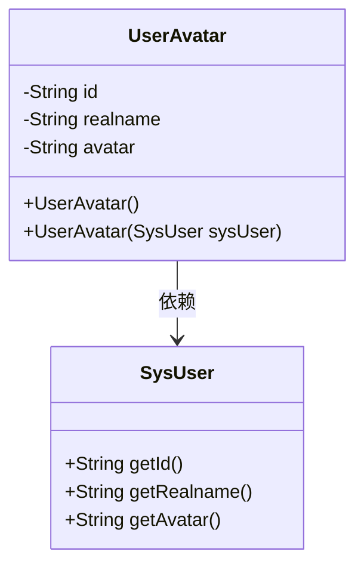
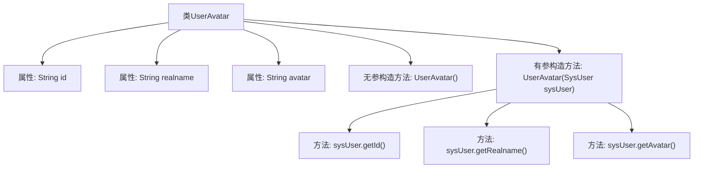

# 基础信息

|      |      |
|------|------|
| 名称 | UserAvatar |
| 编码语言 | .java |
| 代码路径 | JeecgBoot/jeecg-boot/jeecg-module-system/jeecg-system-biz/src/main/java/org/jeecg/modules/system/vo/UserAvatar.java |
| 包名 | org.jeecg.modules.system.vo |
| 依赖项 | ['lombok.Data', 'org.jeecg.modules.system.entity.SysUser'] |
| 概述说明 | 用户头像类含ID、姓名、头像，支持空构造和SysUser构造。 |

# 说明

用户头像类设计用于存储用户的基本信息，包括用户的唯一标识ID、真实姓名以及头像属性。该类支持两种构造方式：一种是通过空构造器创建对象，此时所有属性均为空；另一种是通过SysUser对象进行构造，直接将SysUser对象中的相关属性赋值给用户头像类的对应属性。这种设计灵活性高，便于在不同场景下初始化用户头像信息。

# 类列表 Class Summary

| 名称   | 类型  | 说明 |
|-------|------|-------------|
| UserAvatar | class | 用户头像类包含ID、真实姓名和头像属性，支持空构造和SysUser对象构造。 |

## 类 UserAvatar

|      |      |
|------|------|
| 访问范围 | @Data;public |
| 类型 | class |
| 名称 | UserAvatar |
| 说明 | 用户头像类包含ID、真实姓名和头像属性，支持空构造和SysUser对象构造。 |

### UML类图

**描述：**  
`UserAvatar` 类用于存储用户的头像信息，包含 `id`、`realname` 和 `avatar` 三个私有属性。该类提供了两个构造函数，一个无参构造函数用于初始化空对象，另一个构造函数接受 `SysUser` 对象作为参数，并将其 `id`、`realname` 和 `avatar` 属性赋值给 `UserAvatar` 对象的相应属性。`UserAvatar` 类依赖于 `SysUser` 类来获取用户信息。

### 内部方法调用关系图

这段代码定义了一个名为`UserAvatar`的类，包含三个属性：`id`、`realname`和`avatar`。类中有两个构造方法：一个无参构造方法和一个有参构造方法。有参构造方法接受一个`SysUser`对象作为参数，并将其属性值赋给`UserAvatar`对象的相应属性。流程图展示了类的结构及其构造方法的调用关系。

### 字段列表 Field List

| 名称  | 类型  | 说明 |
|-------|-------|------|
| avatar | String | 定义了一个私有字符串变量avatar。 |
| id | String | 定义了一个私有字符串类型的变量id。 |
| realname | String | 定义了一个私有的字符串类型变量realname。 |

### 方法列表 Method List

| 名称  | 类型  | 说明 |
|-------|-------|------|

