# 基础信息

|      |      |
|------|------|
| 名称 | vo |
| 编码语言 | .java |
| 代码路径 | JeecgBoot/jeecg-boot/jeecg-module-system/jeecg-system-biz/src/main/java/org/jeecg/modules/system/vo |
| 包名 | JeecgBoot.jeecg-boot.jeecg-module-system.jeecg-system-biz.src.main.java.org.jeecg.modules.system.vo |
| 概述说明 | SysUserOnlineVO类存储用户在线信息，包含会话ID、编号、用户名等字段。UserAvatar类存储用户基本信息，支持空构造和SysUser构造。SysUserRoleVO类管理用户角色关联，支持序列化。SysUserRoleCountVo类描述角色信息及用户数量。租户产品包管理系统管理租户、用户、权限和资源。SysCommentVO类记录评论信息。企业微信模块管理部门、用户及同步操作。SysUserTenantVo类存储用户详细信息。SysCommentFileVo类管理评论文件。SysUserDepVo类存储用户与部门关联信息。SysDictPage类管理字典数据。SysDepartExportVo类导出部门信息。组织结构模块管理部门、用户和字典信息。SysUserPositionVo类表示用户职位信息。SysDepartUsersVO类表示部门与用户关系。 |

# 说明

## 概述

该代码模块主要围绕用户管理、角色管理、部门管理、职位管理、租户管理、评论管理以及企业微信集成等核心业务展开。模块中包含了多个实体类和VO（Value Object）类，用于存储和操作用户信息、角色信息、部门信息、职位信息、租户信息、评论信息等。这些类通过封装关键字段和方法，确保数据的完整性、一致性和可操作性。模块中的类支持序列化功能，便于数据的持久化和网络传输，适用于多种业务场景，如用户信息管理、角色分配、部门层级管理、职位关联、租户产品包管理、评论记录等。

## 主要业务场景

1. **用户信息管理**  
   - `SysUserOnlineVO` 类用于存储用户在线状态的基本信息，包括会话ID、用户编号、用户名、真实姓名、头像、生日、性别、手机号等，便于系统管理和用户识别。
   - `UserAvatar` 类用于存储用户的基本信息，包括用户ID、真实姓名、头像等，支持通过空构造器或`SysUser`对象进行初始化，灵活性高。
   - `SysUserTenantVo` 类用于存储用户的详细信息，包括用户ID、账号、昵称、工号、邮箱、手机号、头像、职位、审核状态、部门信息、租户信息、会员状态及管理员标识等，全面描述用户在不同场景下的信息。

2. **角色管理**  
   - `SysUserRoleVO` 类用于表示用户与角色之间的关联关系，包含角色ID和用户ID列表，支持序列化功能，便于数据交换和权限管理。
   - `SysUserRoleCountVo` 类用于存储角色信息及其关联的用户数量，包括角色ID、角色名称、角色描述、角色编码和用户数量，便于角色管理和用户统计。

3. **部门管理**  
   - `SysUserDepVo` 类用于存储用户与部门之间的关联信息，包括用户ID、部门名称、部门ID和父部门ID，便于用户部门信息的查询和管理。
   - `SysDepartUsersVO` 类用于表示部门与用户的关系，包含部门ID和用户ID列表，支持灵活的对象初始化，满足不同场景需求。
   - `SysDepartExportVo` 类用于导出部门信息，包含部门路径、部门名称、部门ID、父部门ID、部门英文名、排序顺序、部门描述、机构类别、部门编码、手机号、传真号码、地址及备注信息，便于系统管理和数据交换。

4. **职位管理**  
   - `SysUserPositionVo` 类用于表示用户职位信息，包含职位ID、职务名称和用户ID，便于职位管理和用户关联操作。

5. **租户管理**  
   - `TenantPackModel` 类用于管理租户产品包信息，包括产品包编码、名称、权限信息、用户列表和状态等，确保租户产品包的有效管理。
   - `TenantPackUserCount` 类用于记录和查询租户产品包的用户数量，确保产品包使用情况的准确性。
   - `TenantDepartAuthInfo` 类用于管理租户的权限配置，包括超级管理员状态、租户信息、产品包人员数量和产品包编码，确保租户资源的合理分配。

6. **评论管理**  
   - `SysCommentVO` 类用于存储评论信息，包括评论ID、表名、数据ID、用户ID、评论内容、日期、相关文件、回复ID及用户信息等，全面记录评论的详细数据和关联信息。
   - `SysCommentFileVo` 类用于表示评论文件信息，包括文件ID、表单文件ID、名称、大小、地址、类型及存储类型，便于评论文件的管理和操作。

7. **企业微信集成**  
   - `JwDepartmentTreeVo` 和 `JdtDepartmentTreeVo` 类用于表示部门树结构，支持部门数据的树形展示和查询，适用于企业组织架构的管理。
   - `JwUserDepartVo` 类用于存储用户的基本信息，包括用户ID、头像、真实姓名及与企业微信相关的信息，适用于用户信息的管理与展示。
   - `SyncInfoVo` 类用于记录同步操作的结果，包括成功和失败的详细信息，确保同步操作的可追溯性和完整性。

通过这些类，模块能够支持复杂的用户管理、角色分配、部门层级管理、职位关联、租户产品包管理、评论记录以及企业微信集成等业务需求，适用于多种企业级应用场景。

### 包内部结构视图

```mermaid
graph TD
    vo --> SysUserOnlineVO.java
    vo --> UserAvatar.java
    vo --> SysUserRoleVO.java
    vo --> SysUserRoleCountVo.java
    vo --> SysCommentVO.java
    vo --> SysUserTenantVo.java
    vo --> SysCommentFileVo.java
    vo --> SysUserDepVo.java
    vo --> SysDictPage.java
    vo --> SysDepartExportVo.java
    vo --> SysUserPositionVo.java
    vo --> SysDepartUsersVO.java
    vo --> tenant
    vo --> thirdapp
    vo --> lowapp
    tenant --> TenantPackUserCount.java
    tenant --> TenantDepartAuthInfo.java
    tenant --> TenantPackUser.java
    tenant --> UserDepart.java
    tenant --> TenantPackAuth.java
    tenant --> TenantPackModel.java
    tenant --> UserPosition.java
    thirdapp --> JwDepartmentTreeVo.java
    thirdapp --> JwUserDepartVo.java
    thirdapp --> JwSysUserDepartVo.java
    thirdapp --> SyncInfoVo.java
    thirdapp --> JdtDepartmentTreeVo.java
    lowapp --> ExportDepartVo.java
    lowapp --> DepartAndUserInfo.java
    lowapp --> SysDictVo.java
    lowapp --> AppExportUserVo.java
    lowapp --> UpdateDepartInfo.java
    lowapp --> DepartInfo.java
```

该流程图展示了`vo`目录下的文件与子目录的层级关系。`vo`目录包含多个Java文件，同时还有三个子目录：`tenant`、`thirdapp`和`lowapp`。每个子目录下又包含多个Java文件，详细展示了文件与目录之间的从属关系。

# 文件列表 File List

| 名称   | 类型  | 说明 |
|-------|------|-------------|
| [SysCommentVO.java](SysCommentVO.md) | file | SysCommentVO类包含评论ID、表名、数据ID、用户ID、内容、日期、文件、回复ID及用户信息。 |
| [SysUserRoleCountVo.java](SysUserRoleCountVo.md) | file | SysUserRoleCountVo类记录角色ID、名称、描述、编码及用户数量。 |
| [SysUserPositionVo.java](SysUserPositionVo.md) | file | SysUserPositionVo类包含职位ID、职务名称和用户ID字段。 |
| [SysUserDepVo.java](SysUserDepVo.md) | file | SysUserDepVo类含用户ID、部门名称、部门ID及父部门ID。 |
| [SysUserTenantVo.java](SysUserTenantVo.md) | file | SysUserTenantVo类包含用户基本信息、职位、审核状态、部门、租户及管理员标识等字段。 |
| [SysDepartUsersVO.java](SysDepartUsersVO.md) | file | SysDepartUsersVO类包含部门ID和用户ID列表，提供两种构造函数。 |
| [SysDepartExportVo.java](SysDepartExportVo.md) | file | SysDepartExportVo类包含部门路径、名称、ID、父ID等字段。 |
| [SysDictPage.java](SysDictPage.md) | file | SysDictPage类包含字典ID、名称、编码、删除状态、描述及字典项列表。 |
| [SysCommentFileVo.java](SysCommentFileVo.md) | file | SysCommentFileVo类包含文件ID、表单文件ID、名称、大小、地址、类型和存储类型属性。 |
| [SysUserRoleVO.java](SysUserRoleVO.md) | file | SysUserRoleVO类包含角色ID和用户ID列表，支持序列化。 |
| [UserAvatar.java](UserAvatar.md) | file | 用户头像类含ID、姓名、头像，支持空构造和SysUser构造。 |
| [SysUserOnlineVO.java](SysUserOnlineVO.md) | file | SysUserOnlineVO类包含会话ID、编号、用户名、真实名、头像、生日、性别和手机号。 |
| [lowapp](lowapp/_module.md) | package | ExportDepartVo类表示部门信息，包含路径、名称、ID和父级ID。DepartAndUserInfo类管理用户和部门列表，支持序列化。SysDictVo类表示字典信息，包含ID、名称、编码等。AppExportUserVo类导出用户信息，包含编号、姓名等。UpdateDepartInfo类更新部门信息，包含ID、名称等。DepartInfo类存储部门信息，包含ID、组织名称和ID列表。 |
| [thirdapp](thirdapp/_module.md) | package | JwDepartmentTreeVo和JdtDepartmentTreeVo用于部门树结构管理，JwUserDepartVo存储用户信息，JwSysUserDepartVo管理用户映射关系，SyncInfoVo记录同步操作结果。 |
| [tenant](tenant/_module.md) | package | 多个数据类用于管理系统中的租户、用户、部门、职位及权限信息。 |

