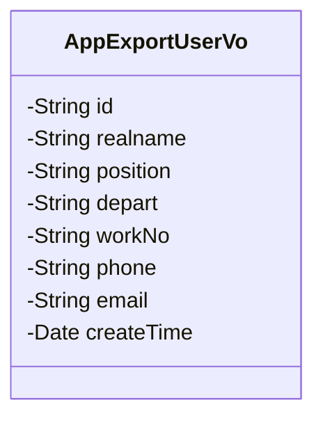
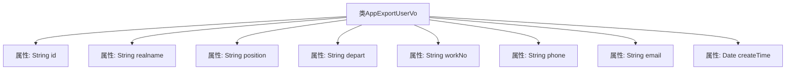

# 基础信息

|      |      |
|------|------|
| 名称 | AppExportUserVo |
| 编码语言 | .java |
| 代码路径 | JeecgBoot/jeecg-boot/jeecg-module-system/jeecg-system-biz/src/main/java/org/jeecg/modules/system/vo/lowapp/AppExportUserVo.java |
| 包名 | org.jeecg.modules.system.vo.lowapp |
| 依赖项 | ['lombok.Data', 'org.jeecgframework.poi.excel.annotation.Excel', 'java.util.Date'] |
| 概述说明 | AppExportUserVo类包含用户编号、姓名、职位、部门、工号、手机号、邮箱和加入时间字段。 |

# 说明

AppExportUserVo类是一个用于导出用户信息的类，包含了多个关键字段。这些字段包括用户编号、姓名、职位、部门、工号、手机号、邮箱以及加入时间。每个字段都用于描述用户的基本信息和相关属性，确保在导出用户数据时能够全面准确地反映用户的各项信息。

# 类列表 Class Summary

| 名称   | 类型  | 说明 |
|-------|------|-------------|
| AppExportUserVo | class | AppExportUserVo类包含用户编号、姓名、职位、部门、工号、手机号、邮箱和加入时间等字段。 |

## 类 AppExportUserVo

|      |      |
|------|------|
| 访问范围 | @Data;public |
| 类型 | class |
| 名称 | AppExportUserVo |
| 说明 | AppExportUserVo类包含用户编号、姓名、职位、部门、工号、手机号、邮箱和加入时间等字段。 |

### UML类图

**描述：**  
`AppExportUserVo` 类用于表示用户导出数据视图对象，包含了用户的基本信息如编号、姓名、职位、部门、工号、手机号、邮箱以及加入时间。这些字段通过 `@Excel` 注解进行标记，用于在导出Excel时指定列名、宽度和日期格式。

### 内部方法调用关系图

这段代码定义了一个名为`AppExportUserVo`的类，用于导出用户信息。类中包含多个属性，每个属性都使用了`@Excel`注解来指定在导出Excel时的列名、宽度和格式。这些属性包括用户编号、姓名、职位、部门、工号、手机号、邮箱和加入时间。代码通过注解的方式简化了Excel导出的配置，使得每个属性在导出时能够自动映射到Excel的相应列。

### 字段列表 Field List

| 名称  | 类型  | 说明 |
|-------|-------|------|
| id | String | 用户编号字段定义为私有字符串类型，宽度为30。 |
| position | String | Excel表格中职位列宽度为30字符。 |
| workNo | String | Excel表格中工号字段，宽度30，类型为字符串。 |
| depart | String | Excel注解定义部门字段，宽度为30。 |
| realname | String | Excel表格中姓名字段宽度为30，对应变量realname。 |
| phone | String | Excel表格中定义了一个宽度为30的“手机号”字段。 |
| createTime | Date | Excel列“加入时间”格式为“yyyy-MM-dd”，宽度30。 |
| email | String | Excel表格中定义了一个名为“邮箱”的列，宽度为30字符。 |

### 方法列表 Method List

| 名称  | 类型  | 说明 |
|-------|-------|------|

