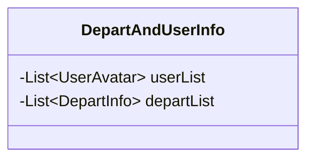
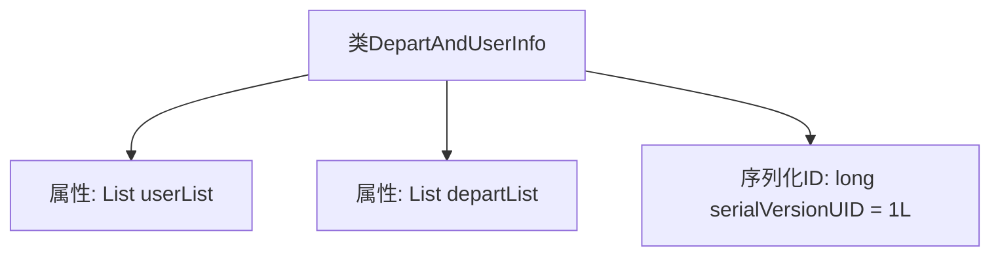

# 基础信息

|      |      |
|------|------|
| 名称 | DepartAndUserInfo |
| 编码语言 | .java |
| 代码路径 | JeecgBoot/jeecg-boot/jeecg-module-system/jeecg-system-biz/src/main/java/org/jeecg/modules/system/vo/lowapp/DepartAndUserInfo.java |
| 包名 | org.jeecg.modules.system.vo.lowapp |
| 依赖项 | ['lombok.Data', 'org.jeecg.modules.system.vo.UserAvatar', 'java.io.Serializable', 'java.util.List'] |
| 概述说明 | DepartAndUserInfo类含用户和部门列表，支持序列化。 |

# 说明

DepartAndUserInfo类是一个用于管理用户列表和部门列表的数据结构，并实现了序列化功能。通过序列化，该类可以将用户和部门的数据转换为可存储或传输的格式，便于数据的持久化和网络传输。该类的主要职责是维护和操作用户与部门的相关信息，确保数据的完整性和一致性。

# 类列表 Class Summary

| 名称   | 类型  | 说明 |
|-------|------|-------------|
| DepartAndUserInfo | class | DepartAndUserInfo类包含用户列表和部门列表，实现序列化。 |

## 类 DepartAndUserInfo

|      |      |
|------|------|
| 访问范围 | @Data;public |
| 类型 | class |
| 名称 | DepartAndUserInfo |
| 说明 | DepartAndUserInfo类包含用户列表和部门列表，实现序列化。 |

### UML类图

这段代码定义了一个名为 `DepartAndUserInfo` 的类，该类实现了 `Serializable` 接口，表明其实例可以被序列化。类中包含两个私有成员变量：`userList` 和 `departList`，分别是一个 `UserAvatar` 类型的列表和一个 `DepartInfo` 类型的列表。该类主要用于存储用户头像信息和部门信息的集合，并且支持序列化操作，便于在网络传输或持久化存储中使用。

### 内部方法调用关系图

这段代码定义了一个名为 `DepartAndUserInfo` 的类，该类实现了 `Serializable` 接口，表明其实例可以被序列化。类中包含两个属性：`userList` 和 `departList`，分别用于存储用户头像信息和部门信息。此外，类中还定义了一个静态的 `serialVersionUID`，用于在序列化和反序列化过程中确保类的版本一致性。该类的结构简单，主要用于组织和存储用户和部门的相关数据。

### 字段列表 Field List

| 名称  | 类型  | 说明 |
|-------|-------|------|
| departList | List<DepartInfo> | 包含部门信息的列表。 |
| serialVersionUID = 1L | long | 定义序列化版本UID为1L。 |
| userList | List<UserAvatar> | 存储用户头像列表的变量。 |

### 方法列表 Method List

| 名称  | 类型  | 说明 |
|-------|-------|------|

