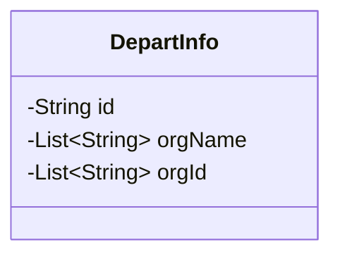
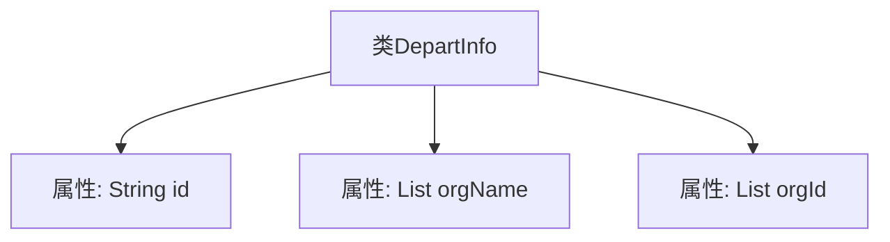

# 基础信息

|      |      |
|------|------|
| 名称 | DepartInfo |
| 编码语言 | .java |
| 代码路径 | JeecgBoot/jeecg-boot/jeecg-module-system/jeecg-system-biz/src/main/java/org/jeecg/modules/system/vo/lowapp/DepartInfo.java |
| 包名 | org.jeecg.modules.system.vo.lowapp |
| 依赖项 | ['lombok.Data', 'java.util.List'] |
| 概述说明 | DepartInfo类存储ID、组织名称和组织ID列表。 |

# 说明

DepartInfo类是一个用于存储部门相关信息的数据结构。它包含三个主要属性：ID、组织名称列表和组织ID列表。ID用于唯一标识该部门，组织名称列表存储与该部门关联的所有组织名称，而组织ID列表则存储这些组织的唯一标识符。通过这三个属性，DepartInfo类能够全面描述一个部门及其相关组织的基本信息，便于在系统中进行管理和查询。

# 类列表 Class Summary

| 名称   | 类型  | 说明 |
|-------|------|-------------|
| DepartInfo | class | DepartInfo类包含ID、组织名称列表和组织ID列表。 |

## 类 DepartInfo

|      |      |
|------|------|
| 访问范围 | @Data;public |
| 类型 | class |
| 名称 | DepartInfo |
| 说明 | DepartInfo类包含ID、组织名称列表和组织ID列表。 |

### UML类图

类图描述：`DepartInfo` 类表示部门信息，包含三个私有成员变量：`id` 表示部门唯一标识，`orgName` 存储上级名称与下级名称的列表，`orgId` 存储上级ID与下级ID的列表。该类通过Lombok的`@Data`注解自动生成getter、setter、toString等方法，简化了代码的编写。

### 内部方法调用关系图

这段代码定义了一个名为 `DepartInfo` 的类，该类包含三个属性：`id`、`orgName` 和 `orgId`。其中，`id` 是一个字符串类型的属性，`orgName` 和 `orgId` 是字符串列表类型的属性，分别用于存储上级名称与下级名称的对应关系以及上级ID与下级ID的对应关系。代码通过 `@Data` 注解自动生成了常见的 getter 和 setter 方法，简化了代码的编写。

### 字段列表 Field List

| 名称  | 类型  | 说明 |
|-------|-------|------|
| id | String | 定义了一个私有字符串类型的变量id。 |
| orgName | List<String> | 私有字符串列表变量orgName。 |
| orgId | List<String> | 私有字符串列表变量orgId。 |

### 方法列表 Method List

| 名称  | 类型  | 说明 |
|-------|-------|------|

