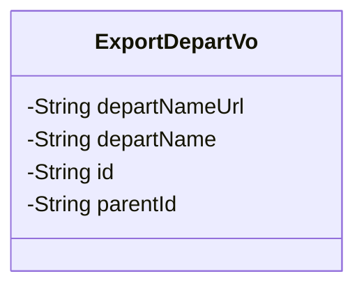
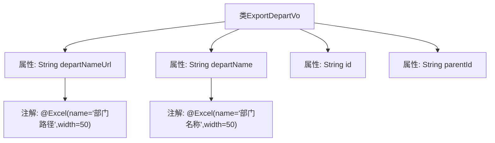

# 基础信息

|      |      |
|------|------|
| 名称 | ExportDepartVo |
| 编码语言 | .java |
| 代码路径 | JeecgBoot/jeecg-boot/jeecg-module-system/jeecg-system-biz/src/main/java/org/jeecg/modules/system/vo/lowapp/ExportDepartVo.java |
| 包名 | org.jeecg.modules.system.vo.lowapp |
| 依赖项 | ['lombok.Data', 'org.jeecgframework.poi.excel.annotation.Excel'] |
| 概述说明 | ExportDepartVo类包含部门路径、名称、ID和父级ID字段。 |

# 说明

ExportDepartVo类是一个用于表示部门信息的类，包含四个主要字段：部门路径、部门名称、部门ID和父级部门ID。这些字段分别用于描述部门在组织结构中的位置、名称、唯一标识以及其上级部门的标识。

# 类列表 Class Summary

| 名称   | 类型  | 说明 |
|-------|------|-------------|
| ExportDepartVo | class | ExportDepartVo类包含部门路径、名称、ID和父级ID字段。 |

## 类 ExportDepartVo

|      |      |
|------|------|
| 访问范围 | @Data;public |
| 类型 | class |
| 名称 | ExportDepartVo |
| 说明 | ExportDepartVo类包含部门路径、名称、ID和父级ID字段。 |

### UML类图

类图描述：`ExportDepartVo` 类用于表示导出部门信息的数据结构，包含四个私有属性：`departNameUrl`（部门路径）、`departName`（部门名称）、`id`（部门ID）和`parentId`（父级部门ID）。这些属性通常用于在导出部门数据时进行映射和格式化，确保数据的完整性和一致性。

### 内部方法调用关系图

该流程图描述了`ExportDepartVo`类的结构，包括其属性和相关注解。`ExportDepartVo`类包含四个属性：`departNameUrl`、`departName`、`id`和`parentId`。其中，`departNameUrl`和`departName`属性分别带有`@Excel`注解，用于指定Excel导出时的列名和宽度。该流程图清晰地展示了类与属性之间的关系，以及注解的应用。

### 字段列表 Field List

| 名称  | 类型  | 说明 |
|-------|-------|------|
| departNameUrl | String | 部门路径字段，类型为字符串，宽度50。 |
| id | String | 定义了一个私有字符串类型的变量id。 |
| departName | String | Excel表格中定义部门名称字段，宽度为50字符。 |
| parentId | String | 定义私有字符串变量parentId。 |

### 方法列表 Method List

| 名称  | 类型  | 说明 |
|-------|-------|------|

