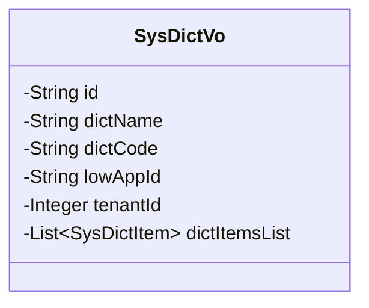
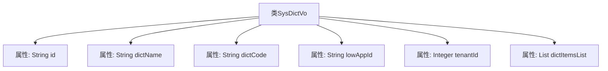

# 基础信息

|      |      |
|------|------|
| 名称 | SysDictVo |
| 编码语言 | .java |
| 代码路径 | JeecgBoot/jeecg-boot/jeecg-module-system/jeecg-system-biz/src/main/java/org/jeecg/modules/system/vo/lowapp/SysDictVo.java |
| 包名 | org.jeecg.modules.system.vo.lowapp |
| 依赖项 | ['com.baomidou.mybatisplus.annotation.IdType', 'com.baomidou.mybatisplus.annotation.TableId', 'lombok.Data', 'org.jeecg.modules.system.entity.SysDict', 'org.jeecg.modules.system.entity.SysDictItem', 'java.util.List'] |
| 概述说明 | SysDictVo类包含字典ID、名称、编码、应用ID、租户ID及子项列表。 |

# 说明

SysDictVo类是一个用于表示字典信息的类，包含字典ID、名称、编码、应用ID、租户ID以及子项列表。字典ID用于唯一标识字典，名称表示字典的显示名称，编码是字典的唯一编码标识。应用ID和租户ID分别用于关联特定应用和租户。子项列表则用于存储该字典下的所有子项信息，确保字典数据的完整性和层次结构。

# 类列表 Class Summary

| 名称   | 类型  | 说明 |
|-------|------|-------------|
| SysDictVo | class | SysDictVo类包含字典ID、名称、编码、应用ID、租户ID及子项列表。 |

## 类 SysDictVo

|      |      |
|------|------|
| 访问范围 | @Data;public |
| 类型 | class |
| 名称 | SysDictVo |
| 说明 | SysDictVo类包含字典ID、名称、编码、应用ID、租户ID及子项列表。 |

### UML类图

这段代码定义了一个名为 `SysDictVo` 的类，用于表示系统字典的值对象。类中包含多个私有字段，如字典ID、字典名称、字典编码、应用ID、租户ID以及字典子项列表。这些字段通常用于存储和管理字典相关的数据。类图展示了 `SysDictVo` 的结构，包括其私有字段及其类型，但没有定义任何公有方法。

### 内部方法调用关系图

该流程图展示了`SysDictVo`类的结构，包括其属性和类型。`SysDictVo`类包含六个属性：`id`、`dictName`、`dictCode`、`lowAppId`、`tenantId`和`dictItemsList`。这些属性分别用于存储字典的唯一标识、名称、编码、应用ID、租户ID以及字典子项列表。通过该图可以清晰地看到类的内部结构及其属性之间的关系。

### 字段列表 Field List

| 名称  | 类型  | 说明 |
|-------|-------|------|
| dictCode | String | 私有字符串变量dictCode。 |
| tenantId | Integer | 定义私有整型变量tenantId。 |
| lowAppId | String | 定义私有字符串变量lowAppId。 |
| id | String | 表ID使用ASSIGN_ID类型，字段为私有字符串id。 |
| dictName | String | 私有字符串变量dictName声明。 |
| dictItemsList | List<SysDictItem> | 私有列表变量dictItemsList，存储SysDictItem类型对象。 |

### 方法列表 Method List

| 名称  | 类型  | 说明 |
|-------|-------|------|

