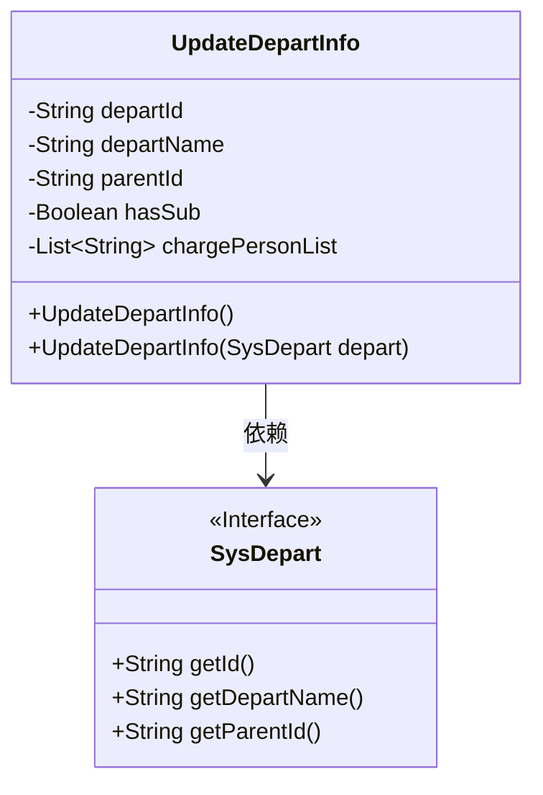
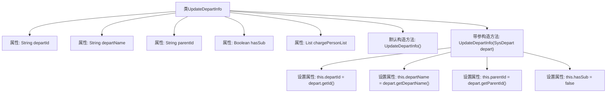

# 基础信息

|      |      |
|------|------|
| 名称 | UpdateDepartInfo |
| 编码语言 | .java |
| 代码路径 | JeecgBoot/jeecg-boot/jeecg-module-system/jeecg-system-biz/src/main/java/org/jeecg/modules/system/vo/lowapp/UpdateDepartInfo.java |
| 包名 | org.jeecg.modules.system.vo.lowapp |
| 依赖项 | ['lombok.Data', 'org.jeecg.modules.system.entity.SysDepart', 'java.util.List'] |
| 概述说明 | 更新部门信息，含ID、名称、上级ID、子部门状态及负责人列表。 |

# 说明

更新部门信息类包含五个关键属性：部门ID用于唯一标识部门，部门名称描述部门的具体名称，上级ID指明该部门的直接上级部门，是否有子部门标识该部门是否存在下级部门，负责人列表记录该部门的所有负责人信息。这些属性共同构成了部门信息的基本结构，便于管理和维护部门层级关系及负责人信息。

# 类列表 Class Summary

| 名称   | 类型  | 说明 |
|-------|------|-------------|
| UpdateDepartInfo | class | 更新部门信息类，包含部门ID、名称、上级ID、是否有子部门及负责人列表。 |

## 类 UpdateDepartInfo

|      |      |
|------|------|
| 访问范围 | @Data;public |
| 类型 | class |
| 名称 | UpdateDepartInfo |
| 说明 | 更新部门信息类，包含部门ID、名称、上级ID、是否有子部门及负责人列表。 |

### UML类图

这段代码定义了一个 `UpdateDepartInfo` 类，用于更新部门信息。该类包含部门ID、部门名称、父部门ID、是否有子部门以及部门负责人ID列表等属性。`UpdateDepartInfo` 类有两个构造函数，一个无参构造函数用于初始化对象，另一个构造函数接受一个 `SysDepart` 接口类型的参数，用于从 `SysDepart` 对象中提取部门信息并初始化 `UpdateDepartInfo` 对象。`SysDepart` 接口提供了获取部门ID、部门名称和父部门ID的方法。

### 内部方法调用关系图

这段代码定义了一个名为`UpdateDepartInfo`的类，用于更新部门信息。类中包含五个属性：`departId`、`departName`、`parentId`、`hasSub`和`chargePersonList`。类提供了两个构造方法：一个默认构造方法和一个带参构造方法。带参构造方法接受一个`SysDepart`对象作为参数，并将其属性值赋给`UpdateDepartInfo`类的相应属性。代码通过构造方法实现了部门信息的初始化和更新。

### 字段列表 Field List

| 名称  | 类型  | 说明 |
|-------|-------|------|
| departId | String | 定义私有字符串变量departId。 |
| chargePersonList | List<String> | 私有字符串列表用于存储负责人信息。 |
| departName | String | 定义了一个名为departName的私有字符串变量。 |
| hasSub | Boolean | 该代码定义了一个布尔类型变量hasSub。 |
| parentId | String | 定义私有字符串变量parentId。 |

### 方法列表 Method List

| 名称  | 类型  | 说明 |
|-------|-------|------|

