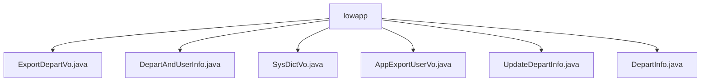

# 基础信息

|      |      |
|------|------|
| 名称 | lowapp |
| 编码语言 | .java |
| 代码路径 | JeecgBoot/jeecg-boot/jeecg-module-system/jeecg-system-biz/src/main/java/org/jeecg/modules/system/vo/lowapp |
| 包名 | JeecgBoot.jeecg-boot.jeecg-module-system.jeecg-system-biz.src.main.java.org.jeecg.modules.system.vo.lowapp |
| 概述说明 | ExportDepartVo类表示部门信息，包含路径、名称、ID和父级ID。DepartAndUserInfo类管理用户和部门列表，支持序列化。SysDictVo类表示字典信息，包含ID、名称、编码等。AppExportUserVo类导出用户信息，包含编号、姓名等。UpdateDepartInfo类更新部门信息，包含ID、名称等。DepartInfo类存储部门信息，包含ID、组织名称和ID列表。 |

# 说明

## 概述

该代码模块主要处理与组织结构和用户管理相关的数据，提供了多个类用于表示和操作部门、用户、字典等信息。这些类通过封装关键字段和方法，确保数据的完整性、一致性和可操作性。模块中的类实现了序列化功能，支持数据的持久化和网络传输，适用于多种业务场景，如部门管理、用户信息导出、字典维护等。

## 主要业务场景

1. **部门管理**：通过`ExportDepartVo`、`UpdateDepartInfo`和`DepartInfo`等类，模块支持部门信息的表示、更新和查询。这些类封装了部门ID、名称、上级部门ID、子部门标识等关键信息，便于维护部门层级关系和负责人信息。

2. **用户信息导出**：`AppExportUserVo`类用于导出用户信息，包含用户编号、姓名、职位、部门、工号、手机号、邮箱等字段，确保在导出用户数据时能够全面准确地反映用户的各项信息。

3. **字典维护**：`SysDictVo`类用于表示字典信息，包含字典ID、名称、编码、应用ID、租户ID以及子项列表。该类支持字典数据的层次结构管理，确保字典数据的完整性和一致性。

4. **用户与部门信息管理**：`DepartAndUserInfo`类用于管理用户列表和部门列表，通过序列化功能支持数据的存储和传输，确保用户与部门信息的完整性和一致性。

### 包内部结构视图

该流程图展示了`lowapp`目录下的文件结构。`lowapp`作为根节点，包含了多个Java文件，这些文件分别用于处理不同的系统功能，如部门导出、用户信息、字典信息等。每个文件都直接隶属于`lowapp`目录，没有进一步的子目录层级。

# 文件列表 File List

| 名称   | 类型  | 说明 |
|-------|------|-------------|
| [AppExportUserVo.java](AppExportUserVo.md) | file | AppExportUserVo类包含用户编号、姓名、职位、部门、工号、手机号、邮箱和加入时间字段。 |
| [DepartAndUserInfo.java](DepartAndUserInfo.md) | file | DepartAndUserInfo类含用户和部门列表，支持序列化。 |
| [DepartInfo.java](DepartInfo.md) | file | DepartInfo类存储ID、组织名称和组织ID列表。 |
| [UpdateDepartInfo.java](UpdateDepartInfo.md) | file | 更新部门信息，含ID、名称、上级ID、子部门状态及负责人列表。 |
| [SysDictVo.java](SysDictVo.md) | file | SysDictVo类包含字典ID、名称、编码、应用ID、租户ID及子项列表。 |
| [ExportDepartVo.java](ExportDepartVo.md) | file | ExportDepartVo类包含部门路径、名称、ID和父级ID字段。 |

