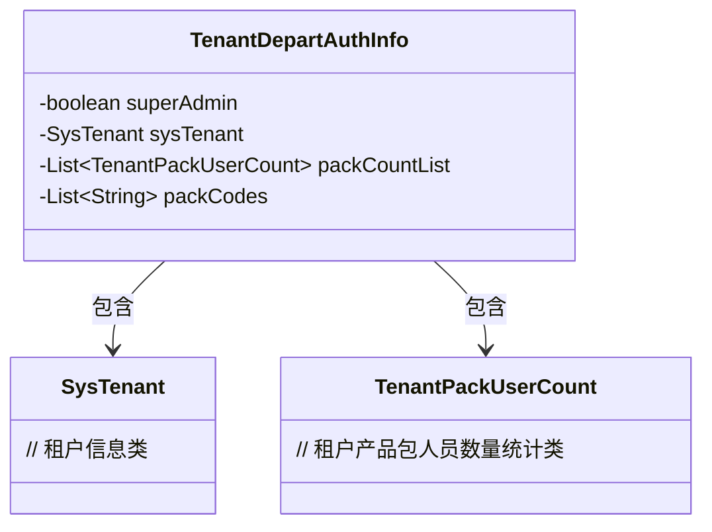
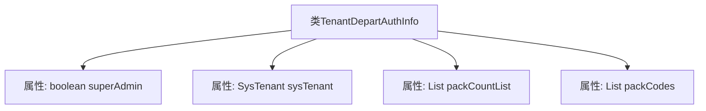

# 基础信息

|      |      |
|------|------|
| 名称 | TenantDepartAuthInfo |
| 编码语言 | .java |
| 代码路径 | JeecgBoot/jeecg-boot/jeecg-module-system/jeecg-system-biz/src/main/java/org/jeecg/modules/system/vo/tenant/TenantDepartAuthInfo.java |
| 包名 | org.jeecg.modules.system.vo.tenant |
| 依赖项 | ['lombok.Data', 'org.jeecg.modules.system.entity.SysTenant', 'java.util.List'] |
| 概述说明 | 类TenantDepartAuthInfo包含超级管理员状态、租户信息、产品包人员数量及产品包编码。 |

# 说明

类TenantDepartAuthInfo包含四个关键属性：超级管理员状态、租户信息、产品包人员数量及产品包编码。超级管理员状态表示用户是否为超级管理员；租户信息涉及租户的具体数据；产品包人员数量表示该产品包允许的用户数量；产品包编码则是产品包的唯一标识。这些属性共同用于管理和识别租户的权限及资源配置。

# 类列表 Class Summary

| 名称   | 类型  | 说明 |
|-------|------|-------------|
| TenantDepartAuthInfo | class | 类TenantDepartAuthInfo包含超级管理员状态、租户信息、产品包人员数量及产品包编码。 |

## 类 TenantDepartAuthInfo

|      |      |
|------|------|
| 访问范围 | @Data;public |
| 类型 | class |
| 名称 | TenantDepartAuthInfo |
| 说明 | 类TenantDepartAuthInfo包含超级管理员状态、租户信息、产品包人员数量及产品包编码。 |

### UML类图

这段代码定义了一个名为 `TenantDepartAuthInfo` 的类，用于存储租户部门的授权信息。该类包含四个私有成员：`superAdmin` 表示当前用户是否为超级管理员，`sysTenant` 表示租户信息，`packCountList` 用于统计租户产品包人员数量，`packCodes` 存储租户产品包的编码。该类依赖于 `SysTenant` 和 `TenantPackUserCount` 类，分别用于表示租户信息和租户产品包人员数量统计。

### 内部方法调用关系图

这段代码定义了一个名为 `TenantDepartAuthInfo` 的类，该类包含了四个属性：`superAdmin`（表示当前用户是否为超级管理员）、`sysTenant`（表示租户信息）、`packCountList`（用于统计租户产品包人员数量）和 `packCodes`（表示租户产品包的编码）。这些属性分别用于存储布尔值、租户信息、租户产品包人员数量列表以及产品包编码列表。代码使用了 Lombok 的 `@Data` 注解，自动生成了 getter、setter、toString 等方法，简化了代码的编写。

### 字段列表 Field List

| 名称  | 类型  | 说明 |
|-------|-------|------|
| sysTenant | SysTenant | 私有系统租户变量sysTenant声明。 |
| superAdmin | boolean | 私有布尔变量表示超级管理员状态。 |
| packCodes | List<String> | 定义了一个存储字符串的私有列表变量。 |
| packCountList | List<TenantPackUserCount> | 私有列表存储租户包用户数量信息。 |

### 方法列表 Method List

| 名称  | 类型  | 说明 |
|-------|-------|------|

